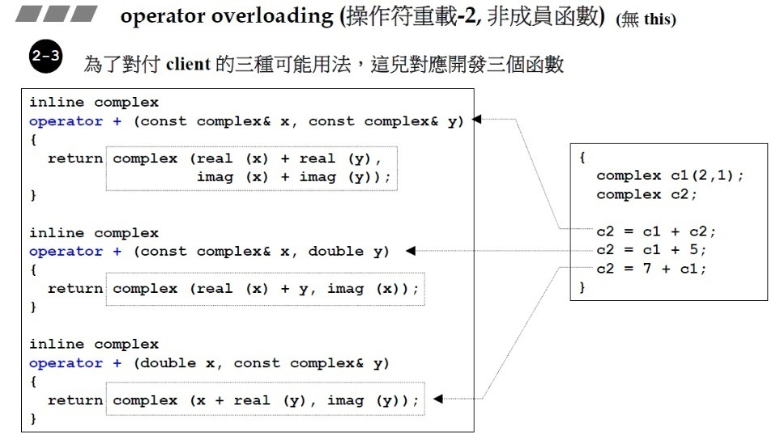
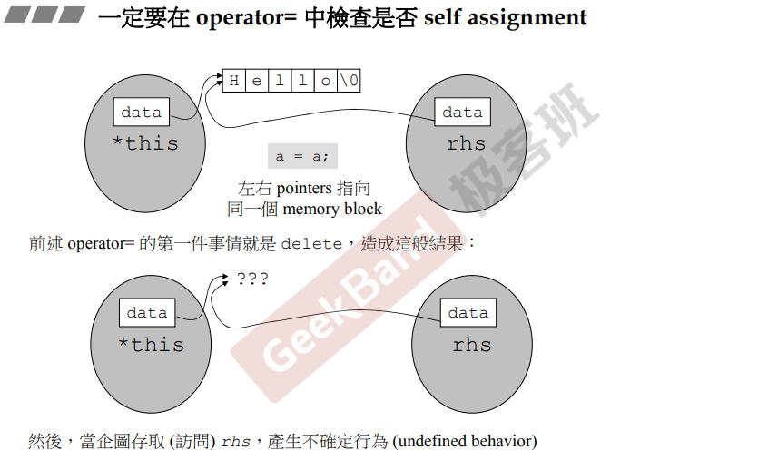
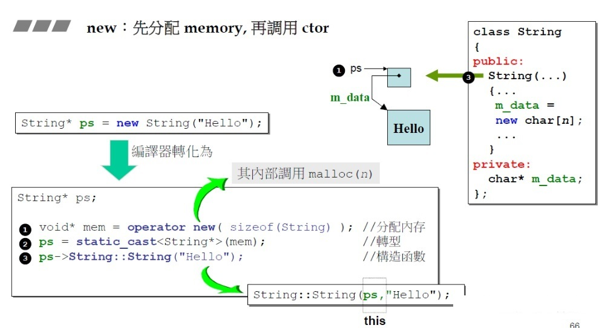
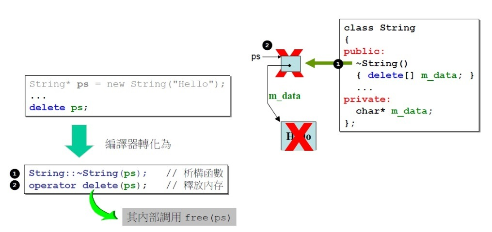
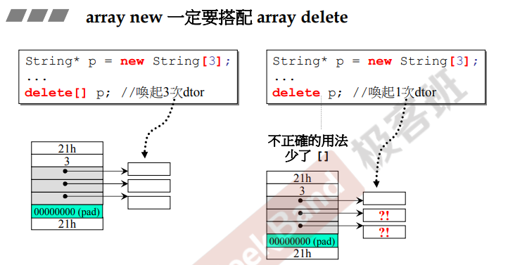
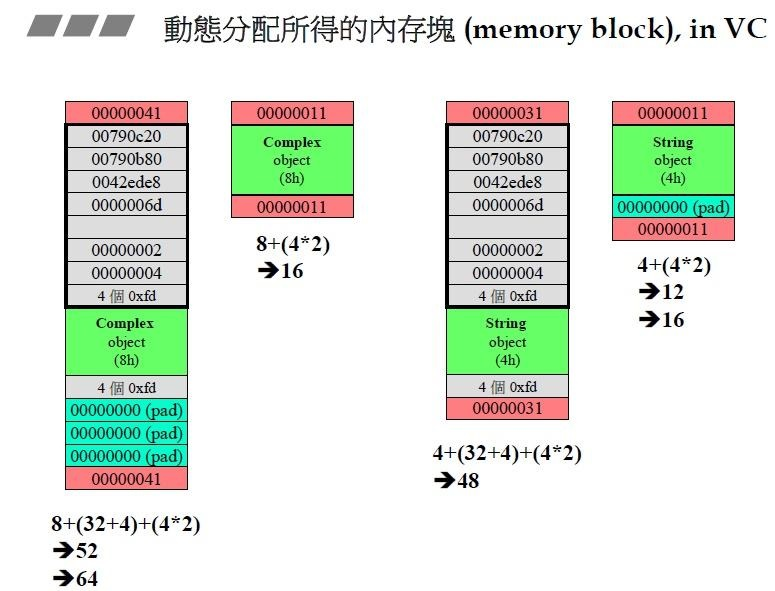

## 一、Class without pointer member(s) —— complex类

### 1、C++简介

### 2、头文件与类的声明

**头文件的防卫式声明**

作用：防止同一个文件被包含多次

1. **#ifndef**

```cpp
#ifndef  __COMPLEX__
#define   __COMPLEX__

... ... // 声明、定义语句

#endif
```

特点：

- 跨平台
- 可针对文件也可针对代码片段。
- 编译慢，有宏命名冲突的风险。

2. **#pragmaonce**

```cpp
#pragmaonce

... ... // 声明、定义语句
```

特点：

- 不跨平台
- 只能针对文件
- 编译快，无宏命名冲突的风险。

### 3、构造函数

如果一个类不带指针，则多半可以不写析构函数（还是推荐写上，万一你忘了呢？）。

在class body 内定义的函数自动inline，在类外要加inline关键字。inline函数可以让编译变快，你可以试着把所有函数都定义inline，但编译器inline不inline就不一定了，换句话说，你只是提交了一份inline“申请”，如果inline的函数简单，编译器就给你通过”申请“。

函数重载常常发生在构造函数中。

如果有一个构造函数已经有默认值，可以重载其他的构造函数，但不能重载与它冲突的那一个。例如：

```c++
class complex{
public:
    complex(double r =0, double i =0)
    :re(r), im(i)
    {}
    complex():re(0), im(0){}  //ERROR!
    ....
private:
    double re, im;
};

//否则，该调用那个呢？有两个作用一样的构造函数。
complex c1;
complex c2();
```

### 4、参数传递与返回值

构造函数有时也会放在private中，singleton设计模式。

参数传递的三种方式，设计类成员函数时，要提前考虑好那些函数的数据会改变，如果不改变请加上const。

- pass by value
- pass by reference
- pass by reference to const (推荐！)

返回值传递的时候，**如果可以**，建议使用return by reference。

**友元（friend）**函数可以取得类的private中的数据，但不建议这么做，因为会破坏封装性。

但有一点请记住：**相同class内的各objects互为友元！**所以下面类中的**func函数**取用private数据合法。

```c++
class complex{
public:
	complex(double r=0, double i=0):re(r), im(i){}
    int func(const complex& param){
        return param.re + param.im;
    }
    // ....
private:
    double re, im;
}

{
    complex c1(2,1);
    complex c2();
    c2.func(c1); // c2 但是取得了c1的private变量
}
```

### 5、操作符重载与临时对象

**（一）操作符重载之成员函数（this）**

- 任何成员函数都有一个**隐藏的pointer（即this）**，操作符重载也不例外。这个pointer(this)就指向调用者。对双目运算符来说，调用者就是左边的那个。
- return by reference 语法分析: **传递者**无需知道**接收者**是以 **reference 形式**接收。
- “+=” 等操作符的重载不能返回`void`类型是因为：用户有可能会进行**连加等多次连续操作**。

**（二）操作符重载之非成员函数（无this）**

与（一）的区别在于这种重载无this指针，它是**全域/局函数。**



**（三）临时对象**

类似（二）中的函数绝对不可以return by reference，因为他们返回的是一个**local object**。所以只能return by value！

**（四）千万不要把一些特殊的操作符重载为成员函数**

比如：<< ,  >> ,

### ~小总结（设计一个class的注意事项）

- 构造函数使用**初始化列表（initialization list)**;
- 函数该不该加 const；
- 参数传递 尽量考虑pass by reference，且考虑该不该加 const；
- 函数返回 是return by value 还是return by reference。

### 6、Complex类的完整实现

**complex.h**

```cpp
#ifndef __MYCOMPLEX__
#define __MYCOMPLEX__

class complex; 
complex&
  __doapl (complex* ths, const complex& r);
complex&
  __doami (complex* ths, const complex& r);
complex&
  __doaml (complex* ths, const complex& r);


class complex
{
public:
  complex (double r = 0, double i = 0): re (r), im (i) { }
  complex& operator += (const complex&);
  complex& operator -= (const complex&);
  complex& operator *= (const complex&);
  complex& operator /= (const complex&);
  double real () const { return re; }
  double imag () const { return im; }
private:
  double re, im;

  friend complex& __doapl (complex *, const complex&);
  friend complex& __doami (complex *, const complex&);
  friend complex& __doaml (complex *, const complex&);
};


inline complex&
__doapl (complex* ths, const complex& r)
{
  ths->re += r.re;
  ths->im += r.im;
  return *ths;
}
 
inline complex&
complex::operator += (const complex& r)
{
  return __doapl (this, r);
}

inline complex&
__doami (complex* ths, const complex& r)
{
  ths->re -= r.re;
  ths->im -= r.im;
  return *ths;
}
 
inline complex&
complex::operator -= (const complex& r)
{
  return __doami (this, r);
}
 
inline complex&
__doaml (complex* ths, const complex& r)
{
  double f = ths->re * r.re - ths->im * r.im;
  ths->im = ths->re * r.im + ths->im * r.re;
  ths->re = f;
  return *ths;
}

inline complex&
complex::operator *= (const complex& r)
{
  return __doaml (this, r);
}
 
inline double
imag (const complex& x)
{
  return x.imag ();
}

inline double
real (const complex& x)
{
  return x.real ();
}

inline complex
operator + (const complex& x, const complex& y)
{
  return complex (real (x) + real (y), imag (x) + imag (y));
}

inline complex
operator + (const complex& x, double y)
{
  return complex (real (x) + y, imag (x));
}

inline complex
operator + (double x, const complex& y)
{
  return complex (x + real (y), imag (y));
}

inline complex
operator - (const complex& x, const complex& y)
{
  return complex (real (x) - real (y), imag (x) - imag (y));
}

inline complex
operator - (const complex& x, double y)
{
  return complex (real (x) - y, imag (x));
}

inline complex
operator - (double x, const complex& y)
{
  return complex (x - real (y), - imag (y));
}

inline complex
operator * (const complex& x, const complex& y)
{
  return complex (real (x) * real (y) - imag (x) * imag (y),
			   real (x) * imag (y) + imag (x) * real (y));
}

inline complex
operator * (const complex& x, double y)
{
  return complex (real (x) * y, imag (x) * y);
}

inline complex
operator * (double x, const complex& y)
{
  return complex (x * real (y), x * imag (y));
}

complex
operator / (const complex& x, double y)
{
  return complex (real (x) / y, imag (x) / y);
}

inline complex
operator + (const complex& x)
{
  return x;
}

inline complex
operator - (const complex& x)
{
  return complex (-real (x), -imag (x));
}

inline bool
operator == (const complex& x, const complex& y)
{
  return real (x) == real (y) && imag (x) == imag (y);
}

inline bool
operator == (const complex& x, double y)
{
  return real (x) == y && imag (x) == 0;
}

inline bool
operator == (double x, const complex& y)
{
  return x == real (y) && imag (y) == 0;
}

inline bool
operator != (const complex& x, const complex& y)
{
  return real (x) != real (y) || imag (x) != imag (y);
}

inline bool
operator != (const complex& x, double y)
{
  return real (x) != y || imag (x) != 0;
}

inline bool
operator != (double x, const complex& y)
{
  return x != real (y) || imag (y) != 0;
}

#include <cmath>

inline complex
polar (double r, double t)
{
  return complex (r * cos (t), r * sin (t));
}

inline complex
conj (const complex& x) 
{
  return complex (real (x), -imag (x));
}

inline double
norm (const complex& x)
{
  return real (x) * real (x) + imag (x) * imag (x);
}

#endif   //__MYCOMPLEX__
```

**complex_text.cpp:**

```cpp
#include <iostream>
#include "complex.h"

using namespace std;

ostream&
operator << (ostream& os, const complex& x)
{
  return os << '(' << real (x) << ',' << imag (x) << ')';
}

int main()
{
  complex c1(2, 1);
  complex c2(4, 0);

  cout << c1 << endl;
  cout << c2 << endl;
  
  cout << c1+c2 << endl;
  cout << c1-c2 << endl;
  cout << c1*c2 << endl;
  cout << c1 / 2 << endl;
  
  cout << conj(c1) << endl;
  cout << norm(c1) << endl;
  cout << polar(10,4) << endl;
  
  cout << (c1 += c2) << endl;
  
  cout << (c1 == c2) << endl;
  cout << (c1 != c2) << endl;
  cout << +c2 << endl;
  cout << -c2 << endl;
  
  cout << (c2 - 2) << endl;
  cout << (5 + c2) << endl;
  
  return 0;
}
```

## 二、Class with pointer member(s) ——String类

### 7、三大函数：拷贝构造、拷贝赋值、析构 (big three)

- class with pointer members 必须自己编写拷贝构造、拷贝赋值和析构函数，否则编译器会使用默认的构造函数，就会**造成浅拷贝和内存泄漏**。

```c++
// String类
class String {
public:
    String(const char* cstr = 0);
    String(const String& str);
    String& operator=(const String& str);
    ~String();
    char* get_c_str() const { return m_data; }
private:
    char* m_data;
};
// 构造函数
inline
String::String(const char* cstr) {
    if (cstr) {
        m_data = new char[strlen(cstr) + 1];
        //strcpy(m_data, cstr); // vs编译报错：strcpy': This function or variable may be unsafe. Consider using strcpy_s instead. 
        strcpy_s(m_data, strlen(cstr)+1, cstr);
    }
    else {
        m_data = new char[1];
        *m_data = '\0';
    }
}
// 析构函数
inline
String::~String() {
    delete[] m_data;
}
// 拷贝构造函数
inline
String::String(const String& str) {
                             // 直接取另一个object的private（兄弟之间互为friend）
    m_data = new char[strlen(str.m_data) + 1];
    //strcpy(m_data, str.m_data);
    strcpy_s(m_data, strlen(str.m_data) + 1, str.m_data);
}
// 拷贝赋值操作符
inline
String& String::operator=(const String& str) {
    if (this == &str)  // !!!检测自我赋值，1.效率高 2.正确性
        return *this;
    delete[] m_data;
    m_data = new char[strlen(str.m_data) + 1];
    //strcpy(m_data, str.m_data); 
    strcpy_s(m_data, strlen(str.m_data) + 1, str.m_data);
    return *this;
}
// 重载<< 操作符
ostream& operator<<(ostream& os, const String& str) {
    os << str.get_c_str();
    return os;
}
```



- 拷贝赋值的经典**四步曲**

  以`s1 = s2`为例(s1、s2是两个字符串)：

  - 第一步：**检测自我赋值**。（否则有可能导致未定义情况）
  - 第二步：清理掉s1的数据。
  - 第三步：为s1分配一块与s2一样大的内存空间
  - 第四步：将s2拷贝到s1中。

### 8、堆、栈与内存管理

**（一）Stack(栈)**

**概念：**是存在于某作用域 (scope) 的一块內存空间(memory space)。例如当你调用函数，函数本身即会形成一个stack 用來放置它所接收的参数，以及返回地址。 在函数本体 (function body) 內声明的任何变量，其所使用的內存块都取自上述 stack。

**（二）heap(堆)**

概念：或谓 system heap，是指由操作系统提供的一块 global 內存空间，程序可动态分配 (dynamic allocated) 从某中获得若干区块(blocks)。

```C++
class Complex{/*····*/}
{
    // c1 所占用的空间来自 stack，其生命在作用域（scope）结束时结束，
    // 这种作用域内的object又被称为auto object，因为他会被自动清理。
    Complex c1(1, 2);
    // Complex(3,1)是临时对象，其所占空间乃是以new自heap动态分配而得，由p指向；
    Complex *p = new Complex(3, 1);
    // p所指的便是heap object，其生命在它被deleted之际结束；
    // 如果没有delete p;那么指针p在作用域结束时就结束了，但是该指针所指的heap object仍然存在，且无法消除，就会造成内存泄漏；
    delete p;
    // c2是static object，其生命在作用域（scope）结束之后任然存在，知道整个程序结束
    static Complex c2(1,2);
}
```

**（三）new与delete**

1. **new**： 先分配内存，在调用构造函数

   

2. **delete:** 先调用析构函数，在释放内存

   

3.  **array new** (``arr = new String[10];``)要搭配 **array delete** (``delete [] arr;``)

   

   侯捷老师提到，如果没有指针的数组，那直接``delete arr；``不使用array delete也是没问题的，因为此时array的内存只有上图左侧那那一块。但是如果存在指针，就必须使用array delete，否则就会造成内存泄漏。因此为了统一且规范，那就 **array new** (``arr = new String[10];``)要搭配 **array delete** (``delete [] arr;``)。

   **注意！！！视频中侯捷老师提到：目前市面上的书籍资料都没有如此详细的对内存块的剖析。所以如果想了解，请移步原视频观看。**

   

### 9、String类的实现

**string.h** 见[7、三大函数：拷贝构造、拷贝赋值、析构(big three)](#7、三大函数：拷贝构造、拷贝赋值、析构-big-three)所示。

**string_text.cpp**

```C++
#include "string.h"
#include <iostream>

using namespace std;

int main()
{
  String s1("hello"); 
  String s2("world");
    
  String s3(s2);
  cout << s3 << endl;
  
  s3 = s1;
  cout << s3 << endl;     
  cout << s2 << endl;  
  cout << s1 << endl;      
}
```

### 10、扩展补充：static、类模板、函数模板及其他

**（一）static**

- **静态数据一定要在类外进行定义**。

- 静态成员函数**没有this指针**。

- 静态成员函数只能操作静态数据。

- 调用静态函数的方法有两种：（1）通过class name调用；（2）通过object调用。

- **一个函数中static的东西，只有当该静态的东西被调用的时候，它才会被创建**，且离开该函数作用域后它依然存在。

  ```c++
  class Account {
  public:
      static double m_rate; // 静态变量
      static void set_rate(const double& x) { m_rate = x; } // 静态函数
  };
  double Account::m_rate = 1.0; // 定义静态变量，必须在类外进行定义
  
  int main() {
      Account::set_rate(5.0); // 通过class name调用静态函数
      Account a;
      a.set_rate(7.0);  // 通过object调用静态函数
  }
  ```

**（二）把构造函数放到private区域**

- Singleton设计模型
- Meyers Singleton设计模式

**（三）cout**

**（四）class template类模板**

```c++
template<typename T>
class complex {/*....*/ }; // 类模板定义
complex<double> c1; // 类模板使用 <参数类型>
```

**（五）函数模板**

- 编译器会对function template进行实参推导（argument deduction）

```c++
template<typename T>
const T& min(const T& a, const T& b){ return b < a ? b : a; } // 类模板定义
c = min(a, b); // 类模板使用，不用像类模板的使用一样加<参数类型>，编译器会自动推导
```

**（六）namespace**

## 三、Object Oriented Programming, Object Oriented Design（OOP，OOD）

侯捷老师提到，只要了解这三种关系，就可以做到让类与类之间建立关系。

- **Inheritance（继承）**
- **Composition（复合）**
- **Delegation（委托）**

### 11、复合、委托与继承


