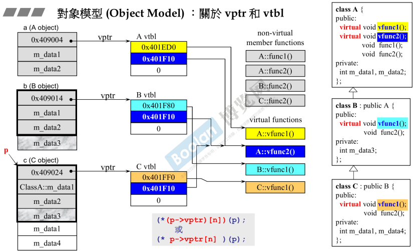
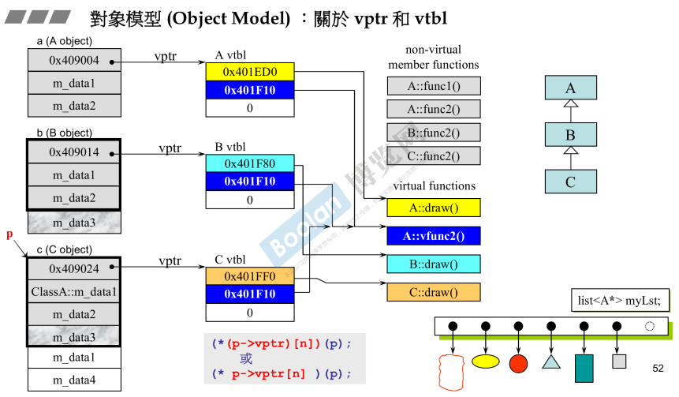
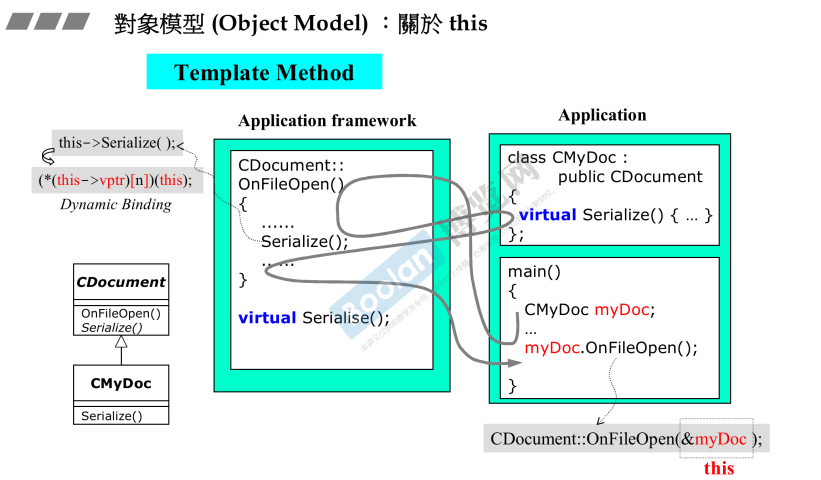
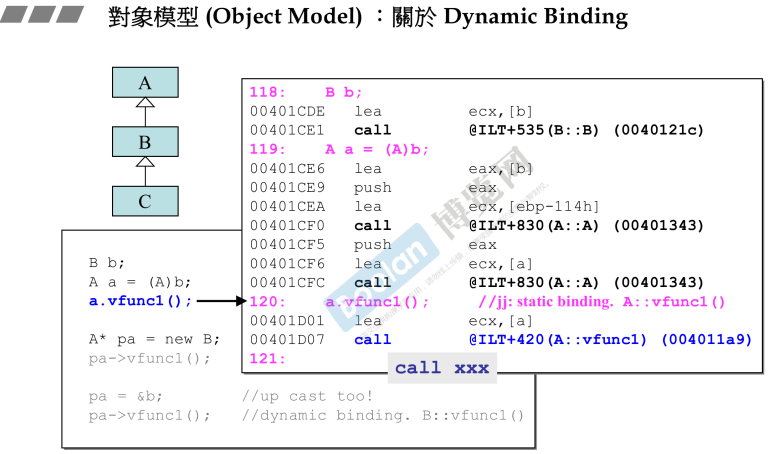
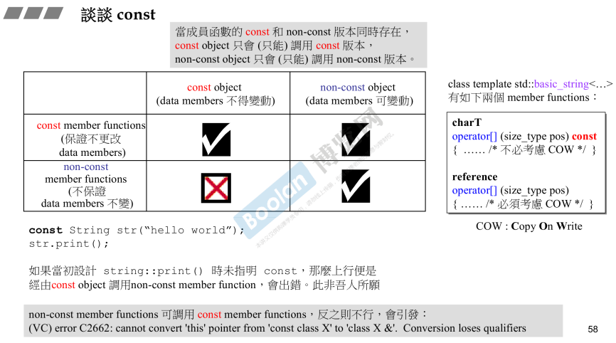



本文是学习侯捷老师的C++面向对象高级编程（下）的课程笔记。



### 1、导读

侯捷老师提到这个课程应该称为C++程序设计Ⅱ兼谈对象模型，因为他并没有过多的叙述面向对象编程，而是在上篇的基础上探讨一些没有讨论过的主题。

- 在先前基础课程所培养的正规、大器的编程素养上，继续探讨更多技术。
- 泛型编程(Generic Programming)和面向对象编程(Object-Oriented Programming)虽然分属不同思维但它们正是C++的技术主线，所以本课程也讨论template (模板)。
- 深入探索面向对象之继承关伪(inheritance)所形成的对象模型(Object Model)，包括隐藏于底层的this指针,vptr (虚指针), vtbl (虚表), virtual mechanism (虚机制),以及虚函数(virtual functions)造成polymorphism (多态)效果。

### 2、conversion function转换函数

作用：把一个class的类型转换成你想要的、自认为合理的类型，但是如何转换有自己在函数体内设计。

格式：`operator double() const{...}`

 注意事项：

1. 不能加返回类型，且要有关键字`double`；
2. 一般情况下都要加`const`；
3. 只要你认为合理，可以写多个转换函数，如`operator double() const{...}`, `operator string() const{...}`

```C++
class Fraction{
public: 
	Fraction (int num, int den= 1 ) : m_numerator(num)，m_denominator(den) { }
	operator double() const{  // 注意：不能有返回类型
		return (double) (m_numerator/ m_denominator);
    }
private :
	int m_numerator; //分子
	int m_denominator; // 分母
};
Fraction f(3,5) ;
double d=4+f; //调用operator double()将变量f的类型转换为double，值为0.6
```

### 3、non-explicit-one-argument constructor

non-explicit-one-argument ctor(非显式的一个实参的构造函数)其实与转换函数的功能**相反**，它的作用是：**把其他类型转换成该class的类型。**

如果**转换函数**和**non-explicit-one-argument ctor同时出现**，可能会**引起歧义**！

```c++
class Fraction{
public: 
	Fraction (int num, int den= 1 ) : m_numerator(num)，m_denominator(den) { }
	operator double() const{  // 注意：不能有返回类型
		return (double) (m_numerator/ m_denominator);
    }
    Fraction operator+ (const Fraction& f) { // +操作符
		return Fraction(...) 
    }
private :
	int m_numerator; //分子
	int m_denominator; // 分母
};
Fraction f(3,5);
Fraction d2=f+4; // [Error] ambiguous
```

- 此时编译器**可以**通过 non-explicit-one-argument ctor 把 4 转换成 Fraction 类型，再与f相加。**也可以**通过转换函数把 Fraction 类型的f转换成 0.6，再与 4 相加。编译器发现有**多条路**可以走通，则引起了**二义性（歧义）**。

解决办法：把**non-explicit**-one-argument ctor声明为**explicit**-one-argument ctor，这样就禁止默认转换了。

```c++
class Fraction{
 public:
	explicit Fraction (int num, int den= 1 ) : m_numerator(num)，m_denominator(den) { }
    //.....
}  
Fraction f(3,5);
Fraction d2=f+4; // [Error] conversion from 'double' to 'Fraction' requested
```

- 此时4无法转换为Fraction类型，那么就只有 f 可以转换为 double 类型，消除了二义性。但是f+4=4.6 得到一个double类型的结果，然而double类型的值无法转换为Fraction类型，所以依然导致报错。

### 4、pointer-like classes （仿指针）

**（1）智能指针**

**（2）迭代器**

### 5、function-like classes (仿函数)

所谓仿函数就是： 一个类，**重载操作符()之后**，表现的像一个函数。

### 6、namespace经验谈

namespace的主要用途就是为了避免命名冲突，在大型工程中尤为常见，避免A写的代码与B写的代码有重名的class或function。

自己在写一些测试代码时也可以使用命名空间封装起来。

### 7、class template 类模板

使用时加上<参数type>

### 8、Function template 函数模板

函数模板在使用时不需要加参数类型，编译器会自动推导参数的类型。

### 9、member template 成员模板

成员模板是指：在一个模板类里面的一个成员依旧是一个模板形式。

### 10、specialization（模板特化）

将泛化的模板指定为固定的模板参数类型

```c++
template <class Key> // 泛化
struct hash{...};

template<> // 特化
struct hash<long>{
    size_ t operator() (long x) const {return x; }
};
 cout << hash<long>()(1000); // 使用(全)特化模板
```

### 11、partial specialization （模板偏特化）

1. 个数上的偏特化

   即将模板中的某个/些参数提前绑定（赋予）默认值。

   ！！！注意：只能提前绑定靠后的模板参数，例：假设有五个模板参数，只能绑定3/4/5，不能绑定1/3/5

   ```c++
   template <typename T, typename U, typename Alloc=alloc, typename Container=vector<T>> 
   class C{...}; // 泛化，默认参数
   // 个数偏特化
   template <typename U, typename Alloc, typename Container>
   class C<int, T, Alloc, Container>{...}
   ```

2. 范围上的偏特化

   例如：将**什么类型都可以**传的模板，偏特化为**只有指针类型能**传的模板。

   ```c++
   template <typename T>
   class C{...};
   // 范围偏特化
   template <typename T>
   classC<T*>{...}
   
   C<string> obj1; // 使用上面的模板
   C<string*>  obj2; // 使用下面的偏特化模板（特别含有指针的模板）
   ```

### 12、模板模板参数

1. 模板模板参数就是模板的参数又是一个模板，如：

   ```c++
   template<typename T, template<typename U> class Container>
   class XCls
   {
       private:
           Container<U> c;
   };
   ```

   模板的第一个参数是`T`类型，第二个参数是一个`Container`，他是一个可以指定一个`U`类型的变量。

   那么如何使用他呢？

   ```c++
   template<typename T>
   class test
   {
       private:
           T t;
   };
   ```

   ```c++
   int main(void)
   {
       XCls<std::string, test> mylst1;
       return 0;
   }
   ```

   我们可以定义一个模板类，然后将其如上方式传入就可以了。

   但是如果传入一个容器呢？比如：`list`

   ```c++
   XCls<string, list> mylst1;
   ```

   如果这样，编译就会报错。分析如下：

   将`string` 和 `list`传入到类`XCls`中，然后就会定义一个`list<string>`的c变量，这样看起来是可以的，因此我们使用list容器的时候就是`list<一个类型>`，但是这里为什么就不行呢？是因为list容器实质上是有第二参数的，虽然第二参数有默认的参数，正如我们平常使用的那样，只需要指定一个参数，但是在这里无法通过编译，因此，我们使用如下解决办法：

   ```c++
   template<typename T>
   using Lst = std::list<T, std::allocator<T>>;
   
   XCls<std::string, Lst> mylst2;
   // 编译时需要加上std=c++11
   ```

   使用`C++11`的`using`关键字的新功能，来定义一个类型的别名，而且使用在模板的情况下，因此我们编译时要指定`std=c++11`。

   然后我们将`list`的别名`Lst`传入进入，就可以编译通过。

2. 这不是模板模板参数

   ```c++
   template<typename T, typename Sequence = list<T>>
   class stack
   {
       private:
           Sequence c;
   };
   stack<int> s1;
   stack<int, deque<int>> s2; 
   stack<int, deque> s3; 
   ```

   第一种，只指定了第一个模板参数，使用第二个默认的模板参数，第三个可以仅指定容器类型而不需要再次指定元素类型。

   第二种，指定了两个模板参数。

   但是！**这不是模板模板参数**。因为，一旦指定了第一个模板参数，那么第二个参数的类型就会确定，而真正的模板模板参数，第二个模板参数和第一个模板参数的类型是没有关系的，可以指定为第一个模板参数的类型，也可以指定为其他类型。因此，这不是模板模板参数！！！

### 13、C++标准库

侯捷老师提到，一定要多多使用、了解、学习C++的标准库！最好是自己亲自动手编程使用那些标准库，不需要自己再次编程实现标准库，因为你实现的没它实现的好，只需要学习怎么使用就行。

### 14、三个主题——variadic templates、auto、ranged-based for

**（一）variadic templates （since C++11）**

variadic templates即：**数量不定的模板参数**。它有如下特点：

- 该语法是C++11的新特性，它可以传入数量不定的模板参数，它把传入的参数分为：**一个**和**一包**。
- 如果你想确定这“一包”参数具体有多少个，可以用语法：`sizeof...(args)`。

```c++
template<typename T, typename... Types>
void print(const T& firstArg, const Types&... args){
    cout << firstArg << endl;
    print(args...); // 递归
}
print(7.5, "hello", bitset<16>(377), 42); // 调用print模板函数
// 此时 "hello", bitset<16>(377), 42这些实参就是args
```

**二）auto （since C++11）**

auto其实就是一个语法糖，面对复杂的返回类型可以用auto自动推导出来。

**（三）ranged-based for （since C++11）**

范围for循环，也是C++11的一个语法糖。它有如下特点：

- 它有两个参数，一个是自己创建的变量，另一个是一个**容器**。
- 范围for循环可以将一个容器(第二个参数)里的元素依次传第一个参数，并在该循环体中依次对每一个元素做操作。
- 如果你不想影响容器中的参数，请**pass by value**，否则请**pass by reference**。

```c++
vector<int> vec;
// .....
for(auto elem : vec){ // pass by value
    cout << elem << endl;
}
for(auto& elem : vec){  // pass by reference
    elem *= 2;
}
```

### 15、Reference

编译器其实把reference视作一种pointer。引用有如下特点：

- 引用是被引用对象的一个**别名**。
- 引用**一定要有初始化**。
- object和其reference的大小相同，地址也相同（**全都是假象**）
- reference通常不用于声明变量，而**用于参数类型（parameters type）和返回类型（return type）**的描述。
- 在函数调用的时候，pass by value和pass by reference传参形式一样，而且reference比较快，所以推荐一般pass by reference。

```c++
double image(const double& img) {...}
double image(const double img) {...} //Ambiguity（二义性）
```

二者不能同时存在，因为调用的时候都是`image(img)`，会造成二义性。

```c++
double image(const double img) {...}
double image(const double img) const {...}
```

`Const`是函数签名的一部分，所以上面的两个函数可以同时存在。

### 16、复合&继承关系下的构造和析构

该部分主要讲了三点：

（1）复合关系下的构造和析构

（2）继承关系下的构造和析构

（3）继承+复合关系下的构造和析构

其中（1）（2）在面向对象高级编程（上）已经讲过了，请自行回顾。

### 17、关于vptr和vtbl

**vptr**: virtual pointer(虚指针)

**vtbl**: virtual table(虚表)

- 当子类继承父类时，除了继承数据之外，同时会继承父类的虚函数。
- 继承父类的函数，继承的其实是它的**调用权**，而不是内存大小。

看图说话：



- B类的内存大小= 继承A类的数据 + B本身的数据；C类的内存大小 =B的数据 + C本身的数据。(如图左边所示)
- A有两个虚函数`vfunc1`、`vfunc2`以及两个非虚函数`func1`、`func2`；B类继承A类的`vfunc2`，同时覆写A类的虚函数`vfunc1`，此时B有两个虚函数(`vfunc1`和`vfunc2`)；C类继承了B类的虚函数`vfunc2`（`vfunc2`其实是从A继承而来的），同时覆写了B类的虚函数`vfunc1`，也有两个虚函数(`vfunc1`和`vfunc2`)。
- 请注意：A B C三个类的非虚函数`func2()`，他们虽然重名，但其实彼此之间毫无关系，这一点要注意，千万别以为B的非虚函数是继承A的非虚函数。
- A B C这三个类一共有八个函数，四个非虚函数，四个虚函数。（关系图中间偏右）。
- 只要一个类拥有虚函数，则就会有一个**虚指针vptr**，该vptr指向一个**虚表vtbl**，**虚表vtbl中放的都是函数指针，指向虚函数所在的位置**。（可以观察到，关系图中虚表中的函数指针都指向相应的虚函数的位置）这其实就是**动态绑定**的关键。
- 如果创建一个指向 C 类的指针p（如`C* p= new C()`）,如果让该**指针p调用虚函数** `C::vfunc1()`，则编译器就知道这是动态绑定，故这时候就会通过 p 找到 vptr，在找到 vtbl，最终通过 vtbl的函数指针找到相应的虚函数。

一个**多态**的例子：一个容器，其元素是指针类型，它的功能是要画出不同的形状，所以要用虚函数，子类要进行覆写实现自己的形状绘制。



- 右下角的`list<A*> myLst;` 就是存储不同形状的指针的容器。没有任何一个容器能够存储不同类型的元素，所以只能使用指针 `A*`。

  ```c++
  A* p = new C();
  p->draw(); // 调用的是C的draw()函数
  ```

- 小总结：C++编译器看到一个函数调用，它有两个考量：

  - 是静态绑定吗？（Call ×××地址×××）

  - 还是动态绑定。

    ！！！！要想**动态绑定**要满足三个条件：

    - 第一：必须是**通过指针来调用**
    - 第二：该指针是**向上转型**(up-cast)的
    - 第三：调用的是**虚函数**

### 18、关于this

当你通过一个对象**调用**一个函数，该**对象的地址就是this指针**。



### 19、关于Dynamic Binding

从汇编角度看一下：

下图中 a是一个**对象**，它调用函数是一个**静态绑定**，可以看到汇编呈现的就是：Call xxx一个地址



下图中pa满足**动态绑定的三个条件**，所以它是一个动态绑定，而在汇编语言中，汇编所呈现出来的那部分命令就等价于C语言中的`(*(p->vptr)[n])(p)`:


### 20、谈谈const

- non-const成员函数可调用const成员函数，反之则不行。
- **const 对象不可以调用 non-const成员函数**，但是non-const 对象可以调用 const 成员函数。
- **const 也是函数签名的一部份**，即可构成函数重载。
- 当成员函数的 **const** 和 **non-const** 版本**同时存在**，**const对象只能（只会）调用const版本的成员函数，non-const对象只能（只会）调用non-const版本的成员函数。**



### 21、关于 new 和 delete

- new 和 delete 配合使用

这部分在[C++面向对象高级编程（上-侯捷）/#8、堆、栈与内存管理](/C/C++面向对象高级编程（上-侯捷）/#8、堆、栈与内存管理)中有详细的笔记。

建议观看视频！


