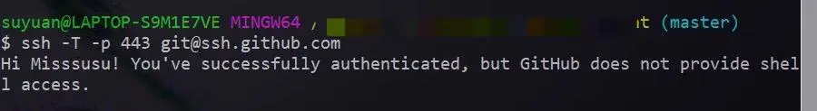

# Git 安装

1. Git官网链接：[Git](https://git-scm.com/) ，除了安装位置，其余全部默认

2. 打开cmd 输入`git` 验证安装完成

3. 安装Git后首先要做的事情是设置你的用户名称和e-mail地址。打开 Git Bush 命令行界面，输入：

   ```shell
   git config --global user.name "name"  #名称
   git config --global user.email "xx@xx.com"   #邮箱
   ```

4. 查询配置：

   ``` shell
   git config --global --list
   ```

5. 生成ssh文件夹, 在 Git Bush 输入:

   ``` shell
   ssh-keygen -t rsa
   ```

   敲击三次回车键，文件目录-C:\Users\用户名.ssh 

6. 将ssh文件夹中的公钥（ id_rsa.pub）添加到GitHub管理平台中（添加后会收到邮件提示）

   - 在GitHub界面点击:

     头像-->settings-->SSH and GPG keys --> New SSH key -->把id_rsa.pub的内容复制到Key文本框-->Add SSH key

7. 在Git Bush 输入：

   ``` shell 
   ssh -T git@github.com
   ```


# Git安装种遇到的问题


## 解决 Failed to connect to github.com port 443:connection timed out

#### 一、第一种

打开Git Bush命令行窗口，输入一下命令：

```
git config --global http.proxy http://127.0.0.1:7890

git config --global https.proxy https://127.0.0.1:7890
```

其中**7890**是本地代理的端口号

```
取消全局代理：
git config --global --unset http.proxy
 
git config --global --unset https.proxy
```

#### 二、第二种

1.  先测试可用性

   ```shell
   ssh -T -p 443 git@ssh.github.com
   ```

    

2. 然后编辑 `~/.ssh/config` 文件，如果没有config文件的话就直接 `vim ~/.ssh/config`加入以下内容

   ```shell
   Host github.com
   Hostname ssh.github.com
   Port 443
   ```

3. 再次测试

   ```shell
   ssh -T git@github.com
   ```

   提示如下就说明成功了

   


# 上传本地文件（夹）到GitHub和更新仓库文件

**第一步：建立git仓库，cd到你的本地项目根目录下，执行git命令**

```shell
git init
```

**第二步：将项目的所有文件添加到仓库中**

```shell
git add .
```

**第三步：将add的文件commit到仓库**

```shell
git commit -m "注释语句"
```

**第四步：去github上创建自己的Repository**

复制弹出的地址**git@github.com:\**\*/\*\*.git**，记得要用**SSH**的地址，尽量不要用HTTPS的地址。

**第五步：将本地的仓库关联到github上---把上一步复制的地址放到下面**

```shell
git remote add origin git@github.com:***/***.git
```

**第六步：上传github之前，要先pull一下，执行如下命令：**

```shell
git pull origin master
```

**第七步，上传代码到github远程仓库**

```shell
git push -u origin master
```

