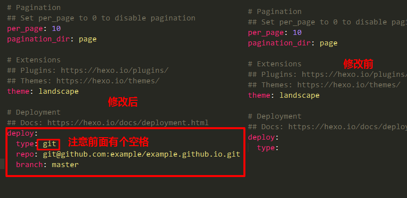



本文记录第一次使用Hexo在GitHub上搭建博客，包括需要的环境配置以及搭建过程中遇到的问题。



## Node.js的 安装和环境配置

1. 下载安装[Nodejs](https://nodejs.org/en/download/) 

2. 在系统变量中查看【path】，点击【编辑】，将nodejs的本地安装地址添加到path中

3. 执行命令`node -v`查看node版本

4. 执行`npm -v`查看npm版本

5. 在系统环境变量中添加 `node_globa`的地址：

   - 设置环境变量，打开【系统属性】-【高级】-【环境变量】，在`系统变量`中新建

   - 变量名：`NODE_PATH`

   - 变量值：`D:\Tools\Nodejs\node_modules`

6. 使用指令`npm root -g`查看npm包默认安装位置（为了避免以后npm的包都安装在C盘，下面会更改下载位置）

7. 在你Node.js的安装位置（与`node_modules`文件夹同级目录），新建两个文件夹，`node_global`和`node_cache`，并执行以下命令

   ``` shell
   npm config set prefix "D:\Tools\Nodejs\node_global"
   npm config set cache "D:\Tools\Nodejs\node_cache"
   ```

8. 编辑`用户变量（环境变量）`的 path，将默认的 C 盘下 `APPData\Roaming\npm` 修改成 `D:\Tools\Nodejs\node_global`，点击确定

9. 最后别忘了在系统变量`Path`里面添加`D:\Tools\Nodejs\node_global`

10. 添加国内npm镜像源 

    ```shell
    npm config set registry https://registry.npm.taobao.org
    ```

    下载cnpm

    ```shell
    npm install -g cnpm --registry=https://registry.npm.taobao.org
    ```

    

## Git的安装和环境配置

1. Git官网链接：[Git](https://git-scm.com/) ，除了安装位置，其余全部默认

2. 打开cmd 输入`git` 验证安装完成

3. 安装Git后首先要做的事情是设置你的用户名称和e-mail地址。打开 Git Bush 命令行界面，输入：

   ```shell
   git config --global user.name "name"  #名称
   git config --global user.email "xx@xx.com"   #邮箱
   ```

4. 查询配置：

   ``` shell
   git config --global --list
   ```

5. 生成ssh文件夹, 在 Git Bush 输入:

   ``` shell
   ssh-keygen -t rsa
   ```

   敲击三次回车键，文件目录-C:\Users\用户名.ssh 

6. 将ssh文件夹中的公钥（ id_rsa.pub）添加到GitHub管理平台中（添加后会收到邮件提示）

   - 在GitHub界面点击:

     头像-->settings-->SSH and GPG keys --> New SSH key -->把id_rsa.pub的内容复制到Key文本框-->Add SSH key

7. 在Git Bush 输入：

   ``` shell 
   ssh -T git@github.com
   ```

8. 新建GitHub仓库，仓库名字必须为 [username].github.io （username必须为你的GitHub名称）

   

## 安装Hexo

1. 在本地新建文件夹保存Hexo博客，在Git Bush中打开该目录，然后依次输入如下命令：

   ``` shell
   cnpm install -g hexo-cli  # 下载hexo脚手架
   hexo -v  # 验证hexo
   hexo init  # 初始化
   hexo s  # 在本地启动hexo
   ```

​	可以在本地打开博客地址看看。

2. 新建md

   - 进入博客目录，然后执行

   ```shell
   hexo n "name"
   ```

   - 本地打开该md文件编辑内容并保存

3. 本地发布博客

   ```shell
   hexo clean
   hexo g
   hexo s
   ```

​       本地浏览器输入 `http:\\localhos:4000`在本地预览博客

4. 部署到GitHub

   - 首先需要安装发布的插件，在站点目录下执行下面的命令，也就是创建的博客目录下：

     ```shell
     npm install hexo-deployer-git --save
     ```

   - 设置`_config.yml`文件

     

     repo: GitHub仓库地址

   - 发布到远端

     ```shell
     hexo d
     ```

     首次需要输入GitHub账号密码

   - 在浏览器输入仓库地址就能访问

5. 修改博客主题

   - 下载主题

     ```shell
     git clone https://github.com/jerryc127/hexo-theme-butterfly.git
     ```

   - 修改 `_config.yml`文件

     ```yml
     # Extensions
     ## Plugins: https://hexo.io/plugins/
     ## Themes: https://hexo.io/themes/
     theme: butterfly  # 修改主题名称，该名称为你的主题文件夹名称
     ```

   - 重新发布

     ```shell
     hexo g
     hexo s
     hexo d
     ```

## 安装中遇到的问题

### Hexo 使用本地图片

1. 更改 _config.yml 配置

   ``` yml
   post_asset_folder: true
   marked:
     prependRoot: true
     postAsset: true
   ```

2. 安装`hexo-renderer-markdown-it` 和 `hexo-image-link`

   ``` shell
   npm uninstall hexo-renderer-marker --save  #卸载 marked
   npm install hexo-renderer-markdown-it --save  #安装markdown-it
   npm install hexo-image-link --save  # 安装hexo-image-link
   ```

3. 路径使用解释

   Hexo将会在你每一次通过 `hexo new [layout] <title>` 命令创建新文章时自动创建一个同名文件夹。

   文件名:  `./test.md`

   图片路径: ` ./test/image.jpg`

   当插入图片 image.jpg 到 test.md 中时，typora 的引用路径为 :

   ```markdown
   
   ```

   Hexo 发布后的引用路径为:

   ```markdown
   
   ```

   此时该图片在本地markdown文件中和博客主页中都能正常显示。

### Markdown中嵌套网页

1. 在markdown文件中加入一下代码：

```html
 <iframe  
 height=850 
 width=90% 
 src="http://mctool.wangmingchang.com/index/jspay/dashang"  
 frameborder=0  
 allowfullscreen>
 </iframe>
// src="目标网页地址"
```

2. 如果想在hexo中使用本地文件还需要做如下操作

   在hexo的配置文件`_config.yml`中，做如下修改：

   ```yml
   skip_render:
     - "games/2048小游戏/2048.html"
     - "games/2048小游戏/css/*"
     - "games/2048小游戏/js/*"
   ```

   `skip_render`代表不希望被hexo渲染的页面，希望hexo直接使用。

   ``` yml
   "/2048.html" # 表示跳过该文件
   "/css/*"  # 表示跳过该文件夹下的文件
   "/css/**"  # 表示跳过该文件夹以及文件夹下的文件夹下的所有文件
   ```

   

### Nunjucks Error expected variable end解决办法

**问题描述**：`hexo g`，`hexo s`都报错

```
COPYFATAL Something's wrong. Maybe you can find the solution here: https://hexo.io/docs/troubleshooting.html
Nunjucks Error:  [Line 78, Column 29] expected variable end
```

参见[官网链接](https://hexo.io/docs/troubleshooting.html#Escape-Contents)

Hexo使用Nunjucks渲染帖子（较早的版本使用Swig，它们具有相似的语法）。用`{ { } }`或`{ ％ ％ }`包装的内容将被解析，并可能导致问题。您可以使用原始标签插件包装**敏感内容**。

```markdown
  # 在敏感内容前加上这个
Hello {{ sensitive }}   #这一行是敏感内容
  # 在敏感内容后加上这个
```

