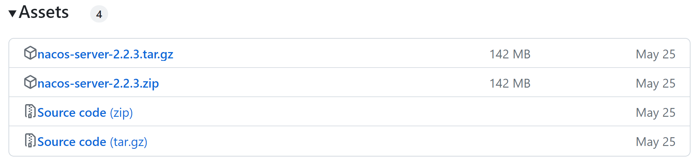

 



nacos作为配置中心的使用方法可以参考nacos官网：[Nacos Spring Cloud 快速开始](https://nacos.io/zh-cn/docs/quick-start-spring-cloud.html)



# 1. Windows安装

开发阶段采用单机安装即可。

## 1.1 下载安装包

在Nacos的GitHub页面，提供有下载链接，找到你需要的版本：

版本对应： [Nacos与SpringBoot的版本对应关系](https://github.com/alibaba/spring-cloud-alibaba/wiki/%E7%89%88%E6%9C%AC%E8%AF%B4%E6%98%8E) 

GitHub主页：https://github.com/alibaba/nacos

GitHub的Release下载页：https://github.com/alibaba/nacos/releases

如图：



windows版本使用`nacos-server-2.2.3.zip`包即可。(当你看到这篇博客时，可能版本已经更新了)

## 1.2 解压

将这个包解压到任意**非中文目录**下，如图：


目录说明：

- bin：启动脚本
- conf：配置文件


## 1.3 端口配置

Nacos的默认端口是8848，如果你电脑上的其它进程占用了8848端口，请先尝试关闭该进程。

**注意**：使用nacos-client 2.x版本时，必须保证nacos server对应的9849端开放。

**如果无法关闭占用8848端口的进程**，也可以进入nacos的conf目录，修改配置文件中的端口：


修改其中的内容：


## 1.4 启动

启动非常简单，进入bin目录，结构如下：


然后执行命令即可：

- windows命令（其中 -m standalone 表示 单机模式运行 ），默认为 cluster（集群）模式：

  ```shell
  startup.cmd -m standalone
  ```


执行后的效果如图：


## 1.5 访问

在浏览器输入地址：http://127.0.0.1:8848/nacos即可：


默认的账号和密码都是nacos，进入后：


# 2.Linux安装

Linux或者Mac安装方式与Windows类似。

## 2.1 安装JDK

Nacos依赖于JDK运行，索引Linux上也需要安装JDK才行。

上传jdk安装包：


上传到某个目录，例如：`/usr/local/`


然后解压缩：

```sh
tar -xvf jdk-8u144-linux-x64.tar.gz
```

然后重命名为java

配置环境变量：

```sh
export JAVA_HOME=/usr/local/java
export PATH=$PATH:$JAVA_HOME/bin
```

设置环境变量：

```sh
source /etc/profile
```


## 2.2 上传安装包

在Nacos的GitHub页面，提供有下载链接，找到你需要的版本：

GitHub主页：https://github.com/alibaba/nacos

GitHub的Release下载页：https://github.com/alibaba/nacos/releases

如图：


上传到Linux服务器的某个目录，例如`/usr/local/src`目录下：


## 2.3 解压

命令解压缩安装包：

```sh
tar -xvf nacos-server-1.4.1.tar.gz
```

然后删除安装包：

```sh
rm -rf nacos-server-1.4.1.tar.gz
```

目录中最终样式：


目录内部：


## 2.4 端口配置

与windows中类似


## 2.5 启动

在nacos/bin目录中，输入命令启动Nacos：

```sh
sh startup.sh -m standalone
```


# 3.Nacos的依赖

父工程：（version 的版本与SpringCloud对应 ，查看[版本说明](https://github.com/alibaba/spring-cloud-alibaba/wiki/%E7%89%88%E6%9C%AC%E8%AF%B4%E6%98%8E)）

```xml
<dependencyManagement>
    <dependencies>
        <dependency>
            <groupId>com.alibaba.cloud</groupId>
            <artifactId>spring-cloud-alibaba-dependencies</artifactId>
            <version>2021.0.5.0</version>
            <type>pom</type>
            <scope>import</scope>
        </dependency>
    </dependencies>
</dependencyManagement>
```

客户端：

```xml
<!-- nacos客户端依赖包 -->
<dependency>
    <groupId>com.alibaba.cloud</groupId>
    <artifactId>spring-cloud-starter-alibaba-nacos-discovery</artifactId>
</dependency>

```

