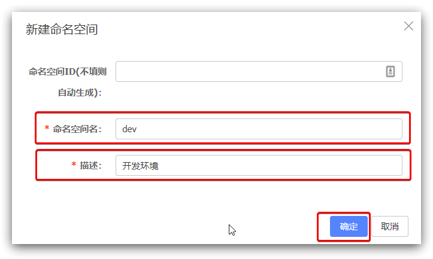
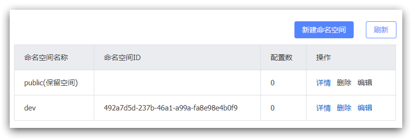

# Nacos注册中心

## 环境版本

- SpringBoot  2.6.13
- SpringCloud   2021.0.5
- JDK 1.8
- Maven 3.6.3

[Nacos与SpringBoot的版本对应关系](https://github.com/alibaba/spring-cloud-alibaba/wiki/%E7%89%88%E6%9C%AC%E8%AF%B4%E6%98%8E) ，**一定要使用对应的版本！**

安装方式可以参考[《Nacos安装指南》](/Java/Nacos下载安装/)

## 1. 服务注册发现

Nacos是SpringCloudAlibaba的组件，而SpringCloudAlibaba也遵循SpringCloud中定义的服务注册、服务发现规范。

### 1）引入依赖

在父工程的pom文件中的`<dependencyManagement>`中引入SpringCloudAlibaba的依赖：

```xml
<dependencyManagement>
    <dependencies>
        <dependency>
            <groupId>com.alibaba.cloud</groupId>
            <artifactId>spring-cloud-alibaba-dependencies</artifactId>
            <version>2021.0.5.0</version>
            <type>pom</type>
            <scope>import</scope>
        </dependency>
    </dependencies>
</dependencyManagement>
```

然后在子工程中的pom文件中引入nacos-discovery依赖：

```xml
<dependency>
    <groupId>com.alibaba.cloud</groupId>
    <artifactId>spring-cloud-starter-alibaba-nacos-discovery</artifactId>
</dependency>
```


### 2）配置nacos地址和注册名

在user-service和order-service的application.yml中添加nacos地址：

```yaml
spring:
  cloud:
    nacos:
      server-addr: localhost:8848
  application:
    name: user-service  #  order-service
```

### 3）添加注解

在启动类上，使用 @EnableDiscoveryClient 注解开启服务注册与发现功能


### 4）重启

重启微服务后，登录nacos管理页面，可以看到微服务信息：

网址：http://127.0.0.1:8848/nacos

默认的账号和密码都是nacos


## 2. 服务注册管理

注意：nacos1.x 和 nacos2.x 的配置方式发生了变化，在[Spring Cloud Alibaba 2021.0.1.0 升级指南](https://github.com/alibaba/spring-cloud-alibaba/blob/2021.x/spring-cloud-alibaba-docs/src/main/asciidoc-zh/sca-upgrade-guide.adoc#spring-cloud-alibaba-2021010-升级指南)中，也对此进行了详细说明。

此篇文档只介绍nacos2.x 的使用方式，参考 [Spring Cloud Alibaba Nacos Config](https://github.com/alibaba/spring-cloud-alibaba/blob/2021.x/spring-cloud-alibaba-docs/src/main/asciidoc-zh/nacos-config.adoc#spring-cloud-alibaba-nacos-config)

### 1）引入依赖

在父工程的pom文件中的`<dependencyManagement>`中引入SpringCloudAlibaba的依赖：

```xml
<dependencyManagement>
    <dependencies>
        <dependency>
            <groupId>com.alibaba.cloud</groupId>
            <artifactId>spring-cloud-alibaba-dependencies</artifactId>
            <version>2021.0.5.0</version>
            <type>pom</type>
            <scope>import</scope>
        </dependency>
    </dependencies>
</dependencyManagement>
```

然后在子工程中的pom文件中引入nacos-config依赖：

```xml
<dependency>
    <groupId>com.alibaba.cloud</groupId>
    <artifactId>spring-cloud-starter-alibaba-nacos-config</artifactId>
</dependency>
```

### 2）配置application.yml

`spring-cloud-alibaba`从`2021.0.1.0`版本开始，默认使用`spring.config.import`方式引入配置，如果您想继续使用`bootstrap` 方式加载配置，您可以在项目根`pom.xml`文件中加入以下依赖：

```xml
<dependency>
    <groupId>org.springframework.cloud</groupId>
    <artifactId>spring-cloud-starter-bootstrap</artifactId>
    <version>3.1.1</version>
</dependency>
```

在运行此 NacosConfigApplication 之前，您需要先配置 `application.yaml` 文件中的 Nacos Server 地址，并引入对应的配置，例如：

```yaml
spring:
  application:
    name: nacos-config
  cloud:
    nacos:
      config:
        serverAddr: 127.0.0.1:8848
        namespace: 38824c8f-36ed-4f33-9ed7-a45d61616b46  # 若不配置，默认为public
        group: dev  # GROUP 不配置默认使用 DEFAULT_GROUP。
  config:
    import:
      - nacos:nacos-config.yaml  # DataID 可以修改
```

### 3）创建配置

在 Nacos 的控制台（http://localhost:8848/nacos/index.html）新增一个DataId为yaml为扩展名的配置，如下所示：


然后在弹出的表单中，填写配置信息：


### 4）读取远程配置

可以通过 `@Value` 读取配置

```java
@RestController
@RequestMapping("test")
public class testController {

    @Value("${nacos.user.name}")
    private String name;
    @Value("${nacos.user.age}")
    private Integer age;
    
}
```

此时就可以获取在nacos配置文件中配置的内容。但是存在一个**问题**：修改远程内容后，服务端无法读取最新的内容。**动态刷新**闪亮登场！！

### 5）动态刷新

Nacos Config Starter 默认为所有获取数据成功的 Nacos 的配置项添加了监听功能，在监听到服务端配置发生变化时会实时触发 `org.springframework.cloud.context.refresh.ContextRefresher` 的 refresh 方法 。

如果需要对 Bean 进行动态刷新，请参照 Spring 和 Spring Cloud 规范。推荐给类添加 `@RefreshScope` 或 `@ConfigurationProperties ` 注解。

在之前的配置类上添加`@RefreshScope`注解：

```java
@RestController
@RequestMapping("test")
@RefreshScope  // 动态刷新
public class testController {

    @Value("${nacos.user.name}")
    private String name;
    @Value("${nacos.user.age}")
    private Integer age;
    
}
```

添加`@RefreshScope`注解后，重启服务。再次修改远程配置内容，点击【发布】按钮，就可以获取每次更新后的配置内容。

## 3. 命名空间和分组 

Nacos提供了namespace来实现环境隔离功能。

- nacos中可以有多个namespace
- namespace下可以有group、service等
- 不同namespace之间相互隔离，例如不同namespace的服务互相不可见


### 1） 创建namespace

默认情况下，所有service、data、group都在同一个namespace，名为public：


我们可以点击页面新增按钮，添加一个namespace：


然后，填写表单：



就能在页面看到一个新的namespace：




### 2） 给微服务配置namespace

给微服务配置namespace只能通过修改配置来实现。

例如，修改order-service的application.yml文件：

```yaml
spring:
  cloud:
    nacos:
      server-addr: localhost:8848
      config:
        namespace: 492a7d5d-237b-46a1-a99a-fa8e98e4b0f9 # 命名空间，填ID
        group: dev
```

### 3）namespace 与 group 最佳实践

每个微服务创建自己的 namespace 进行隔离，group 来区分 dev，prod，test 等环境


## 4. 服务分级存储模型

一个**服务**可以有多个**实例**，例如我们的user-service，可以有:

- 127.0.0.1:8081
- 127.0.0.1:8082
- 127.0.0.1:8083

假如这些实例分布于全国各地的不同机房，例如：

- 127.0.0.1:8081，在上海机房
- 127.0.0.1:8082，在上海机房
- 127.0.0.1:8083，在杭州机房

Nacos就将同一机房内的实例 划分为一个**集群**。

也就是说，user-service是服务，一个服务可以包含多个集群，如杭州、上海，每个集群下可以有多个实例，形成分级模型，如图：


微服务互相访问时，应该尽可能访问同集群实例，因为本地访问速度更快。当本集群内不可用时，才访问其它集群。例如：


杭州机房内的order-service应该优先访问同机房的user-service。


### 1）给user-service配置集群

修改user-service的application.yml文件，添加集群配置：

```yaml
spring:
  cloud:
    nacos:
      server-addr: localhost:8848
      discovery:
        cluster-name: HZ # 集群名称
```

重启两个user-service实例后，我们可以在nacos控制台看到下面结果：


我们再次复制一个user-service启动配置，添加属性：

```sh
-Dserver.port=8083 -Dspring.cloud.nacos.discovery.cluster-name=SH
```

配置如图所示：


启动UserApplication3后再次查看nacos控制台：


### 2）同集群优先的负载均衡

默认的`ZoneAvoidanceRule`并不能实现根据同集群优先来实现负载均衡。

因此Nacos中提供了一个`NacosRule`的实现，可以优先从同集群中挑选实例。

1）给order-service配置集群信息

修改order-service的application.yml文件，添加集群配置：

```sh
spring:
  cloud:
    nacos:
      server-addr: localhost:8848
      discovery:
        cluster-name: HZ # 集群名称
```


2）修改负载均衡规则

修改order-service的application.yml文件，修改负载均衡规则：

```yaml
userservice:
  ribbon:
    NFLoadBalancerRuleClassName: com.alibaba.cloud.nacos.ribbon.NacosRule # 负载均衡规则 
```


## 5. 权重配置

实际部署中会出现这样的场景：

服务器设备性能有差异，部分实例所在机器性能较好，另一些较差，我们希望性能好的机器承担更多的用户请求。

但默认情况下NacosRule是同集群内随机挑选，不会考虑机器的性能问题。


因此，Nacos提供了权重配置来控制访问频率，权重越大则访问频率越高。


在nacos控制台，找到user-service的实例列表，点击编辑，即可修改权重：


在弹出的编辑窗口，修改权重：


> **注意**：如果权重修改为0，则该实例永远不会被访问
