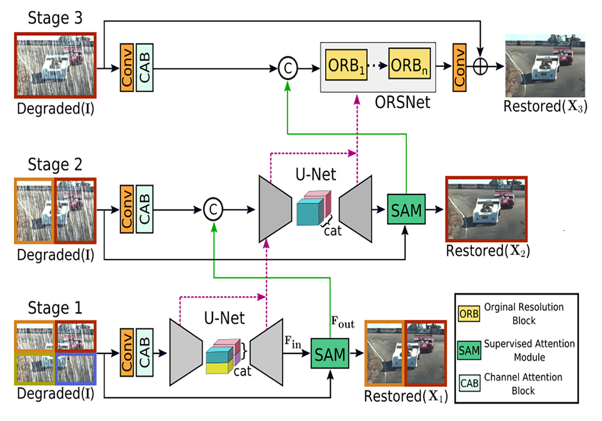
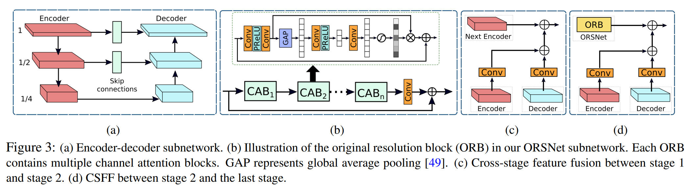
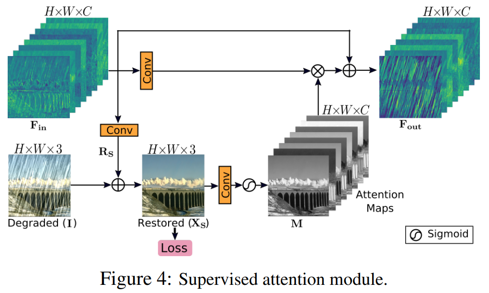



- Multi-Stage Progressive Image Restoration是2021年发表在CVPR上的一篇关于Image Restoration的论文，作者提出了一种新的network architecture——MPRnet。
- 论文下载地址：https://arxiv.org/abs/2102.02808
- 代码托管：https://github.com/swz30/MPRNet



## 一、Abstract

图像恢复任务在恢复图像时需要**空间细节**和**高级上下文信息**之间的复杂平衡。在本文中，**作者提出了一种新的协同设计，可以最佳地平衡这些竞争目标**。主要提出一个多阶段架构，它逐步学习降级输入的恢复功能，从而将整个恢复过程分解为更易于管理的步骤。具体来说，该模型首先使用**编码器-解码器**架构学习上下文化特征，然后将它们**与保留本地信息的高分辨率分支相结合**。在每个阶段，我们引入一种新颖的**每像素自适应设计**，利用原位**监督注意力**来重新加权局部特征。**这种多阶段架构的一个关键要素是不同阶段之间的信息交换。**为此，作者提出了一种双向方法，其中信息不仅从早期到后期按顺序交换，而且特征处理块之间还存在横向连接，以避免任何信息丢失。由此产生的紧密互联的多阶段架构称为**MPRNet**，在包括**图像去噪、去模糊和去噪**在内的一系列任务中，在十个数据集上提供了强大的性能增益。

## 二、Contributions

1. 一个新颖的基于多阶段方法，生成具有丰富上下文以及精确的空间信息的能力。基于其多阶段的本质，我们提出的框架将图像恢复的任务拆分为了几个子问题来进行渐进式的恢复。
2. 一个有效的监督注意力模块，在多阶段任务中，能在达到下一个阶段之前更有效地利用当前恢复的图像数据。
3. 提出了一个跨阶段的多尺度特征融合方法。
4. 我们在10个生成数据集以及真实数据集上完成各种修复任务展示了MPRNet的性能（包括图像去雨、去模糊和去噪），同时保持低的复杂性。

## 三、Multi-Stage Progressive Restoration

提出的图像恢复框架包括三个逐步恢复图像的阶段。前两个阶段是**基于编码器-解码器子网络**，由于大的感受野，这些子网络学习广泛的上下文信息。由于图像恢复是一个位置敏感的任务(需要从输入到输出的像素到像素的对应关系)，最后一个阶段采用了一个**在原始输入图像分辨率上操作的子网络(没有任何下采样操作)**，从而在最终输出图像中保留所需的精细纹理。

本模型不是简单地级联多个阶段，而是在每两个阶段之间加入一个**受监督的注意力模块**。在清晰图像的监督下，该模块在将前一阶段的特征图传递到下一阶段之前对其进行重新缩放。此外，引入了**跨阶段特征融合机制**，其中早期子网络的中间多尺度上下文化特征有助于巩固后一子网络的中间特征。

虽然MPRNet堆叠了多个阶段，但每个阶段都可以访问输入图像。在输入图像上调整多面片层次结构，并将图像分割成不重叠的面片：四个用于Stage1，两个用于Stage2，原始图像用于最后阶段。在任何给定的Stage S，不是直接预测恢复的图像${X_S}$ ，所提出的模型预测残差图像$R_S$，退化的输入图像 $I$ 被添加到该残差图像$R_S$ 以获得: $X_S$ = $I$ + $R_S$ 。我们通过以下损失函数优化**MPRNet**端到端:
$$
L = \sum\limits_{S = 1}^3 {[ {L_{char}}({X_S},Y) + \lambda {L_{edge}}({X_S},Y)]}~~~~~~~~~~~~~~~~~~~~~~~(1)
$$
其中 $Y$ 代表真实图像，而 ${L_{char}}$代表 *Charbonnier* 损失：
$$
{L_{char} } = \sqrt { { {\left\| { {X_S} - Y} \right\|}^2} + {\varepsilon ^2} } ~~~~~~~~~~~~~~~~~~~~~~~~~~~~~~~~~~~~~~~~~~~~~~(2)
$$
对于所有实验，常数 $ \varepsilon$ 根据经验设置为$ {10^{ - 3}}$。此外，边缘损耗 $L_{edge}$ 定义为:
$$
{L_{edge} } = \sqrt { { {\left\| {\Delta ({X_S}) - \Delta (Y)} \right\|}^2} + {\varepsilon ^2} } ~~~~~~~~~~~~~~~~~~~~~~~~~~~~~~~~~(3)
$$
其中 $\Delta$ 表示拉普拉斯算子。等式(1)中的参数 $\lambda$ 控制两个损失项的相对贡献，设置为0.05。接下来，描述提出方法的每个关键部分。

###  3.1 Complementary Feature Processing

现有的用于图像恢复的单级CNNs通常使用以下架构设计之一：1).编-解码器，2).单尺度特征主线。编-解码器网络首先逐渐将输入映射到低分辨率表示，然后逐渐应用反向映射来恢复原始分辨率。虽然这些模型有效地编码了多尺度信息，**但是由于重复使用下采样操作，它们易于牺牲空间细节**。

**编-解码器子网**：图3a显示了编-解码器子网，它基于标准的U-Net，具有以下组件。首先，添加通道注意块(CABs) 来提取每个尺度的特征(CABs见图3b)。第二，U-Net跳过连接的特征映射也用CAB处理。最后，我们不是使用转置卷积来提高解码器中特征的空间分辨率，而是使用双线性上采样，然后是卷积层。这有助于减少输出图像中由于反卷积而经常出现的棋盘格伪影。

**原始分辨率子网**：为了保留从输入图像到输出图像的精细细节，模型在最后阶段引入了原始分辨率子网(ORSNet)(见图2)。ORSNet不采用任何下采样操作，并生成空间丰富的高分辨率要素。它由多个原始解决方案块(ORB)组成，每个解决方案块还包含CABs。ORB的示意图如图3b所示。

### 3.2 Cross-stage Feature Fusion

在本文的框架中，在两个编-解码器之间(见图3c)以及编-解码器和**ORSNet**之间(见图3d)引入了**CSFF模块**。请注意，在将一个阶段的特征传播到下一个阶段进行聚合之前，先用1×1卷积对其进行细化。提出的CSFF有几个优点。首先，由于在编-解码器中重复使用上采样和下采样操作，使得网络不容易受到信息丢失的影响。第二，一个阶段的多尺度特征有助于丰富下一个阶段的特征。第三，网络优化过程变得更加稳定，因为它简化了信息流，从而允许我们在整个体系结构中添加几个阶段。

### 3.3 Supervised Attention Module

最近用于图像恢复的多阶段网络直接预测每个阶段的图像，然后将其传递到下一个连续阶段。相反，我们在每两个阶段之间引入一个受监督的注意模块，这有助于实现显著的性能增益。SAM的示意图如图4所示，其贡献是双重的。首先，它在每个阶段提供了对渐进图像恢复有用的基本事实监控信号。其次，在局部监督预测的帮助下，我们生成注意力图来抑制当前阶段信息量较少的特征，只允许有用的特征传播到下一阶段。

如图4所示，**SAM** 在较早阶段获取输入特征 ${F_{in} } \in {R^{H \times W \times C } }$ 并首先通过简单的 ${1 \times 1}$ 卷积生成残差图像 ${R_S} \in {R^{H \times W \times 3} }$，其中${H \times W}$表示空间维度，$C$ 表示通道数量。将残差图像加到退化的输入图像 $I$ 上，得到复原图像 ${X_S} \in R^{H \times W \times 3}$。对于这个预测的图像 ${X_S}$，我们提供了真实图像的明确监督。接下来，使用${1 \times 1}$卷积随后 **sigmoid激活** 从图像 ${X_S}$ 生成的像素注意力掩模 ${M \in {R^{H \times W \times C} } }$。然后，这些掩模被用于重新校准变换后的局部特征 ${F_{in} }$  (在 ${1 \times 1}$ 卷积之后获得)，导致注意力引导的特征被添加到身份映射路径。最后，由**SAM**产生的注意力增强的特征表示  ${ F_{out} }$ 被传递到下一阶段进行进一步处理。

## 四、Conclusion

在这项工作中，我们提出了一个**多阶段的图像恢复**架构，通过在每个阶段注入监督来逐步改善退化的输入。我们为我们的设计制定指导原则，要求在多个阶段**进行互补**的特征处理，并在它们之间进行灵活的信息交换。为此，我们提出了上下文丰富和空间精确的阶段，它们统一编码一组不同的特征。为了确保交互阶段之间的协同作用，我们提出了**跨阶段的特征融合**和**从早期到后期的注意力引导输出交换**。我们的模型在众多基准数据集上实现了显著的性能提升。
