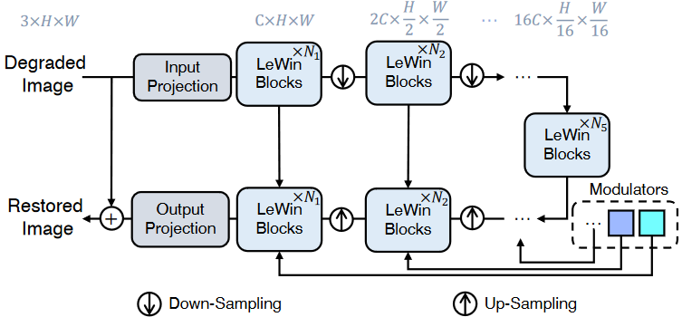
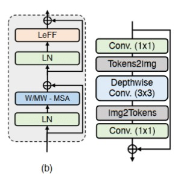
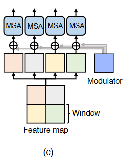
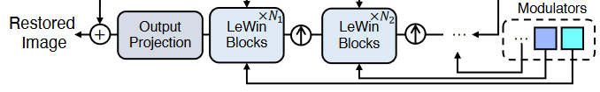
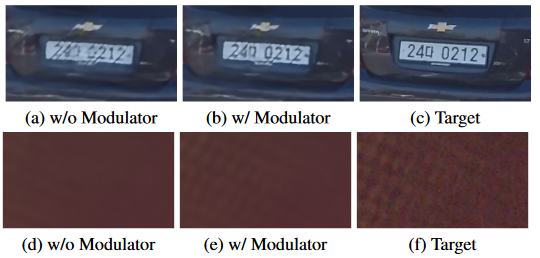
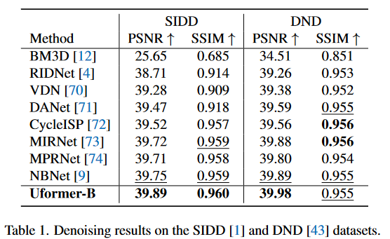
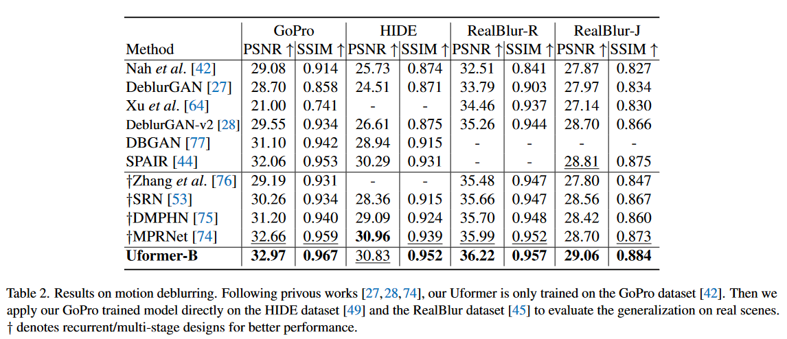
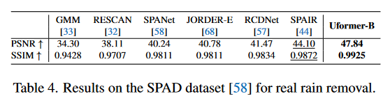



- 论文名称：**Uformer：A General U-Shaped Transformer for Image Restoration**
- 论文下载地址：https://arxiv.org/abs/2106.03106
- 代码托管：https://github.com/ZhendongWang6/Uformer



# 一、Abstract

在本文中，我们提出了Uformer，一种高效的**基于Transformer**的图像恢复架构，其中我们使用Transformer块构建了一个分层的编码器-解码器网络。在Uformer中，有两个核心设计。

- 引入了**局部增强窗口( Le Win ) Transformer块**，它执行**基于非重叠窗口的自注意力**而不是全局自注意力。在捕获局部上下文的同时，显著降低了高分辨率特征图上的计算复杂度。
- 以多尺度空间偏置的形式提出了一个**可学习的多尺度恢复modulator**，用于调整Uformer解码器的多层特征。我们的调制器在引入少量额外参数和计算成本的同时，展示了对各种图像复原任务恢复细节的卓越能力。

在这两种设计的支持下，Uformer在图像恢复中具有捕获局部和全局依赖的能力。为了评估我们的方法，在多个图像复原任务上进行了广泛的实验，包括图像去噪、运动去模糊、离焦去模糊和去雨。

# 二、Introduction

## 2.1 Motivation

- CNNs无法捕捉长距离的像素依赖（Transformer可以弥补）。
- Transformer架构在所有token之间全局计算自注意力，计算复杂度呈二次方（W-SMA可以弥补）。
- Transformer在捕捉局部依赖关系方面表现出局限性（CNNS可以弥补）。

## 2.2 Solution

利用多尺度分辨率下特征图中自注意力的能力来恢复更多的图像细节。

- 参考了U-Net和transformer的结构， 提出Uformer。
- 将U-Net中的卷积层用transformer代替。
- 保持整体的分层encoder-decoder结构和skip-connections。

## 2.3 Core designs

- **Locallyenhanced Window (LeWin) Transformer block:**

  基于非重叠窗口的自注意力代替全局自注意力，以此来降低计算复杂度；

  层次化的特征图并保持窗口大小不变，基于窗口的低分辨率自注意力能够捕获更多的全局依赖关系；

  前馈网络的两个全连接层之间引入深度卷积层，以更好地捕获局部上下文。

- **learnable multi-scale restoration modulator**：

  在每个Le Win Transformer块中的特征中添加一个可学习的基于窗口的tensor，以适应恢复更多细节的特征；

  得益于简单的算子和基于窗口的机制，可以灵活地应用于不同框架下的各种图像复原任务。

# 三、Method

在本节中，我们首先描述了Uformer用于图像复原的整体流程和层次结构。然后，我们给出Uformer的基本组成部分Le Win Transformer模块的细节。之后，我们提出了multi-scale restoration modulator。

## 3.1 Overall Pipeline

1. Uformer首先用一个 $3∗3$ 卷积，带LeakyReLU的激活来提取出low-level的特征 $X_0$ , 尺寸为 $C \times H \times W$ 。(**这个操作在视觉任务中非常常见**)

2. 然后，沿用U型结构设计，特征 $X_0$ 通过 $K$ 个编码器stage。每一个stage包含 $N_K$ 个LeWin Transformer块和一个下采样层。LeWin块利用自注意力机制来捕捉长距离依赖，同时也通过非重叠窗口降低了计算成本。在下采样层中，先把特征flatten成2维空间特征图，对其下采样，然后把通道数变成二倍。（利用2步长，$4*4$卷积实现）

3. 接下来，在编码器末尾部分加上一个LeWin块构成的bottleneck。在这个stage，由于层级结构，transformer块捕捉更长的依赖关系。

4. 为了实现特征重建，解码器同样包含 $K$ 个stages。每一个stage由一个上采样层加 $N_K$ 个LeWin块构成。使用$2*2$的转置卷积，步长2完成上采样。分辨率加倍，通道数减半。

5. LeWin transformer块传入：经过上采样层处理的特征图+编码器对应层的特征图（跳跃连接）+Modulartors传入

6. 在 K 个编码器stages之后，把特征flatten成2维特征图，尺寸为 $3\times H \times W$ 。最后，重建出的图片用以下公式获得，$ I'=I+R$ . 实验中， $K=4 $。每一个stage设置了2两个LeWin块。损失函数是Charbonnier loss：
   $$
   l(I',\hat I) = \sqrt{\parallel I'-\hat I \parallel^2 + \epsilon^2}
   $$
   其中$\hat I$ 是Ground-truth图像，$\epsilon = 10^{-3}$ 是经验常数。 

## 3.2 LeWin Transformer Block

**transformer存在的问题：**

- 标准Transformer架构在所有tokens之间全局计算自注意力，这导致了计算复杂度关于令牌数量呈二次方的关系。在高分辨率特征图上应用全局自注意力是不合适的。
- **局部上下文信息**对于图像复原任务是必不可少的，因为退化像素的邻域可以用来恢复其干净的版本，但是以前的工作表明Transformer在捕获局部依赖方面表现出局限性。

**Addressing issues：**

提出了一个局部增强窗口( Locally-enhanced Window，LeWin ) Transformer模块，如下图( b )所示，它得益于Transformer中的自注意力机制来捕获长程依赖关系，同时也将卷积算子引入Transformer以捕获有用的局部上下文。

给定一个特征 在第$ (l−1)$ 块 $X_{l−1}$ , 我们使用一下两个核心设计：**(1)非重叠窗口的多头自注意力(W-MSA), (2) locally-enhanced 前馈神经网络（LeFF）.** 公式表示写为：
$$
X'_l = W-MSA(LN(X_{l-1}))+X_{l-1}
$$

$$
X_l = LeFF(LN(X'_l)) + X'_l
$$

**Window-base Multi-head Self-Attention(W-MSA).** 不像初代transformer那样使用全局自注意力，而是在非重叠的局部窗口内执行自注意力。

给定一个二维特征图 $X \in R^{C∗H∗W}$ ，我们把 $X$ 分成不重叠的尺寸为 $M∗M$ 的窗口，然后把每一个窗口的特征flatten，这样 $X_i$ 尺寸为 $M^2∗C$。然后，我们在这些序列上做自注意力。假设头数为 $k$ ，那么头的维数为 $d_k=C/k$。然后在非重叠窗口内计算第 k 个头的自注意力，可以写为：
$$
X={X^1, X^2, ···，X^N}, N=HW/M^2
$$

$$
Y^i_k=Attention(X^iW^Q_k,X^iW^K_k,X^iW^V_k), i=1,2,···N
$$

$$
\hat X_k = {Y^1_k, Y^2_k,···,Y^N_k}
$$

$X_k$为第$k$个头的输出。然后将所有头的输出${ 1，2，· · ·，k }$串联，再进行线性投影得到最终结果。

**Locally-enhanced Feed-Forwawrd Network(LeFF).** 标准Transformer中的前馈网络( Feed-Forward Network，FFN )利用本地上下文的能力有限。实际上，**邻域像素是图像复原的重要参考**。

为了克服这个问题，我们加入了一个depth-wise 卷积块，如上图右边所示。我们首先对每一个token应用一个线性投影层 (1×1卷积) 来增加特征维度；然后把tokens reshape成2维特征图；再使用一个 3∗3 的depth-wise 卷积来捕捉局部信息；然后我们再把这个特征flatten成tokens；最后通过另一个线性投影把维度降低。这里的每一个线性投影的激活都使用GELU。

## 3.3 Multi-Scale Restoration Modulator 多尺度恢复调制器

不同类型的图像退化(例如模糊、噪声、雨等。)有各自不同的扰动模式需要处理或恢复。为了进一步提高Uformer处理各种扰动的能力，我们提出了一个轻量级的多尺度恢复调制器来校准特征并试图恢复更多的细节。

- 调制器：M ×M ×C 的可学习张量，在自注意模块之前添加到所有非重叠窗口。
- 引入了边际额外参数和计算成本，但是很小。有助于以很少的计算成本恢复细节。
- 有效性：图像去模糊和图像去噪。

**图像去模糊和图像去噪的可视化对比图：**

可能的解释：在解码器的每个阶段添加modulator可以灵活调整特征图，从而提高恢复细节的性能。

# 四、Experiment

作者做了去噪、去模糊、去雨的实验。

- 去噪：

- 去模糊

- 去雨

更多实验细节，感兴趣的朋友可以阅读原文。

# 五、Conclusion

在本文中，我们通过**引入Transformer块**，提出了一种用于图像恢复任务的替代架构**Uformer**。与现有的基于ConvNet的结构不同，我们的Uformer构建在主要组件LeWin Transformer块的基础上，它不仅**可以处理局部上下文**，而且**可以有效地捕获长程依赖**。为了处理各种图像复原退化和提高复原质量，我们提出了一种**可学习的多尺度复原modulator**插入到Uformer解码器中。大量实验表明，Uformer在去噪、运动去模糊、离焦去模糊和去雨等任务上都取得了优异的性能。**Uformer也以更少的计算成本和更少的模型参数**大幅超越了UNet家族。

