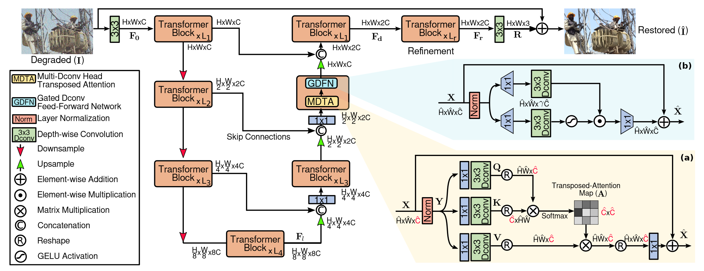
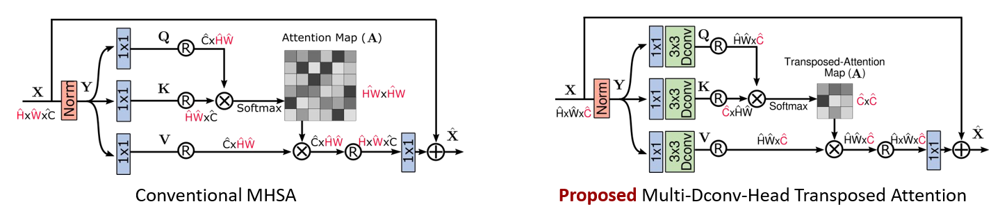
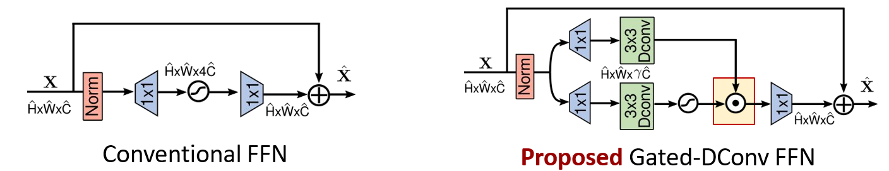



- Restormer: Efficient Transformer for High-Resolution Image Restoration是2022年发表在CVPR上的一篇关于Image Restoration的论文，在多个图像恢复任务上取得了最先进的结果，包括**图像去雨、单图像运动去模糊、散焦去模糊（单图像和双像素数据）和图像去噪**等。
- 论文下载地址：https://arxiv.org/abs/2111.09881
- 代码托管：https://github.com/swz30/Restormer



# 一、Abstract

CNNs 对于从大规模数据中学习泛化的图像先验知识(priors)方面表现良好，因此已广泛用于图像复原和相关任务中。而就在最近，另一类神经网络架构 Transformers 在自然语言和 high-level 视觉任务上表现出了显著的性能提升。虽然 Transformer 模型减轻了 CNN 的缺点（即有限的感受野和对输入内容的不适应），但**其计算复杂度随空间分辨率成二次方增长**，因此无法应用于大多数涉及高分辨率图像的图像复原任务中。在这项工作中，作者通过在构建块（多头注意力和前馈网络）中进行几个关键设计来提出一种高效的 Transformer 模型，以便它**可以捕获远程像素交互**，同时仍然适用于大图像。该模型取名为 Restoration Transformer (Restormer)，在多个图像复原任务上取得了SOTA结果，包括图像去雨、单图像运动去模糊、散焦去模糊（单图像和双像素数据）和图像去噪（高斯灰度/彩色去噪和真实图像去噪）。

# 二、Introduction

图像复原 (Image restoration) 是通过从退化（degraded）的图像输入中去除退化（例如，噪声、模糊、雨滴）来重建 (reconstructing) 高质量图像的任务。由于卷积神经网络 (CNN) 在从大规模数据中学习**可泛化先验知识**方面表现良好，因此它们已成为首选的复原方法。

在 CNN 中，其基本操作是“卷积”，它为 CNN 提供了**局部连接和平移不变性**的特性。虽然这些特性为 CNN 带来了效率和泛化性，但它们也产生了两个主要问题：(a) **卷积算子的感受野有限**，无法对长距离像素依赖性进行建模；(b) 卷积 filters 在推理时具有**静态权重**，**不能灵活地适应输入内容**。为了解决上述缺点，一种更强大和动态的替代方案是**自注意力 (SA) 机制**，它通过所有其他位置的加权和来计算给定像素的输出特征。虽然SA在捕获远程像素交互方面非常有效，但其复杂度随空间分辨率呈二次方增长，因此无法应用于高分辨率图像。

作者从自注意力（SA）、前馈网络（FN）对 transformer 进行改进，并使用一种渐进性学习策略来训练模型。本文的主要贡献可以总结如下：

- **提出了Restormer，一种编码-解码结构的Transformer**，用于在**高分辨率图像**上进行多尺度局部/全局表示学习，而不将它们分解成局部窗口，从而利用遥远的图像上下文。
- 提出了一种**使用深度卷积的多头转置注意模块**(multi-Dconv head transposed attention, MDTA)，它能够聚合局部和非局部像素交互，并且足够有效地处理高分辨率图像。
- 一种新的**使用深度卷积的门控前馈网络**(Gated-Dconv feed-forward network, GDFN)，它执行受控的特征转换，即抑制信息量较少的特征，只允许有用的信息进一步通过网络层次结构。

# 三、Method

我们的主要目标是开发一个能够处理高分辨率图像的高效Transformer模型，用于恢复任务。为了缓解计算瓶颈，我们将关键设计引入到多头SA层和比单尺度网络计算需求更小的多尺度层次模块。



本文所提方法的整体架构如上图所示。其整体执行流程为：给定降质图像的图像 $I \in \mathbb{R}^{H \times W \times 3} $，Restormer 首先使用一个卷积去获得低级特征嵌入 $F_0 \in \mathbb{R}^{H \times W \times C}$ ，其中 $H \times W$ 表示空间维度而 $C$ 表示通道数。接下来，这些浅层特征 $F_0$ 通过一个 4 级对称的 encoder-decoder 并且转化为深层特征 $F_d \in \mathbb{R}^{H \times W \times 2C}$ 。每一级encoder-decoder都包含多个 Transformer block，block的数量从小到大逐渐增加，以保持效率。从高分辨率输入开始，编码器分层减少空间大小，同时扩展通道容量。解码器把低分辨率的潜在特征$F_l \in \mathbb{R}^{\frac H8 \times \frac W8 \times 8C}$  作为输入并渐进式地恢复出高分辨率表示。对于特征下采样和上采样，作者分别应用pixel-unshuffle和pixel-shuffle操作。为了帮助恢复过程，**编码器的特征通过跳过连接 (skip connection)与解码器的特征串联在一起**。串联操作之后是 $1×1$ 卷积，以减少所有层级的通道数量（减半），顶部的层级除外。在第1级，作者让 Transformer 块将编码器的低级图像特征与解码器的高级特征聚合在一起。这有助于在恢复的图像中保留精细的结构和纹理细节。接下来，在高空间分辨率下操作的再精细阶段，深层特征 $F_d$ 被进一步丰富。我们可以在实验部分中看到，这些设计选择提高了图像质量。最后，对细化后的特征采用卷积层生成残差图像 $R \in \mathbb{R}^{H \times W \times 3} $，其中添加降质的图像以获得复原的图像: $\hat{I} = I + R $。

## 3.1 多头 深度可分离卷积 转置注意（Multi-Dconv Head Transposed Attention）

Transformers 中的主要计算开销来自于自注意力（SA）层。 在传统的 SA 中，key-query点积交互的**时间和内存复杂度与输入的空间分辨率成二次方增长**，即对于 $W×H$ 像素的图像，其复杂度为 $O(W^2H^2)$ 。

- 10x10的输入图片  $\Rightarrow$  Attention map size = 100 x 100 pixels
- 100x100的输入图片  $\Rightarrow$ Attention map size = 10,000 x 10,000 pixels
- 1000x1000的输入图片 $\Rightarrow$ Map size = 1,000,000 x 1,000,000 pixels

因此，将 SA 应用于经常涉及高分辨率图像的大多数图像复原任务是不可行的。 为了缓解这个问题，**作者提出了具有线性复杂度的 MDTA**，如上图 2（a）所示。 **关键因素是跨通道而不是空间维度应用 SA，即计算跨通道的交叉协方差来生成隐式地编码全局上下文的注意力图**。 作为 MDTA 的另一个重要组成部分，作者引入了深度卷积，它在计算特征协方差来产生全局注意力图之前强调局部上下文。



在获得一个层归一化张量 $Y\in \mathbb{R}^{\widehat{H} \times \widehat{W} \times \widehat{C} }$ 之后，MDTA 首先前向传播生成 query（**Q**）、key（**K**）和 value（**V**），这丰富了局部上下文。 它是通过应用 1×1 卷积来聚合像素别和跨通道的上下文，并应用 $3\times3$ 深度卷积来编码通道级空间上下文来实现的，产生 $Q=W_p^QW_d^QY$ ， $K=W_p^KW_d^KY$ 和 $V=W_p^VW_d^VY$ 。其中， $W_p^{(·)}$ 是 $1×1$ 逐点卷积（**point-wise convolution**）， $W_d^{(·)}$ 是 $3 \times 3$ 的深度卷积（**depth-wise convolution**）。

- 逐点卷积 + 深度卷积 = [深度可分离卷积](https://zhuanlan.zhihu.com/p/453434386)

作者在网络中使用无偏置卷积层。接下来，作者重塑 query 和 key 投影，使得它们的点积交互生成一个大小为 $R^{\widehat{C} \times \widehat{C} }$ 的转置注意力图 A ，而不是大小为 $R^{\widehat{H}\widehat{W} \times \widehat{H}\widehat{W} }$ 的巨大的常规的注意力图。 总的来说，MDTA 过程被定义为：
$$
\widehat{X} = W_p \cdot Attention(\widehat{Q},\widehat{K},\widehat{V}) + V
$$

$$
Attention(\widehat{Q},\widehat{K},\widehat{V}) = \widehat{V} \cdot Softmax(\widehat{K} \cdot \widehat{Q} / \alpha)
$$

其中 $X$ 和 $\widehat{X}$ 是输入和输出特征图；矩阵 $\widehat{Q} \in \mathbb{R}^{\widehat{H}\widehat{W} \times \widehat{C} }$ ，$\widehat{K} \in \mathbb{R}^{\widehat{C} \times \widehat{H}\widehat{W} }$  和 $\widehat{V} \in \mathbb{R}^{\widehat{H}\widehat{W} \times \widehat{C} }$  是从原始大小 $\mathbb{R}^{\widehat{H} \times \widehat{W} \times \widehat{C} }$对张量进行变形后获得的。这里， $\alpha$ 是一个可学习的缩放参数，用于在应用 softmax 函数之前控制 $\widehat{K}$ 和 $\widehat{Q}$ 的点积的大小。 与传统的多头 SA 相似，作者将通道数量划分为“head”，然后并行学习单独的注意力图。

```python
## Multi-DConv Head Transposed Self-Attention (MDTA)
class Attention(nn.Module):
    def __init__(self, dim, num_heads, bias):
        super(Attention, self).__init__()
        self.num_heads = num_heads  # 注意力头的个数
        self.temperature = nn.Parameter(torch.ones(num_heads, 1, 1))  # 可学习系数
        
        # 1*1 升维
        self.qkv = nn.Conv2d(dim, dim*3, kernel_size=1, bias=bias)
        # 3*3 分组卷积
        self.qkv_dwconv = nn.Conv2d(dim*3, dim*3, kernel_size=3, stride=1, padding=1, groups=dim*3, bias=bias)
        # 1*1 卷积
        self.project_out = nn.Conv2d(dim, dim, kernel_size=1, bias=bias)

    def forward(self, x):
        b,c,h,w = x.shape  # 输入的结构 batch 数，通道数和高宽

        qkv = self.qkv_dwconv(self.qkv(x))
        q,k,v = qkv.chunk(3, dim=1)  #  第 1 个维度方向切分成 3 块
        # 改变 q, k, v 的结构为 b head c (h w)，将每个二维 plane 展平
        q = rearrange(q, 'b (head c) h w -> b head c (h w)', head=self.num_heads)
        k = rearrange(k, 'b (head c) h w -> b head c (h w)', head=self.num_heads)
        v = rearrange(v, 'b (head c) h w -> b head c (h w)', head=self.num_heads)

        q = torch.nn.functional.normalize(q, dim=-1)  # C 维度标准化，这里的 C 与通道维度略有不同
        k = torch.nn.functional.normalize(k, dim=-1)

        attn = (q @ k.transpose(-2, -1)) * self.temperature
        attn = attn.softmax(dim=-1)

        out = (attn @ v)  # 注意力图(严格来说不算图)
        
        # 将展平后的注意力图恢复
        out = rearrange(out, 'b head c (h w) -> b (head c) h w', head=self.num_heads, h=h, w=w)
        # 真正的注意力图
        out = self.project_out(out)
        return out

```


## 3.2 门控深度可分离卷积前馈网络（Gated-Dconv Feed-Forward Network）

为了转换特征，常规的前馈网络 (FN) 分别且一致地对每个像素位置进行操作。 它使用两个 1×1 卷积，一个是扩展特征通道（通常因子 $\gamma=4$ ），第二个是将通道减少回原始的输入维度。 在隐藏层中应用了非线性。 在这项工作中，**作者提出了 FN 中的两个基本修改来改进表示学习：（1）门控机制，以及（2）深度卷积**。所提出的 GDFN 的架构如下图右所示。 



门控机制被形式化为线性变换层的两条平行路径的元素乘积，其中之一被 GELU 非线性激活。 与在 MDTA 中一样，作者还在 GDFN 中包含深度卷积来编码来自空间相邻像素位置的信息，这对于学习局部图像结构以进行有效的图像复原很有用。 给定一个输入张量 $X \in \mathbb{R}^{\widehat{H} \times \widehat{W} \times \widehat{C} }$ ，GDFN 被形式化为如下形式：
$$
\widehat{X} = W_p^0 \cdot Gating(X) + X
$$

$$
Gating(X) = \phi(W_d^1W_p^1(LN(X))) \odot (W_d^2W_p^2(LN(X)))
$$

其中， $\odot$ 表示逐元素乘法， $\phi$ 表示 GELU 非线性激活函数，LN 是层归一化。 总体而言，GDFN 控制着通过 pipeline 中各个层级的信息流，从而允许每个层级专注于与其它层级互补的细节。也就是说，与 MDTA（专注于用上下文信息丰富特征）相比，GDFN 承担者一个独特的角色。 由于与常规 FN 相比，所提出的 GDFN 执行更多操作，因此作者降低了扩展率 $\gamma$ 以具有相似的参数和计算负担。

```python
## Gated-Dconv Feed-Forward Network (GDFN)
class FeedForward(nn.Module):
    def __init__(self, dim, ffn_expansion_factor, bias):
        super(FeedForward, self).__init__()
        
        # 隐藏层特征维度等于输入维度乘以扩张因子
        hidden_features = int(dim*ffn_expansion_factor)
        # 1*1 升维
        self.project_in = nn.Conv2d(dim, hidden_features*2, kernel_size=1, bias=bias)
        # 3*3 分组卷积
        self.dwconv = nn.Conv2d(hidden_features*2, hidden_features*2, kernel_size=3, stride=1, padding=1, groups=hidden_features*2, bias=bias)
        # 1*1 降维
        self.project_out = nn.Conv2d(hidden_features, dim, kernel_size=1, bias=bias)

    def forward(self, x):
        x = self.project_in(x)
        x1, x2 = self.dwconv(x).chunk(2, dim=1)  # 第 1 个维度方向切分成 2 块
        x = F.gelu(x1) * x2  # gelu 相当于 relu+dropout
        x = self.project_out(x)
        return x

```


## 3.3 渐进式学习（Progressive Learning）

在裁剪后的小 patch 上训练 Transformer 模型可能不会对全局的图像统计信息进行编码，从而在测试时的全分辨率图像上提供次优的性能。为此，作者**使用渐进式学习，其中网络在早期阶段在较小的图像 patch 上进行训练，在后期的训练阶段中逐渐增大。**通过渐进式学习在混合大小的 patch 上训练的模型在测试时表现出增强的性能，其中图像可以具备不同的分辨率（这是图像复原中的常见情况）。渐进式学习策略的行为方式类似于课程学习过程：网络从简单的任务开始，逐渐转向学习更复杂的任务（需要保留精细的图像结构/纹理）。由于对大 patch 的训练需要花费更长的时间，因此作者会**随着 patch 大小的增加而减小batch大小**，以保持每个优化步骤的时间与固定 patch 训练相似。

# 四、Experiments and Analysis

论文对关于实验是如何做的细节描述的很简单，只详细介绍了在Image Restoration的四个方面的实验对比。

论文的消融实验可以看看:

- 深度可分离可以进一步提升模型性能；
- encoder-decoder的第一阶段只concate不通过卷积进行通道数减少的融合。第一阶段浅层特征往往包含一些边缘等结构信息，有利于low-level任务。
- Progressive学习机制指标更好；
-  深而窄的模型比宽而浅的模型更好；


# 五、Conclusion

**Restormer：**处理高分辨率图像**方面具有计算效率**。
**MDTA：**（跨通道而不是空间维度，SA，进行局部与非局部相关像素聚合，建模全局上下文+线性复杂度）
**GDFN：**引入了**门控机制**控制信息流动, 进而使得每层聚焦于不同的细节信息。抑制低信息特征，仅保留有用信息。
