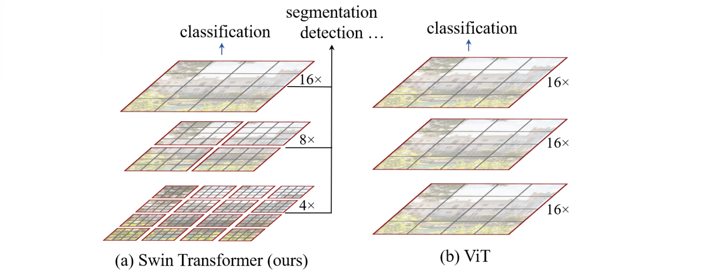
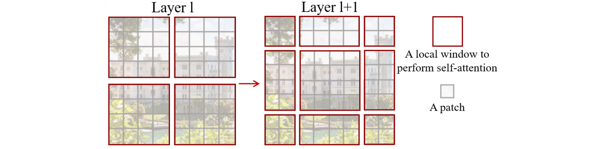
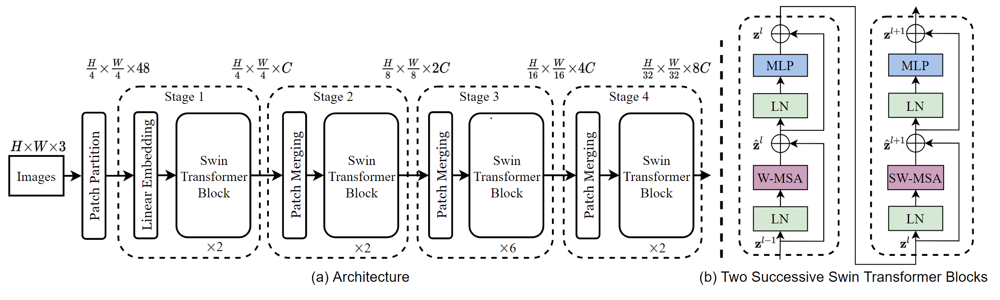
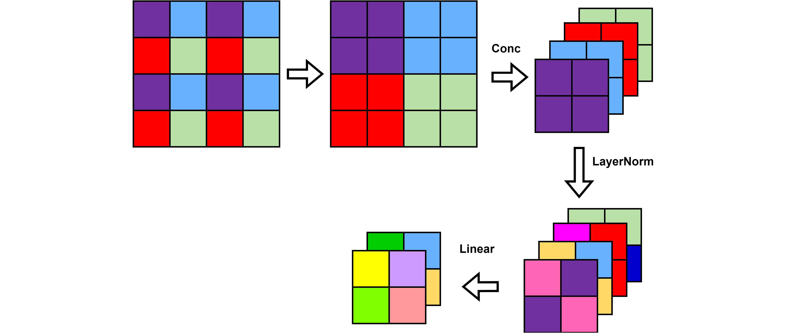
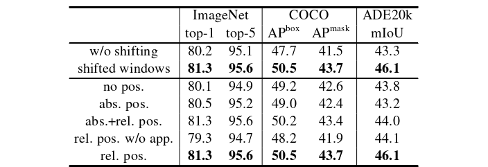
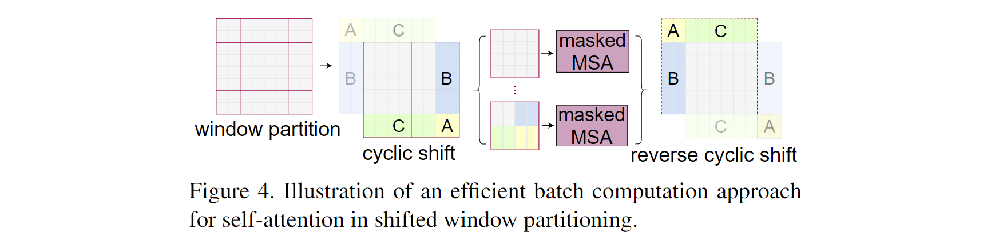
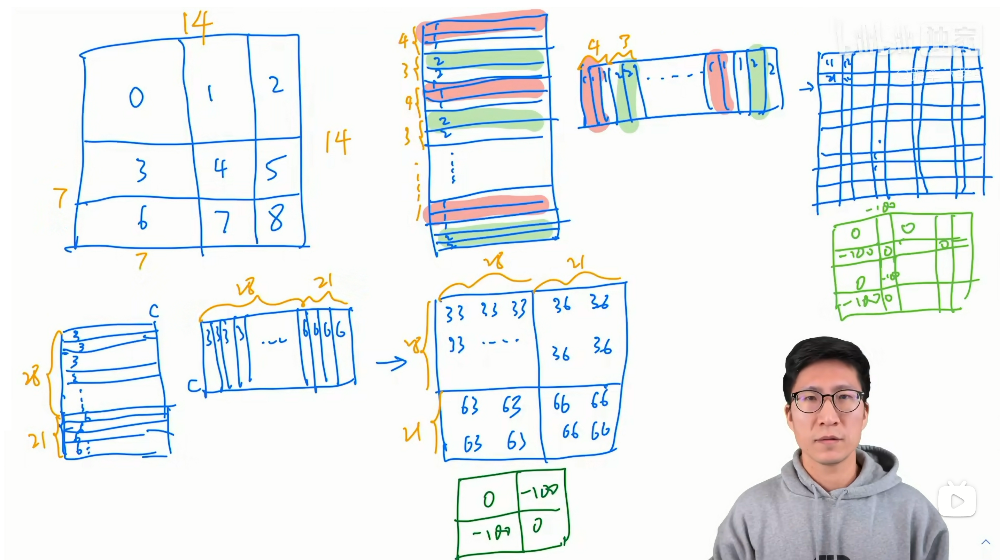
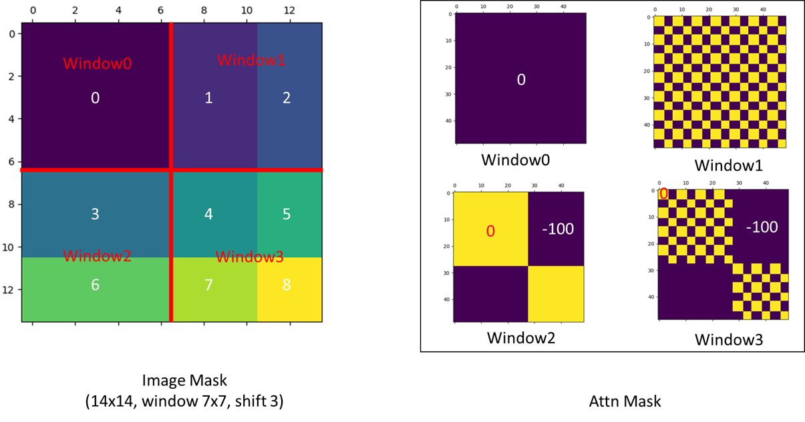



- 论文名称：**Swin Transformer: Hierarchical Vision Transformer using Shifted Windows**
- 论文下载地址：https://arxiv.org/abs/2103.14030
- 代码托管：https://github.com/microsoft/Swin-Transformer
- B站朱毅大神视频讲解：https://www.bilibili.com/video/BV13L4y1475U/
- 代码复现：





**Swin Transformer** 是2021年微软研究院发表在ICCV上的一篇文章，并且已经获得`ICCV 2021 best paper`的荣誉称号。Swin Transformer网络是继[Vision Transformer](https://hr-insist.github.io/%E8%AE%BA%E6%96%87%E7%AC%94%E8%AE%B0/%E8%AE%BA%E6%96%87Vision_Transformer/)后，Transformer模型在CV领域的又一次碰撞。该模型不仅在Image Classification领域取得较好的成绩，而且在Object Detection 和 Semantic Segmentation领域大放异彩。



# 一、Abstract

本文提出了一种新的视觉Transformer，称为 **Swin Transformer**，它可以作为计算机视觉的通用骨干网络。将 Transformer 从NLP领域转换为CV领域的挑战来自于两个域之间的差异，例如**视觉实体的尺度差异大**，以及**图像中像素相对于文本中单词的高分辨率**。为了解决这些差异，我们提出了一个**分层( hierarchical ) Transformer**，其表示是用**移动窗口( Shifted windows )**计算的。移动窗口方案通过**将自注意力计算限制到非重叠的局部窗口，同时允许跨窗口连接**，从而带来更高的效率。这种分层体系结构具有在各种尺度上建模的灵活性，并且**具有与图像大小相关的线性计算复杂度**。Swin Transformer 的这些特性使其可以兼容广泛的视觉任务，包括图像分类( ImageNet - 1K的top - 1准确率为87.3 %)和密集预测任务，如目标检测( 在COCO test-dev上实现了58.7 box AP和51.1 mask AP )和语义分割( 53.5 mIoU )。2021年，它的性能在 COCO 上以 +2.7 box AP 和 +2.6 mask AP 以及在 ADE20K 上 +3.2 mIoU 的大幅度超越了 SOTA 技术，显示了基于 Transformer 的模型作为视觉中枢的潜力。**分层设计和移位窗口方法也被证明对 All-MLP 体系结构有利**。

# 二、Introduction

在本篇论文中，我们寻找Transformer的拓展应用，以至于它能作为计算机视觉中的通用骨干网络，就像Transformer在NLP中和CNNs在视觉领域中的一样。我们观察到，将语言领域的高性能迁移到视觉领域的重大挑战可以通过两种模式之间的差异来解释。**其中一个差异是尺度**。不像词tokens作为语言Transformers处理中的基本元素。视觉元素在规模上可以非常大，这是一个在目标检测等任务中已经受到关注的问题。在已存在的基于Transformer的模型当中，tokens都是固定尺度的，这一性质不符合视觉应用。**另一个不同是，与词在文本段落中相比图片拥有非常高的分辨率(非常大的像素)**。这些已存在的很多视觉任务像语义分割要求在像素级别的密集预测，这在高分辨率图片上可能让Transformer难以应对，因为它的自注意力的计算复杂度是图片大小的平方倍。为了克服这个问题，我们提出了一个通用的 Transformer骨架，叫做 Swin Transformer，Swin Transformer构造了分层的特征图，计算复杂度和图片大小呈线性关系。

**Figure 1** (a) Swin Transformer通过merge更深层的图像块(灰色表示)来构建分层的特征图，**它的计算复杂度和输入图片大小呈线性关系，因为自注意力只在局部窗口(红色表示)中计算**，它因此能作为图片分类和密集识别任务的通用骨干网络。(b) 最为对比，以前的 vision Transformers产生单个的低分辨率特征图，并且由于是全局自注意力计算，所以计算复杂度与输入图片的大小呈平方关系。

正如Figure 1(a)中所述， Swin Transformer通过**从小尺度的patch开始，并逐渐的在更深的Transformer层中merge相邻的patch， 从而构造一个分层的表征 (hierarchical representatio) **。通过这些分层特征图，Swin Transformer模型可以方便地利用高级技术进行密集预测，如特征金字塔网络 (FPN)和 U-Net。**通过在无重叠的窗口上计算 局部自注意力(local self-attention) 能够达到线性计算复杂度**，这个无重叠窗口是图片的一部分(轮廓是红色的)。每个窗口的图像块个数是固定的，因此复杂度随着图片大小呈线性关系。这些优点让Swin Transformer适合作为很多视觉任务的通用骨干网络。和以前的基于Transformer的架构对比，以前的产生单一像素的特征图和复杂性呈平方关系。

**Figure 2 **: 在Swin Transformer架构中计算自注意力的移动窗口方法的一个说明。在Layer ${l}$ 层(左)采用常规窗口划分方案,在每个窗口中计算自注意力。在下一层Layer ${l+1}$层(右)，移动分割窗口，重新产生新的窗口。**新窗口中的自注意计算横跨Layer ${l}$ 层中窗口的边界，让这些窗口连接起来。**

Swin Transformer 的一个关键设计元素是它 **在连续自注意力层之间的窗口分区的移动 (shift)**，如图 2 所示。移动窗口桥接了前一层的窗口，提供二者之间的连接，显著增强建模能力 (见表 4)。这种策略对于现实世界的延迟也是有效的：**一个局部窗口内的所有 query patch 共享相同的 key 集合**，这有助于硬件中的内存访问。相比之下，早期的基于滑动 (sliding) 窗口的自注意力方法由于不同 query 像素具有不同的 key 集合而在通用硬件上受到低延迟的影响。我们的实验表明，所提出的移位窗口方法的延迟比滑动窗口方法低得多，而建模能力相似。移位窗口方法也被证明对 All-MLP 架构有益。

Swin Transformer在图片分类，物体检测，语义分割识别任务中达到了很强的性能。在上述三个任务中在相同的延迟下Swin Transformer远胜ViT / DeiT和ResNe(X)t模型。

# 三、Conclusion

本文提出了一种新的 vision Transformer：Swin Transformer，它产生一个分层的特征表示，并且具有与输入图像大小有关的线性计算复杂度。2021年，Swin Transformer在COCO目标检测和ADE20K语义分割上取得了最先进的性能，大大超过了以前最好的方法。我们希望Swin Transformer在各种视觉问题上的强大性能将鼓励视觉和语言信号的统一建模。作为 Swin Transformer 的关键元素，基于移动窗口的自注意力机制被证明在视觉问题上是有效和高效的，我们也期待着研究其在自然语言处理中的应用。 

# 四、Related Work

**CNN and 变种** CNN作为标准的网络模型贯穿整个视觉领域。深层高效的卷积神经网络架推动了在视觉领域中进行深度学习的浪潮，出现了一系类高级架构。但是基于 Transformer架构来处理视觉和语言任务的统一模型具有很大的潜力。、

**基于自注意力的骨干网络架构** 基于自注意力的骨干网络架构 受到自注意力层和Transformer架构在自然语言处理领域成功运用的启发。一些工作用自注意力层取代ResNet的一些或者全部的空间卷积层。

**自注意力/Transformers使CNNs更完美** 另一个工作是用自注意力层和Transformers来增强标准的 CNN架构。自注意力层可以通过提供对远距离依赖关系或异构交互进行编码的能力来补充主干或头部网络。更多最近的基于编码器解码器的Transformer已经应用到了物体检测，和实例分割任务。我们的工作探索了Transformers对于基本视觉特征提取的适应性，并且是对这些工作的补充。

**基于Transformer的视觉骨干网络** 和我们的工作最相近的是Vision Transformer (ViT)和它的后续变种。但是它的架构在密集型视觉任务或者当输入图片图像非常高时是不适合作为通用骨干网络的，因为它适应于低图像特征图，并且复杂度随着图片大小呈平方关系。根据经验我们发现我们的Swin Transformer在图片分类上在这些所有的方法中，达到了最好的速度精度权衡。而且我们的计算复杂性是线性的，并且在局部操作。种种原因使得Swin Transformer在目标检测和语义分割上达到了最好的精度。

# 五、Method

## 5.1 Overall Architecture

Swin Transformer体系结构的概述如图3 所示 (tiny版Swin-T )。输入的${H \times W \times 3}$的RGB图像首先通过 **patch 分割模块 (Patch Partition)**( 如ViT )将分割成不重叠的 patchs 。**每个 patch 被当作一个 "token" ( 相当于NLP中的词源 )处理，它的特征被设置为原始像素RGB值的串联(concatenation)**。在我们的实现中，每${4 \times 4}$相邻的像素为一个Patch，然后在channel方向展平（flatten），因此每个 patch 展平后的特征维度为 ${4 \times 4 \times 3 = 48}$。所以通过Patch Partition后图像shape由 `[H, W, 3]`变成了 `[H/4, W/4, 48]`。

**Figure3** (a)一个Swin Transformer (Swin-T)架构。(b)两个连续的 Swin Transformer 块 (符号表示见公式(3))。**W-MSA和SW-MSA**分别是**常规窗口和移动窗口**配置的**多头自注意力模块**。

然后在这个原始值特征上应用一个**线性嵌入层 (Linear Embedding)**，将其投影到任意维度( 记为 $C$ )。在这些 patch tokens 上应用了若干**具有改进的自注意力的Transformer blocks ( Swin Transformer blocks )** 。Transformer Block保持 tokens 的数量( ${\frac{H}{4} \times \frac{W}{4} }$ )不变，与线性嵌入一起称为**Stage 1**。

为了产生**层次化表示 (hierarchical representation)**，随着网络的深入，通过 patch 合并层来减少 token 的数量。第一个 Patch 合并层将每组 ${2 \times 2}$ 相邻的 Patch 的特征进行拼接，则patch token的数量变为原来的 $\frac{1}{4}$，即${\frac{H}{8} \times \frac{W}{8} }$ ,  而patch token的 channel将扩大为原来的$4$倍，即${4C }$。然后在 $4C$ 维的拼接特征上添加一个线性层，这将 token 的数量减少$2 \times 2 = 4$倍( $2 \times$分辨率下采样)，将输出维度设置为$2C$。之后应用 Swin Transformer blocks 进行特征转换，分辨率保持在$\frac{H}{8} \times \frac{W}{8}$。首个 Patch 的合并层和特征变换 Swin Transformer blocks 被记为 **Stage 2**。重复两次与 Stage2 相同过程，作为"阶段3 "和"阶段4 "，输出分辨率分别为 $\frac{H}{16} \times \frac{W}{16}$ 和 $\frac{H}{32} \times \frac{W}{32}$。**每个 Stage 都会改变张量的维度，从而形成一种层次化的表征**，具有与典型卷积网络相同的特征图分辨率，如VGG和ResNet。因此，所提出的架构可以方便地替换现有方法中的主干网络，用于各种视觉任务。

- **Patch Merging**  Patch Merging层进行下采样。该模块的作用是做降采样，用于缩小分辨率，调整通道数 进而形成层次化的设计，同时也能节省一定运算量。在CNN中，则是在每个Stage开始前用stride=2的卷积/池化层来降低分辨率。patch Merging是一个类似于池化的操作，但是比Pooling操作复杂一些。池化会损失信息，patch Merging不会。

  

- **Swin Transformer block **  Swin Transformer 相比于 Transformer block (例如 ViT)，将 **标准多头自注意力模块 (MSA)** 替换为 **基于移位窗口的多头自注意力模块 (W-MSA / SW-MSA)** 且保持其他部分不变 (描述于 5.2 节)。如图 3(b) 或上图所示，一个 Swin Transformer block 由一个 **基于移位窗口的 MSA 模块 (SW-MSA)** 构成，紧接着让**GELU**非线性激活函数放在一个 2层的 **MLP**中间。**LayerNorm (LN) 层**被应用于每个 MSA 模块和每个 MLP 前，且一个 **残差连接** 被应用于每个模块后。

## 5.2 Shifted Window based Self-Attention

标准的 Transformer 架构及其对图像分类的适应性都进行了**全局自注意力**，即计算一个token和所有其他token之间的关系。全局注意力计算导致了**相对于token数量的二次计算复杂度**，使其不适用于许多需要token集合进行密集预测或表示高分辨率图像的视觉问题。

### 5.2.1 Self-attention in non-overlapped windows

为高效建模，我们提出 **在非重叠的局部窗口中计算自注意力**，取代全局自注意力。以不重叠的方式均匀划分图像得到各个窗口。已知 D = 2C，则设每个非重叠局部窗口都包含 N = M × M 个 patch tokens，则基于具有 N = h × w 个 patch tokens 的图像窗口的 MSA 模块和 基于非重叠局部窗口的 W-MSA 模块的计算复杂度分别是：

其中前者和图像块数$hw$ 呈平方关系，后者当 M 是固定时呈线性关系( M 默认设置为7)。对于一个大的$hw$ 全局自注意力计算通常是承受不起的，然而基于自注意力的窗口 (W-MSA) 则具有良好的扩展性。

- **self-attention**公式：

$$
Attention(Q,K,V)=SoftMax(\frac{QK^T}{\sqrt d})V
$$

- **MSA计算量** ：对于feature map中的每个像素 (或称作token, patch)，都要通过$W_q$ , $W_k$ , $W_v$ 生成对应的 query(q)，key(k)以及value(v)。这里假设q, k, v的向量长度与 feature map 的深度 C 保持一致。那么对应所有像素生成Q的过程如下式: 
  $$
  A^{hw \times C} \cdot W^{C \times C}_q=Q^{hw \times C}
  $$
  
  - $A^{hw \times C}$ 为将所有像素（token）拼接在一起得到的矩阵（一共有hw个像素，每个像素的深度为C）
  - $W^{C \times C}_q$W 为生成 query 的变换矩阵
  - $Q^{hw \times C}$ 为所有像素通过 $W^{C \times C}_q$ 得到的query拼接后的矩阵
  
  根据矩阵运算的计算量公式可以得到生成 $Q$ 的计算量为 ${hw \times C \times C}$，生成$K$和$V$同理都是$hwC^2$，那么总共是 ${3hwC^2}$。接下来$Q$和 $K^T$ 相乘，对应计算量为 $(hw)^2C$ :
  $$
  Q^{hw \times C} \cdot K^{T(C \times hw)}= X^{hw \times hw}
  $$
    接下来忽略除以 $\sqrt d$ 以及softmax的计算量，假设得到 ${\Lambda ^{hw \times hw} }$，最后还要乘以 $V$，对应的计算量为 $(hw)^2C$(hw) :
  $$
  \Lambda ^{hw \times hw} \cdot V^{hw \times C}=B^{hw \times C}
  $$
  那么对应单头的Self-Attention模块，总共需要 $3hwC^2 + (hw)^2C + (hw)^2C=3hwC^2 + 2(hw)^2C$ 。而在实际使用过程中，使用的是多头的Multi-head Self-Attention模块，在之前的文章中有进行过实验对比，多头注意力模块相比单头注意力模块的计算量仅多了最后一个融合矩阵 $W_O$ 的计算量 $hwC^2$ 。
  $$
  B^{hw \times C} \cdot W_O^{C \times C} = O^{hw \times C}
  $$
  所以总共加起来是：$4hwC^2 + 2(hw)^2C$ 
  
- **W-MSA模块计算量**：对于W-MSA模块首先要将feature map划分到一个个窗口 (Windows) 中，假设每个窗口的宽高都是$M$，那么总共会得到 $\frac {h} {M} \times \frac {w} {M}$ 个窗口，然后对每个窗口内使用多头注意力模块。刚刚计算高为$h$，宽为$w$，深度为$C$的 feature map 的计算量为 $4hwC^2 + 2(hw)^2C$，这里每个窗口的高为$M$，宽为$M$，带入公式得：
  $$
  4M^2C^2 + 2M^2C
  $$
  又因为有 $\frac {h} {M} \times \frac {w} {M}$ 个窗口，则：
  $$
  {\frac {h}{M} } \times {\frac{w}{M} } \times (4M^2C^2 + 2(M)^2C)=4hwC^2 + 2M^2hwC
  $$
  故使用W-MSA模块的计算量为：$4hwC^2 + 2M^2hwC$

### 5.2.2 Shifted window partitioning in successive blocks

基于窗口的自注意力模块 (W-MSA) 虽将计算复杂度从二次降为线性，**但跨窗口之间交流与联系的匮乏将限制其建模表征能力**。为引入跨窗口的联系且同时保持非重叠窗口的计算效率，我们提出一个 **移位窗口划分方法**，它能在连续的 Swin Transformer block 中交替的使用两个划分窗口的方法。

正如**Figure 2**所述，第一个模型用了一个规则的窗口分割策略，这个策略从左上的像素开始，8x8的特征图用4x4(M=4)窗口大小将其均匀分割成2 × 2。然后，下个模块采用从前一层移动的窗口配置，通过用规则分割窗口向左上**循环位移**  $(\lfloor \frac{M}{2} \rfloor,\lfloor \frac{M}{2} \rfloor)$个像素。在移动窗口分割方法下，连续的 Swin Transformer block计算方法如下：

其 $\hat z^l$ 和 $z^l$ 分别表示 **block $l$** 的 **(S)W-MSA 模块**和 **MLP 模块**的**输出特征**；W-MSA和SW-MSA分别表示使用**常规窗口**和**移动窗口**分区配置的**基于窗口的多头自注意力**。

移位窗口划分方法引入了先前层非重叠相邻窗口间的联系，且对图像分类、目标检测和语义分割很有效，如表 4 所示。

### 5.2.3 Efficient batch computation for shifted configuration

移动窗口分割的一个问题是：它将产生很多个窗口。在移动配置中从$\lceil \frac{h}{M} \rceil\times\lceil \frac{w}{M} \rceil$  到 $(\lceil \frac{h}{M} \rceil+1)\times(\lceil \frac{w}{M} \rceil+1)$，一些窗口可能会比 $M\times M$ 还小。一个naive的解决方法是把较小的窗口填充到 $M\times M$ 大小，当计算注意力的时候屏蔽填充值。当在规则的分割中的窗口数较少时例如2x2。用这个天真的方法增加的计算量是相当可观的(`(2x2)`变成`(3x3)`将变大2.25倍)。

在这里，我们提出了一个更有效的批量计算方法：**沿着左上方向循环移动**。如 Figure 4所述。移动之后，一个批量窗口由在特征图中不相连的几个子窗口组成，**mask机制是用来限制在每个子窗口中的自注意力计算**。随着循环移动，**批量窗口的数量保持和规则的窗口分割的数量一样**。

- 附上[朱毅大神在B站](https://www.bilibili.com/video/BV13L4y1475U)的讲解图: 

如左上角的图所示，经过cycle shift操作后得到了4个local window。1) 左上角是个完整的window；2) 右上角左边一部分，右边一部分；3) 左下角上边一部分，下边一部分；4) 右下角四个部分。

拿左下角的local window举例，高度和宽度都是7，其中“3号”是`4x7`，“6号”是`3x7`，窗口展平后就得到左下角的token序列，经过相似度计算后得到上图下方的矩阵。对该矩阵进行分块，其中左上角是“3号”的相似度计算结果，右下角是“6号”的相似度计算结果，右上角和左下角是不需要的部分。只有相同编码的部分才能计算self-attention，不同编码位置间计算的self-attention需要归0，根据self-attention公式，最后需要进行Softmax操作，**不同编码位置间计算的self-attention结果通过mask加上-100**，在Softmax计算过程中，Softmax(-100)无线趋近于0，达到归0的效果。

右上角和右下角的mask计算方式都是与左下角类似的。因为右上角的local window是左右排列的，因此它得到的Q ， K ， V是条纹状的，即先逐行遍历，在这7行中，都会先遍历到4个红色的，然后再遍历到3个绿色的。两个条纹状的矩阵相乘后，得到的相似度矩阵是网络状的。同样的，**不同编码位置间计算的self-attention结果通过mask加上-100**，在Softmax计算过程中，Softmax(-100)无线趋近于0，达到归0的效果。

右下角由4个不同编码位置组成的local window的计算方式都是类似的，在此不做过多描述。

- 关于上图的不相邻的块不计算使用的掩码方式以及计算方式，官方给出了可视化的解释：

- 通过**循环移动**操作后，将shift后的多个窗口重新组成4个窗口。在计算自注意力的时候采用mask掩码的方式，如上面两张图所示。其中右侧Mask中，`黄色0`代表需要计算的自注意力，`紫色-100`代表多余的部分，需要mask掉。

### 5.2.4 Relative position bias

在计算自注意力的时候，在计算相似性时我们让每个head都包含一个**相对位置偏置** $B\in\Bbb R^{M^2\times M^2}$

$$
 \mathrm {Attention}(Q,K,V)=\mathrm {SoftMax}(QK^T/\sqrt d+B)V
$$
其中 $Q，K，V \in \Bbb R^{M^2\times d}$ 是query, key 和 value矩阵，d是query/key维度， $M^2$ 是在一个窗口中的patchs 数。因为沿着每个轴的相对位置分布在 $[-M + 1, M - 1]$之间，我们的参数化一个更小尺寸的偏置矩阵 $\hat B\in\Bbb R^{(2M-1)\times(2M-1)}$，$B$的值来自 $\hat B$  。

如上表所示，与**不用偏置**的或者**使用绝对位置嵌入**的方法相比，**相对位置偏置**能观察到巨大性能的提升。进一步的添加绝对位置嵌入到输入中会使得性能略降。因此在我们的实现中没有采用这种方法。**在预训练中学习到的相对位置偏差也可以用于初始化模型，通过双三次插值使用不同的窗口大小进行微调。**

- 相对位置偏置详细解析可以自行百度。

## 5.3 Architecture Variants

我们构造的基础模型 Swin-B 具有类似于 ViT-B/DeiT-B 的模型大小和计算复杂度。我们也引入了 Swin-T，Swin-S 和 Swin-L，其模型大小和计算复杂度分别是 Swin-B 的0.25x, 0.5x和2x  。注意到，Swin-T 和 Swin-S 的复杂度分别与 ResNet-50 (DeiT-S) 和 ResNet-101 相似。每种架构的窗口尺寸均默认设为$M=7$ 。对于所有实验，每个 head 的 Query 维度 $d=32$，且每个 MLP 的扩展层为$\alpha =4$ 。每种架构的各 Stage 层数如下：

- Swin-T: C = 96, layer numbers = {2, 2, 6, 2}
- Swin-S: C = 96, layer numbers = {2, 2, 18, 2}
- Swin-B: C = 128, layer numbers = {2, 2, 18, 2}
- Swin-L: C = 192, layer numbers = {2, 2, 18, 2}

# 六、Experiment

Swin Transformer 在Image Classification、Object Detection 和 Semantic Segmentation 领域都有很好的表现。感兴趣的可以自行查看[原论文](https://arxiv.org/abs/2103.14030)最后的实验部分。

---

参考资料：

[Swin-Transformer网络结构详解](https://blog.csdn.net/qq_37541097/article/details/121119988)

[【机器学习】详解 Swin Transformer (SwinT)](https://blog.csdn.net/qq_39478403/article/details/120042232)

[Swin Transformer 论文精读，并解析其模型结构](https://blog.csdn.net/qq_54185421/article/details/126109521)

[Swin Transformer论文精读【论文精读】](https://www.bilibili.com/video/BV13L4y1475U/)

[Swin Transformer 详解](https://svainzhu.com/2022/02/Swin-T.html)

