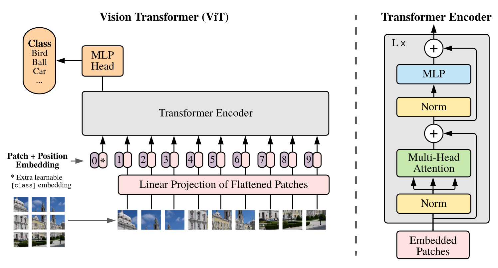
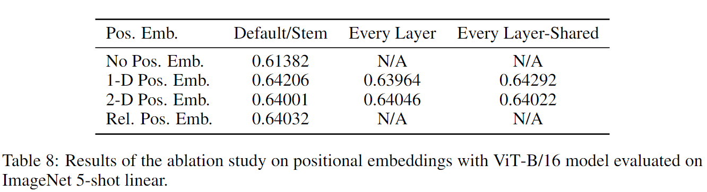
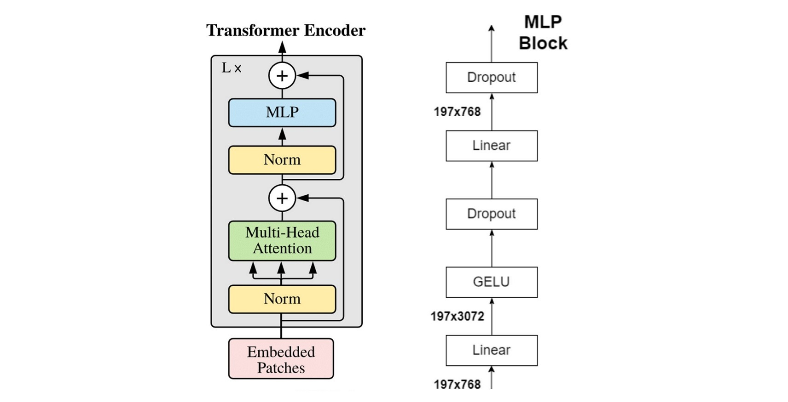
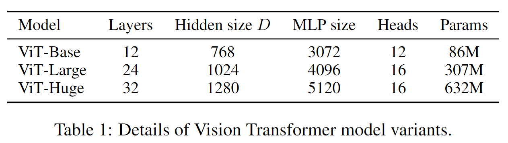
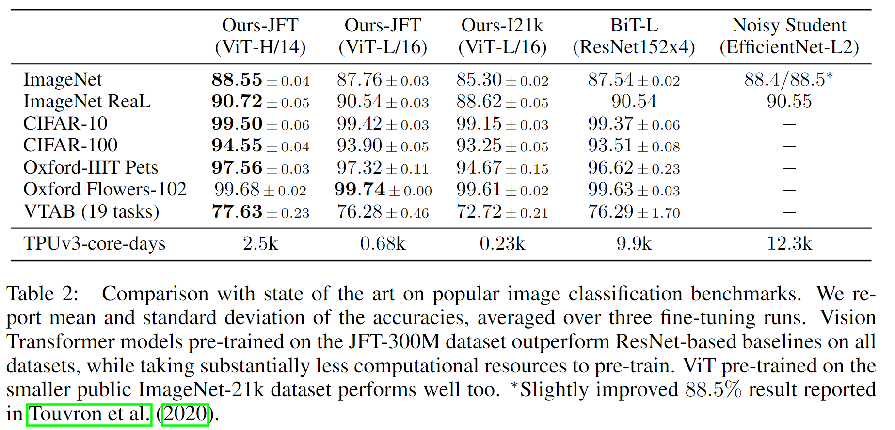
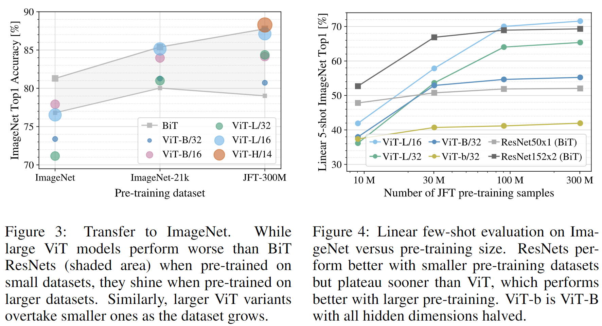
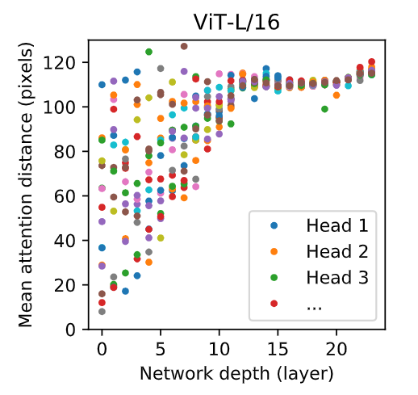



- 论文名称：**An Image Is Worth 16x16 Words: Transformers For Image Recognition At Scale**
- 论文下载地址：https://arxiv.org/abs/2010.11929
- 代码托管：https://github.com/google-research/vision_transformer
- B站朱毅大神视频讲解：https://www.bilibili.com/video/BV15P4y137jb/
- 代码复现：https://github.com/HR-Insist/paper-code/tree/master/ViT





**Vision Transformer**将CV和NLP领域知识结合起来应用于**Image Classification**，**对原始图片进行分块，展平成序列，输入进原始Transformer模型的编码器Encoder部分**，最后接入一个全连接层对图片进行分类。在大型数据集上表现超过了当时SOTA模型。



## 一、Abstract

&emsp;&emsp;虽然 **Transformer** 架构已成为 NLP 任务的事实标准，但它在 CV 中的应用仍然有限。在视觉领域上，attention 要么与卷积网络结合使用，要么用于替换卷积网络的某些组件，同时保持其整体结构。我们证明了这种对 CNNs 的依赖是不必要的，直接应用于图像块序列  (sequences of image patches) 的纯 Transformer 可以很好地执行**图像分类**任务。当对大量数据进行预训练并迁移到多个中小型图像识别基准时 (ImageNet、CIFAR-100、VTAB 等)，与 SOTA 的 CNN 相比，**Vision Transformer (ViT)** 可获得更优异的结果，同时仅需更少的训练资源。

## 二、Introduction

&emsp;&emsp;基于**self-attention**的架构，尤其是 **Transformer**，已成为 NLP 中的首选模型。主要方法是**在大型文本语料库上进行预训练，然后在较小而特定于任务的数据集上进行微调**。 由于 Transformers 的计算效率和可扩展性，训练具有超过 100B 个参数的、前所未有的模型成为了可能。随着模型和数据集的增长，仍未表现出饱和迹象。 

&emsp;&emsp;受 NLP 中 Transformer 成功**放缩 (scaling)** 的启发，我们尝试**将标准 Transformer 直接应用于图像，并尽可能减少修改**。为此，**我们将图像拆分为块 (patch)，并将这些图像块的 线性嵌入序列 (the sequence of linear embeddings) 作为 Transformer 的输入。图像块 image patches 的处理方式与 NLP 应用中的标记 tokens (单词 words) 相同**。我们以有监督方式训练图像分类模型。

&emsp;&emsp;当在没有强正则化的中型数据集（如 ImageNet）上进行训练时，这些模型产生的准确率比同等大小的 ResNet 低几个百分点。 这种看似令人沮丧的结果可能是意料之中的：**Transformers 缺乏 CNN 固有的一些归纳偏置 (inductive biases)，例如平移等效性 (translation equivariance) 和局部性 (locality)，因此在数据量不足的情况下训练时不能很好地泛化**。 

&emsp;&emsp;但是，如果模型在更大的数据集 (14M-300M 图像) 上训练，情况就会发生变化。我们发现 **大规模训练胜过归纳偏置 ( large scale training trumps inductive bias)**。我们的 **Vision Transformer (ViT) 在以足够的规模进行预训练并迁移到具有较少数据点的任务时获得了出色结果**。当在公共 ImageNet-21k 数据集或内部 JFT-300M 数据集上进行预训练时，ViT 在多个图像识别基准上接近或击败了最先进的技术。特别是，最佳模型在 ImageNet 上的准确率达到 88.55%，在 ImageNet-RealL 上达到 90.72%，在 CIFAR-100 上达到 94.55%，在 19 个任务的 VTAB 上达到 77.63%。

## 三、Conclution

我们已经探索了Transformers 在图像识别中的直接应用。与之前在计算机视觉中使用self-attention的工作不同，除了最初的补丁提取步骤外，我们没有在架构中引入image-specific inductive biases (特定于图像的感应偏差)。相反，我们将图像解释为一个补丁序列，并通过像NLP中使用的标准Transformers  encoder来处理它。这种简单而又可扩展的策略在与大型数据集的预训练相结合时效果出奇地好。因此，Vision Transformer在许多图像分类数据集上符合或超过了技术水平，同时预训练也相对便宜。虽然这些初步结果令人鼓舞，但仍有许多挑战。**一个是**将ViT应用于其他计算机视觉任务，如检测和分割。我们的结果，加上Carion等人（2020）的结果，表明了这种方法的前景。**另一个**挑战是继续探索自我监督的预训练方法。我们的初步实验表明自监督预训练有了很大的改进，但自监督和大规模监督预训练之间仍有很大差距。最后，ViT的进一步扩展可能会导致性能的提高。

## 四、Related Work

Transformers 是由 Vaswani 等人提出的**机器翻译**方法，并已成为许多 NLP 任务中最先进的方法。基于大型 Transformer 的模型通常在大型语料库上进行预训练，然后根据手头的任务进行微调：**BERT**使用 **去噪自监督** 预训练任务，而 **GPT** 工作线使用 **语言建模** 作为其预训练任务。

应用于图像的简单自注意力要求 **每个像素关注所有其他像素**。由于像素数量的二次方成本，其无法缩放到符合实际的输入尺寸。因此，曾经有研究者尝试过几种近似方法以便于在图像处理中应用 Transformer。Parmar 等人只在每个 query 像素的局部邻域而非全局应用自注意力，这种局部多头点积自注意力块完全可以代替卷积。在另一种工作中，稀疏 Transformer 采用可放缩的全局自注意力，以便适用于图像。衡量注意力的另一种方法是将其应用于大小不同的块中，在极端情况下仅沿单个轴。许多这种特殊的注意力架构在 CV 任务上显示出很好的效果，但是需要在硬件加速器上有效地实现复杂的工程。

**与我们最相关的是 [Cordonnier ](https://arxiv.org/abs/1911.03584)等人的模型，该模型从输入图像中提取 2×2 大小的块，并在顶部应用完全的自注意力**。该模型与ViT 非常相似，但我们的工作进一步证明了**大规模的预训练使普通的 Transformers 能够与 SOTA 的 CNNs 竞争 (甚至更优)**。此外，Cordonnier 等人使用 2×2 像素的小块，使模型只适用于小分辨率图像，而我们也能处理中分辨率图像。

将 CNN 与自注意力的形式相结合有很多有趣点，例如增强用于图像分类的特征图，或使用自注意力进一步处理CNN 的输出，如用于目标检测、视频处理、图像分类，无监督目标发现，或统一文本视觉任务。

另一个最近的相关模型是图像 GPT (iGPT)，它在降低图像分辨率和颜色空间后对图像像素应用 Transformers。该模型以无监督的方式作为生成模型进行训练，然后可以对结果表示进行微调或线性探测以提高分类性能，在 ImageNet 上达到 72% 的最大精度。

我们的工作增加了在比标准 ImageNet 数据集更大尺度上探索图像识别的论文的数量。使用额外的数据源可以在标准基准上取得 SOTA 的成果。此外，Sun 等人研究了 CNN 性能如何随数据集大小而变化，Kolesnikov、Djolonga 等人从 ImageNet-21k 和JFT-300M 等大规模数据集对 CNN 迁移学习进行了实证研究。我们也关注后两个数据集，但是是训练 Transformers 而非以前工作中使用的基于 ResNet 的模型。

## 五、Method

在模型设计中，我们尽可能地遵循原始 Transformer (Vaswani 等, 2017)。 这种有意简单设置的优势在于，可扩展的 NLP Transformer 架构及其高效实现几乎可以开箱即用。



Figure1：模型概述。我们将一张图像切割成一些固定尺寸的图像块，对每个pathc进行线性嵌入，并添加位置嵌入，然后将产生的向量序列输入到标准的Transformer encoder中。为了执行识别任务，我们添加了一个额外可学习的classification token到序列中。Transformer 编码器的插图受Vaswani 的Transformer(Attention is all you need)的启发。

### 5.1 Patch Embeddings

上图概述了ViT的结构。原始的Transformer接受**一维标记嵌入序列 (Sequence of token embeddings)** 作为输入。为了处理2D图像，我们将图像 ${x \in {R^{H \times W \times C} } }$  reshape为一个展平 (flatten) 的2D块序列，即${x \in {R^{H \times (P^2 \cdot C)} } }$ ，其中 $( H , W )$ 是原图的分辨率，$C$ 是通道数 (RGB图像$C=3$)，$( P , P )$ 是每一个图像块的分辨率，$N = HW/P^2$ 是产生的图像块的个数，同时也作为Transformer的有效输入的序列长度。Transformer在其所有层中使用固定的隐向量 (latent vector) 大小D，因此我们将图像块展平，并使用 **可训练的线性投影 (FC 层)** 将维度 ${P^2 \cdot C}$ 映射为 $D$ 维，同时保持图像块数 $N$ 不变 (等式 1)。我们将这个投影的输出称之为**块嵌入 (patch embeddings)** 。

- 对于图像数据而言，其数据格式为[H, W, C]是三维矩阵明显不是Transformer想要的。所以需要先通过一个Embedding层来对数据做个变换。首先将一张图片按给定大小分成一堆Patches。以ViT-B/16为例，将输入图片(224x224) 按照16x16大小的Patch进行划分，划分后会得到 $(224/16)^2=14^2=196$ 个Patches。接着通过线性映射将每个Patch映射到一维向量中，以ViT-B/16为例，每个Patch数据shape为[16, 16, 3]通过映射得到一个长度为768 ($16 \times 16 \times 3 = 768$) 的向量。此时就得到一个`[196, 768]` 的嵌入向量。到目前为止就已经成功地将一个vision的问题变成了一个NLP的问题了，输入就是一系列1D的token，而不再是一张2D的图片了。

```python
class PatchEmbed(nn.Module):
    """ Image to Patch Embedding """
 
    def __init__(self, img_size=224, patch_size=16, in_chans=3, embed_dim=768):
        super().__init__()
        # (H, W)
        img_size = to_2tuple(img_size)
        # (P, P)
        patch_size = to_2tuple(patch_size)
        # N = (H // P) * (W // P)
        num_patches = (img_size[1] // patch_size[1]) * (img_size[0] // patch_size[0])
        
        self.img_size = img_size
        self.patch_size = patch_size
        self.num_patches = num_patches
        
        # 可训练的线性投影 - 获取输入嵌入
        self.proj = nn.Conv2d(in_chans, embed_dim, kernel_size=patch_size, stride=patch_size)
 
    def forward(self, x):
        B, C, H, W = x.shape
        # FIXME look at relaxing size constraints
 
        assert H == self.img_size[0] and W == self.img_size[1], \
            f"Input image size ({H}*{W}) doesn't match model ({self.img_size[0]}*
{self.img_size[1]})."
 
        # (B, C, H, W) -> (B, D, (H//P), (W//P)) -> (B, D, N) -> (B, N, D)
        #   D=embed_dim=768, N=num_patches=(H//P)*(W//P)
        #   torch.flatten(input, start_dim=0, end_dim=-1)  # 形参：展平的起始维度和结束维度    
        # 可见 Patch Embedding 操作 3 步到位
        x = self.proj(x).flatten(2).transpose(1, 2)
        return x
```


### 5.2 Learnable Embedding

类似于 BERT 的 class token，此处 **为图像块嵌入序列预设一个可学习的嵌入 (Learnable Embedding) (${z_0^0 = x_{class} }$)**，该嵌入在 Transformer 编码器输出的状态/特征 $z_L^0$ 用作 图像表示  (等式 4)。无论是预训练还是微调，都有一个 分类头 (Classification Head) 附加在 $z_L^0$ 之后，从而用于图像分类。分类头在预训练时由一个 单层 MLP 实现，在微调时由 单个线性层 实现 (多层感知机与线性模型类似，区别在于 MLP 相对于 FC 层数增加且引入了非线性激活函数，例如 FC + GELU + FC 形式的 MLP)。

- 以ViT-B/16为例，就是一个长度为768的向量，与之前从图片中生成的tokens拼接在一起，`Cat([1, 768], [196, 768]) -> [197, 768]`。**可学习嵌入** 在训练时随机初始化，然后通过训练得到，其具体实现为：

```python
### 随机初始化
self.cls_token = nn.Parameter(torch.zeros(1, 1, embed_dim))  # shape = (1, 1, D)
### 分类头 (Classifier head)
self.head = nn.Linear(self.num_features, num_classes) if num_classes > 0 else nn.Identity()
### 前馈过程 (Forward)
B = x.shape[0]  # Batch Size
# 通过 可学习的线性投影 获取 Input Imgaes 的 Patch Embeddings (实现在 3.1 节)
x = self.patch_embed(x)  # x.shape = (B, N, D)
# 可学习嵌入 - 用于分类
cls_tokens = self.cls_token.expand(B, -1, -1)  # shape = (B, 1, D)
# 按元素相加 附带 Position Embeddings
x = x + self.pos_embed  # shape = (B, N, D) - Python 广播机制
# 按通道拼接 获取 N+1 维 Embeddings
x = torch.cat((cls_tokens, x), dim=1)  # shape = (B, N+1, D)
```

### 5.3 Position Embeddings

**位置嵌入** ${E_{pos} \in R^{(N +1) \times D} }$  也被加入图像块嵌入，**以保留输入图像块之间的空间位置信息**。不同于 CNN，Transformer 需要位置嵌入来编码 patch tokens 的位置信息，这主要是由于 **自注意力的扰动不变性 (Permutation-invariant)，即打乱 Sequence 中 tokens 的顺序并不会改变结果**。

- 相反，若不给模型提供图像块的位置信息，那么模型就需要通过图像块的语义来学习拼图，这就额外增加了学习成本。

- 关于Position Embedding就是原始Transformer中讲到的Positional Encoding，这里的Position Embedding采用的是一个可训练的参数（`1D Pos. Emb.`），是直接叠加在tokens上的（add），所以Position Embedding的shape要一样 。以ViT-B/16为例，刚刚拼接[class] token后shape是`[197, 768]`，那么这里的Position Embedding的shape也是[197, 768],所以加上位置编码信息之后，这个序列还是`[197×768]`。

- 对于Position Embedding作者也有做一系列对比试验，**在源码中默认使用的是`1D Pos. Emb.`**，对比不使用Position Embedding准确率提升了大概3个点，和`2D Pos. Emb.`比起来没太大差别。

  

### 5.4 Transformer Encoder

**Transformer 编码器** 由交替的 **多头自注意力层** (MSA) 和 **多层感知机块** (MLP) 构成。在每个块前应用 **层归一化 (Layer Norm)**，在每个块后应用 **残差连接 (Residual Connection)**。

- **多头自注意力 (MSA)** 就是原始的Multi-Head Attenti，首先产生：k、q、v，每一个都是197×768，这里因为做的是多头自注意力，所以其实最后的维度并不是768，假设现在使用的是VIsion Transformer的base版本，即多头使用了12个头，那么最后的维度就变成了768/12=64，也就是说这里的k、q、v变成了197×64，但是有12个头，有12个对应的k、q、v做自注意力操作，最后再将12个头的输出直接拼接起来，这样64拼接出来之后又变成了768，所以多头自注意力出来的结果经过拼接还是197×768。
- **MLP Block**，如图右侧所示，就是**全连接+GELU激活函数+Dropout**组成也非常简单，需要注意的是第一个全连接层会把输入节点个数翻4倍`[197, 768] -> [197, 3072]`，第二个全连接层会还原回原节点个数`[197, 3072] -> [197, 768]`



### 5.5 Inductive bias

**归纳偏置 (Inductive bias)**：注意到，Vision Transformer 的图像特定归纳偏置比 CNN 少得多。在 CNN 中，**局部性 (locality)、二维邻域结构 (two-dimensional neighborhood structure,) 和 平移等效性 (translation equivariance) **存在于整个模型的每一层中。**而在 ViT 中，只有 MLP 层是局部和平移等变的，因为自注意力层都是全局的**。二维邻域结构 的使用非常谨慎：在模型开始时通过将图像切分成块，并在微调时调整不同分辨率图像的位置嵌入 (如下所述)。此外，初始化时的位置嵌入不携带有关图像块的 2D 位置的信息，图像块之间的所有空间关系都必须从头开始学习。关于归纳偏置，详见《**[【机器学习】浅谈 归纳偏置 (Inductive Bias)_闻韶-CSDN博客_归纳偏置](https://blog.csdn.net/qq_39478403/article/details/121107057)**》 

### 5.6Hybrid Architecture

混合架构 (Hybrid Architecture)：作为原始图像块的替代方案，输入序列可由 CNN 的特征图构成。在这种混合模型中，图像块嵌入投影 被用在 经 CNN 特征提取的块 而非 原始输入图像块。作为一种特殊情况，块的空间尺寸可以为 ，这意味着输入序列是通过 简单地将特征图的空间维度展平并投影到 Transformer 维度 获得的。然后，如上所述添加了分类输入嵌入和位置嵌入，再将三者组成的整体馈入 Transformer 编码器。简单来说，就是先用 CNN 提取图像特征，然后由 CNN 提取的特征图构成图像块嵌入。由于 CNN 已经将图像降采样了，所以块尺寸可为 。

- 既然transformer全局建模的能力比较强，卷积神经网络又比较data efficient（不需要太多的训练数据），所以搞出了一个混合的网络，前面是卷积神经网络，后面是transformer
- 假设现在将一整张图输入一个CNN，比如说Res50，最后出来一个14×14的特征图，这个特征图拉直了以后恰好也是196个元素，然后用新的到的196个元素去和全连接层做操作得到新的patch embedding。

## 六、Experiments

为了了解训练好每个模型到底需要多少数据，在不同大小的数据集上做预训练，然后在很多的数据集上做测试，作者一共训练了三种模型，参数如下图所示：



而ViT 并不像 CNN 那样具有 Inductive Bias，若直接在 ImageNet 上训练，同 level 的 ViT 效果不如 ResNet。但若先在较大的数据集上预训练，然后再对特定的较小数据集进行微调，则效果优于 ResNet。比如 ViT 在Google 私有的 300M JFT 数据集上预训练后，在 ImageNet 上的最好的 Top-1 ACC 可达 88.55%，这在当时已和 ImageNet上的 SOTA 相当了 (Noisy Student EfficientNet-L2 效果为 88.5%，Google 最新的 SOTA 是 Meta Pseudo Labels，效果可达 90.2%)：



vision trasformer到底需要多少数据才能训练的比较好？下图中图三是整个 vision trasformer论文最重要的take home message，是作者最想让读者知道的，这张图基本上把所有的实验都快概括了。



- 图三的主要意思是说，灰色代表bit，也就是各种大小的resnet，最下面表示50，最上面表示152，他所想要展示的是在中间的灰色区域就是resnet能达到的效果范围，剩下的圆点就是各种大小不一的vision transformer。
- 在最小的ImageNet上做预训练时，vision transformer是完全不如resnet，vision transformer基本上所有的点都在灰色区域的下面。这说明vision transformer在中小型数据集上做预训练的时候的效果是远不如残差网络的，原因就是因为vision transformer没有使用先验知识（归纳偏置），所以它需要更大的数据去让网络学得更好。
- 只有当用特别大的数据集JFT-300M时，vision transformer是比bit对应的res152还要高的。

**总之这个图所要表达的是两个信息：**

1. 如果想用vision transformer，那么得至少准备差不多和ImageNet-21k差不多大小的数据集，如果只有很小的数据集，还是选择使用卷积神经网络比较好。
2. 当已经拥有了比ImageNet-21k更大的数据集的时候，用vision transformer就能得到更好的结果，它的扩展性更好一些。Transformer 的一个特色其 **Scalability**：**当模型和数据量提升时，性能持续提升**。在大数据下，ViT 可能会发挥更大的优势。

最后作者想看一下自注意力是否起作用了，之所以想用transformer，就是因为自注意力的操作能够模拟长距离的关系。论文分析了 不同 Layers 的 Mean Attention Distance，其类比于 CNN 的感受野。结果表明：**前面层的自注意力的距离虽然差异很大，有的自注意力中的头注意的距离还是挺近的，能达到20个像素，但是有的头能达到120个像素；随着网络越来越深，网络学到的特征也会变得越来越高级，越来越具有语义信息，模型后半部分自注意力的距离已经非常远了，基本覆盖全局，也就是说它已经学到了带有语义性的概念，而不是靠邻近的像素点去进行判断**。


