

本文是学习侯捷老师的STL标准库和泛型编程的课程学习笔记。



## 第一讲：学会运用STL各大部件 (components)，并初步认识其体系结构。

### 1. 认识headers、版本、重要资源

- C++标准库的header files 不带副档名(.h)，例如 `#include <vector>`
- 新式C header files 不带副档名.h，例如 `#include <cstdio>`
- 旧式C header files (带有副档名).h仍然可用，例如 `#include <stdio.h>`
- 新式headers内的组件封装于namespace "std"
  `using namespace std;`  or `using std::cout;` (for example)
- 旧式headers内的组件不封装于namespace "std"
- 重要网页：
  - https://cplusplus.com/
  - https://zh.cppreference.com/
  - https://gcc.gnu.org

### 2. STL体系结构基础介绍

STL六大部件（component是）：

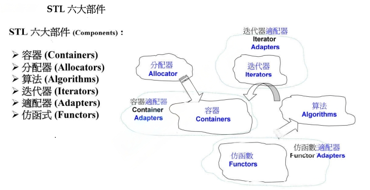

- **容器(Containers)**要放东西，东西要占内存，容器非常好的是帮我们把内存的问题全部解决掉，我们只用把东西放进去或者取出来，内存的事情不用管；
- 所以容器的后面要有另外一个部件支持它，那就是**分配器(Allocators)**。
- 很多操作被独立出来，变成一个个的函数，是模板函数，放在**算法(Algorithms)**里面。
- 算法处理容器中的数据，中间的桥梁是**迭代器(Iterators)**，迭代器是范化的指针。
- **仿函数(Functors)**它的作用就是一种函数。
- **适配器(Adaters)**帮我们转换一些东西，可以转换容器、仿函数、迭代器。

### 3. 容器之分类与各种测试（一）

大致分为三类： Sequence Containers 、 Associative Containers 和 Unordered Containers

Sequence Containers序列式容器：按照元素放入的次序排列

- Array数组(C++11)
- Vector
- Deque双向队列(两端可进可出)
- List双向链表
- Forward-List单向链表(C++11)

Associative Containers关联式容器(key-value,适合快速的查找)
使用红黑树(高度平衡二分树，特殊的二分树)实现的。
Set和Map的key不能重复，Multiset和Multimap可以重复。

- Set/Multiset(key就是value，value就是key，key和value不分)
- Map/Multimap(每一个节点是key-value)

Unordered Containers不定序容器(也是一种关联式容器，其实是用hashTable做的一个容器，C++11新出的一种容器)，内部实现都是使用HashTable Separate Chaining

- unordered Set/Multiset
- unordered Map/Multimap

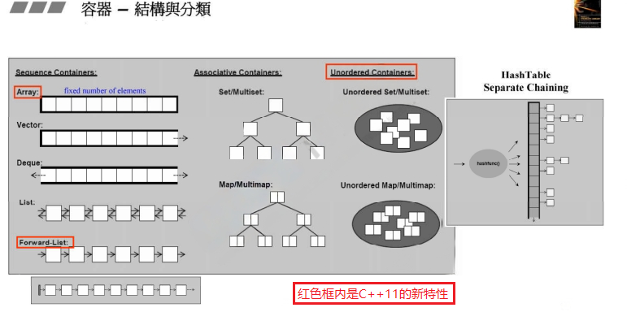

```c++
// 计算消耗的时间
#include <ctime>
clock_t t = clock();
//.......
std::cout << "spend" << clock() - t << "ms" << endl; // 毫秒
```

### 4. 容器之分类与各种测试（二）

- **vector**内存的特性是只能往后扩展，往后扩展的方式是**两倍扩展**。在另一个内存空间中寻找两倍大小的空的连续空间，并且把原来的内容copy到新空间中，所以扩展内存相对耗时。

- `push_back` 是`vector`放元素的动作，放到vector的尾部。

- `vector` 只有 `push_back()`，没有 `push_front()`。
- `std::find()` 是C++标准库提供的函数，采用的是顺序查找的方式。

- `bsearch` 是C中本来就提供的二分查找方式，bsearch按理说比较快，但是先进行sort，大部分时间花在了sort上面，就可能导致  sort + bsearch 的时间 > std::find() 的时间。

- ！！！注意：vector中的元素如果是自定义类，该类需要重载 ==操作符，才可以使用STL的find查找。

### 5. 容器之分类与各种测试（三）

- `std::list` 容器是用指针的前后指针的方式连接前后两个数据。与 `std::vector` 扩展空间的方式相比，`std::list` 存放新元素的方式是每当有一个新的元素需要存储，就在内存空间中开辟一个新的空间存放该元素，并且使用前后指针连接该元素。

  可以调用list容器自己的 `sort()` 对list排序，无法用全局的 sort() 函数。`list.sort();`

  如果容器自己有 `sort()` 方法，那就尽量调用容器自己的 `container.sort()`，不用标准器的全局 sort()

- `forward_list` 只有 `push_front()`，没有`push_back()`。

  同样的，只有 `front()`，没有 `back()`。

- `std::deque` 容器在内存中是**分段存储**的，但是使用者感觉是连续的。

  `std::deque` 也是可以扩充空间的，而且**两端都可扩充**。每一次扩充的大小为一个段。通过一个**map指针**指向每个段的首地址。

  `std::deque` 本身没有 `sort()` 函数，需要使用全局的 `sort()` 排序。

- `std::statck` 和 `std::queue` 没有自己的数据结构，其实是借用 `std::deque` 实现的,所以有人不把 statck 和 queue 叫做容器，而是叫做容器的 adpater。

### 6. 容器之分类与各种测试（四）

- `multiset` 可以看做是小型的关联式容器

  有些容器（如：multiset， multimap等）是因为它功能的限制，不允许在容器的头或者尾添加元素，只能使用 `container.insert(item);`插入元素。

  元素放进去的时候会比较慢，但是后面的查找会非常快（使用 `container.find()`函数比使用标准库的 `find()`函数快很多，甚至不到1ms）。

- `multimap` 内部是红黑树（平衡二叉搜索树）

  **不可以用 []操作符做 insertion**

  插入时，要使用pair<>打包key和value，multimap.insert(pair<int, string>(1, "hello"));

- `unordered_multiset` / `unordered_set` 内部实现使用 hash_table

  `unordered_multiset.bucket_count()`  获取篮子 (bucket)数量

  元素不断的加，当元素的个数大于等于篮子的个数，篮子的个数会变成两倍，在将元素打散放在篮子中。

- `unordered_multimap` / `unordered_map` 内部实现使用 hash_table

- `std::set` 内部实现是 红黑树

  `std::set` 中的元素都是排好序的（按照key升序），如果key是对象，那么必须重载<操作符。

  `std::set` 集合中没有重复的元素

- `std::map` 内部实现是 红黑树

  `std::map` 中的元素总是按照键值key进行比较排序的。

  `std::map` 支持下标访问符，即在[]中放入key，就可以找到与key对应的value。`value = map[key]`

  `std::map` 不支持修改Key，支持修改Value。

### 7. 分配器之测试

分配器是一个class，直接使用分配器是可行的，分配器提供两个函数allocate()和deallocate()，一个拿一个还；直接使用分配器

其实是没有需要的，因为你真正的工具是容器，没有必要使用容器背后的分配器去拿内存还内存。

```C++
int* p;
allocator<int> alloc1;//建立分配器
p = alloc1.allocate(1);//拿一个
alloc1.deallocate(p, 1);//还一个(要指明个数)
```

分配器不建议直接使用，如果是小量的内存的使用就用malloc/free, new/delete。

## 第二讲：深度探索STL的所有分配器、容器、迭代器，以及它们之间的体系结构；深及源代码

### 8.源代码之分布（VC，GCC）

所谓标准库，它的接口是标准的，但是各家都可以自己去实现标准库，各家的做法可能也都相似，比如都会使用红黑树，哈希表等。

VC++的标准库都在inlcude文件夹中。

### 9. OOP (面向对象编程) vs. GP (泛型编程）

OOP企图将datas和methods关联在一起。GP是将datas和methods分开来。

全局的sort设计的时候，要求迭代器（指针）是可以**随机访问**的。RandomAccessIterator随机访问迭代器。因为list不是一个连续空间，因此list后面的迭代器是不能跳来跳去的（随机访问），所以 **list 不能使用 ::sort() 排序**，只能使用 list 自身的 sort()，`list.sort()`。

所有的 algorithms其内最终涉及元素本身的操作，无非就是比大小。

### 10. 技术基础：操作符重载and模板(泛化, 全特化, 偏特化)

这一小节在[C++面向对象高级编程（下）](/C/C++面向对象高级编程（下-侯捷）/#10、specialization（模板特化）)中讲过，这里就不重复描述了。

### 11. 分配器

1. 先谈operator new()和malloc()：

   内存的分配，最后都会走到malloc，malloc这个函数在根据不同的操作系统(windows lunix )，调用不同操作系统的system api，拿到内存。

2. operator delete 和 free():

   delete 的底层对应的就是 C 的free()。

### 12. 容器之间的实现关系与分类

大致分为两类： sequence containers 和 associative containers

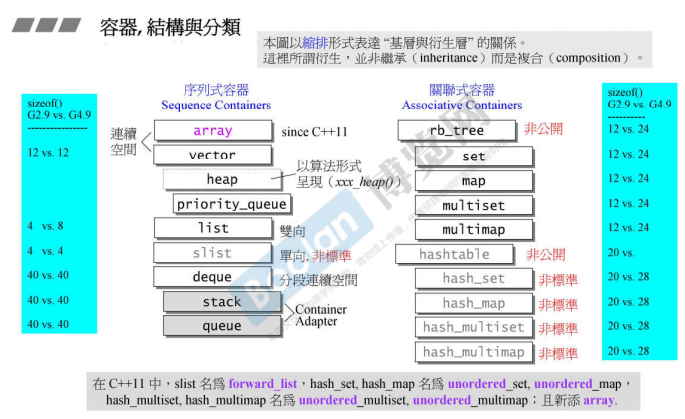

上图以缩排的形式表示”基层与衍生层“的关系。这里所谓衍生，**并非是继承而是复合**。

其中 heap 是通过 vector实现，priority_queue 是通过 heap实现。

stack 和 queue 里有一个deque。

### 13. 深度探索 list（上）

list 在开辟内存时，不仅需要数据的空间，还需要前后指针的空间。

### 14. 深度探索 list（下）

### 15. 迭代器的设计原则和Iterator Traits的作用与设计

### 16. 容器vector深度探索

vector是一种**动态增长**的数组

靠三个指针start ( begin ), finish ( end ), end_of_storage就可以控制整个容器。

容器是前闭后开后开，因此finish后面还有空间。

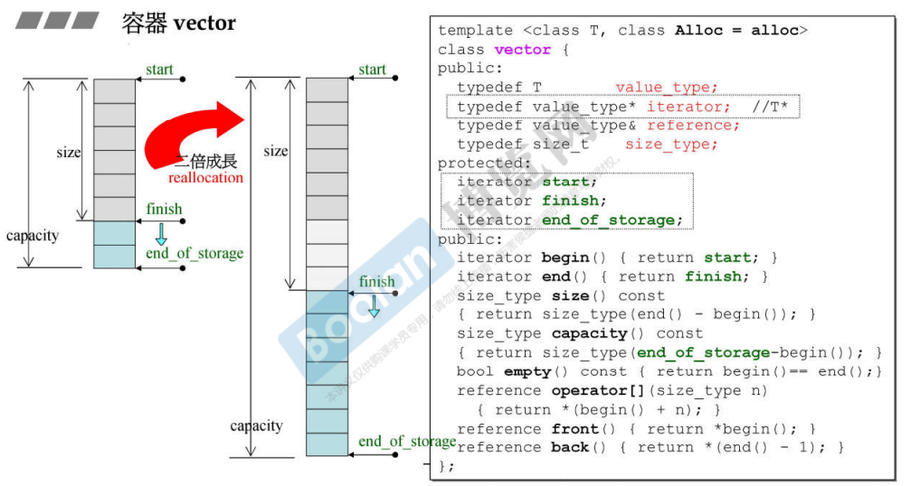

当 vector 的 capacity 不足时，就会**二倍增长**。开辟足够的新空间用于存放 capacity 大小的 vector，每一次的内存reallocation，就会有大量的拷贝动作（将原来的vector拷贝到新的内存空间），会引发大量的拷贝构造函数，而且原来的空间也要都释放（析构函数）。

### 17. array、forward_list深度探索

- array 是不能扩充的，必须知道大小。
- array 没有构造函数和析构函数。
- forward_list 是单向链表。

### 18. deque、queue和 stack深度探索（上）

`deque`是双向开口的一段空间，其实是分段连续。单向开口的就是 `vector`。

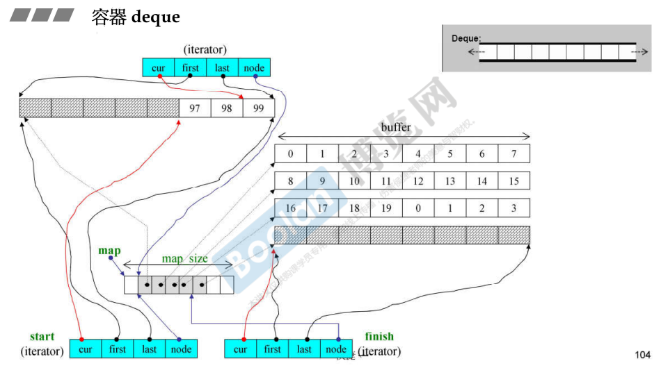

`deque<T>::insert()`：

- 如果是在最前端或者最后端插入新元素，那就直接插入。
- 否则判断插入的位置靠近前端还是后端。如果安插点之前的元素较少，就把安插点之前的元素往前移动；否则就把安插点之后的元素往后移动。

### 19.  deque、queue和 stack深度探索（下）

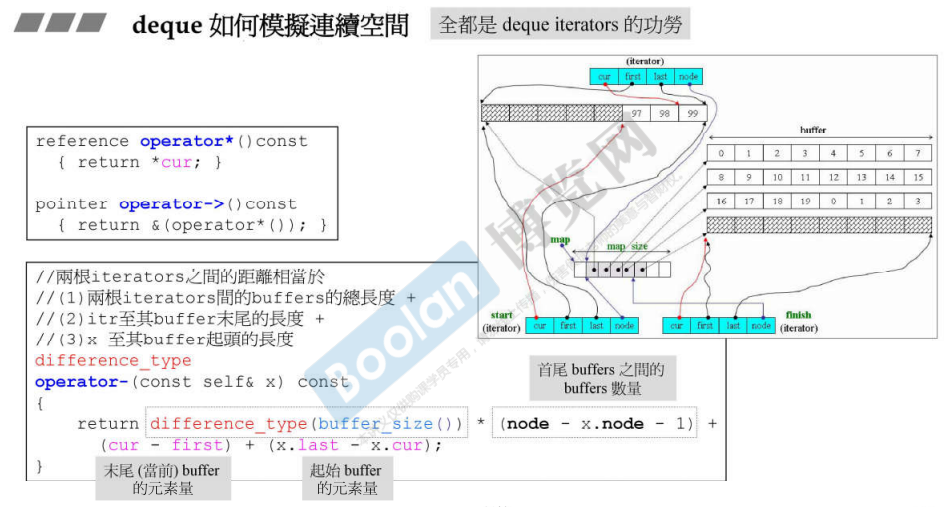

`queue` 先进先出， `stack` 先进后出。二者都没有 `iterator`。

queue 和 stack 的内部默认有一个deque，封掉deque的某些功能，就实现了queue 和 stack。

```c++
template<class T, class Sequence=deque<T>>
class queue{
public:
    // ....
private:
    Sequence c;//低层容器
    // ....
}
```

statck 和 queue 默认的是使用 deque 做为低层结构，也可以选择使用 list 做为底层结构。

queue 不可选择 vector 做为底层结构，因为 vector 没有 pop 函数。

stack 和 queue 都补课选择 set 或 map 作为底层结构。因为：

`stack<string, set<string>> c;`  has no member named 'push_back'、'back'、'pop_back' ······

`stack<string, map<string>> c;`  map的使用就错了。

### 20. RB-tree 深度探索

`Red-Black tree` （红黑树）是一种平衡二元搜索树。

不应使用 `rb_tree` 的 `iterators` 改变元素值（key 值）。

提供两种 insert 操作：`insert_unique()` 和 `insert_equal()` 。前者表示 key 值不可重复，否则插入失败；后者表示 key 值可以重复。insert 操作可能会导致树的结构改变。

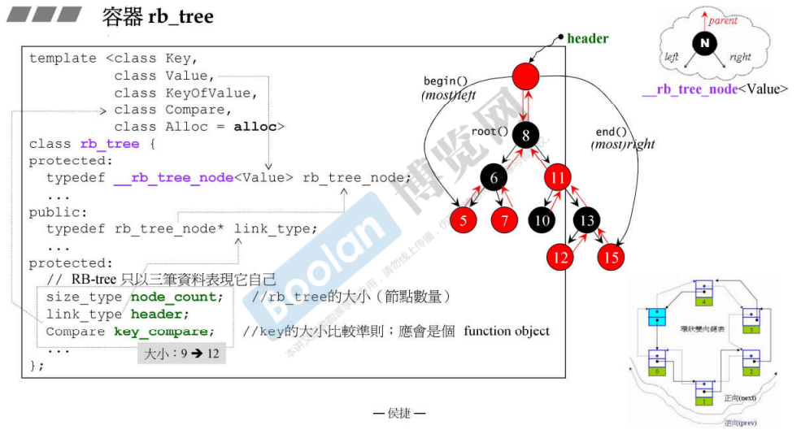

我们不会直接使用rb_tree，而是使用更上层的set和map。

```c++
templater<class Key,
	class Value, //Value表示key和data的整体<key, data>
	class KeyOfValue,//如何在value里面拿到key
	class Compare,//告诉红黑树如何比大小
	class Alloc = alloc>
```

### 21. set、multiset深度探索

`set/multiset` 以 rb_tree 为底层，可以自动排序，其元素的 value 和 可以 合一： **value 就是 key**。

无法使用 `set/multiset` 的 `iterators` 改变元素值。

`set` 元素的 key 必须独一无二， 因此其 insert() 用的是 rb_ tree 的 `insert _unique()`。

`multiset` 元素的 key 可以重复，因此其 insert() 用的是 rb_ tree 的 `insert_equal()` 。

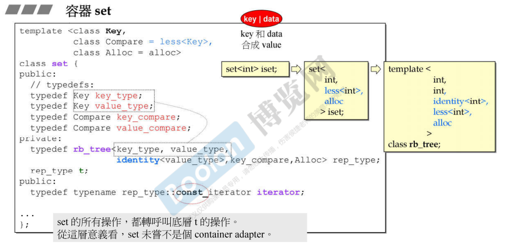

set de 所有操作，都是呼叫底层 rb_tree 的操作。

！！！容器自身的算法 往往比 泛型算法 更快。

### 22. map、multimap深度探索

`map/multimap` 以 rb_tree 为底层，可以自动排序。

无法使用 `map/multimap` 的 `iterators` 改变元素 key 值，但是可以改变元素 data 值。

map 内部自动将 user 指定的 key_type 设为 const，以禁止对元素的 key 值进行赋值。

`set` 元素的 key 必须独一无二， 因此其 insert() 用的是 rb_ tree 的 `insert _unique()`。

`multiset` 元素的 key 可以重复，因此其 insert() 用的是 rb_ tree 的 `insert_equal()` 。

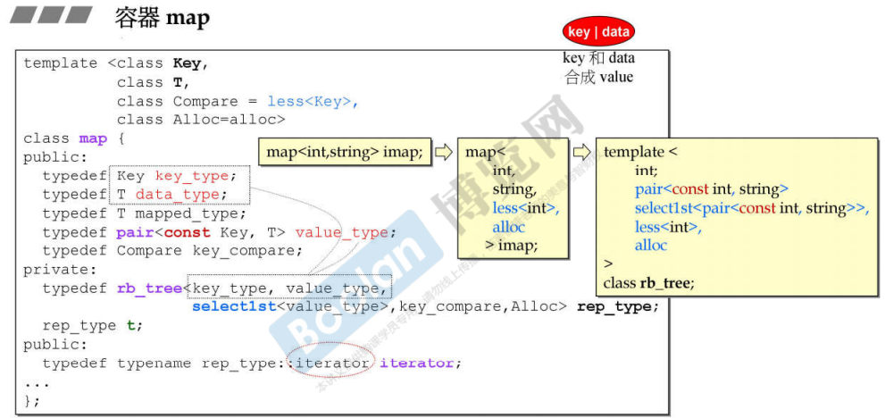

map 拥有独特的 operator[] ：如果找到 key，返回 data；如果未找到，则插入 key。

其中的关键就是 `lower_bound()` 算法。

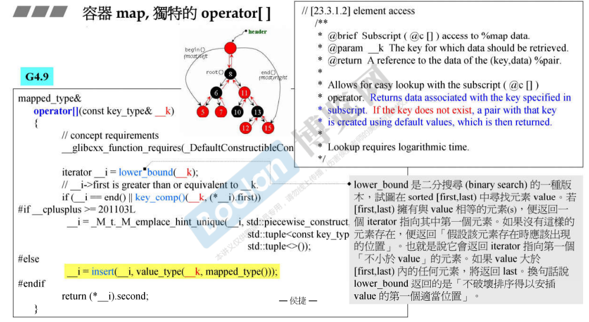

### 23. hashtable深度探索（上）

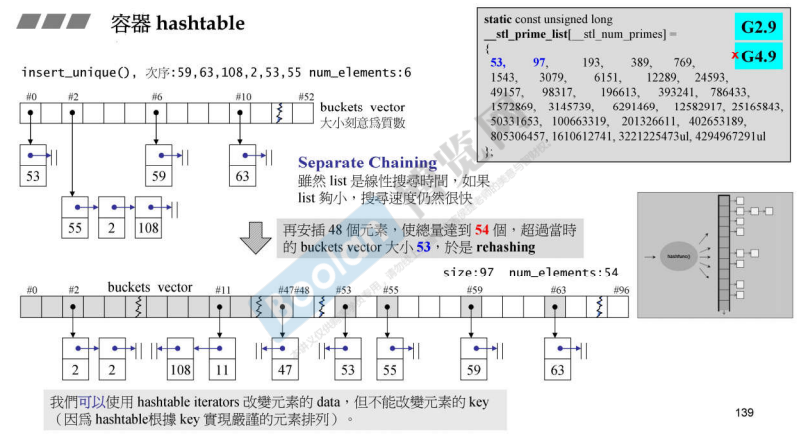

当元素个数 > buckets（篮子）个数时，rehashing，增大篮子个数。所以：**buckets个数一定大于元素个数！**

buckets的个数一般为素数，如53，97, 193...

！！！仿函数：函数对象，行驶函数功能的类。**必须重载 operator() 操作符**。

### 24. hashtable深度探索（下）

hashcode计算：`hash<type>`，如：`hash<int>`  `hash<char>`  `hash<char*>`  `hash<const char*>` .......

！！！注意：标准库没有提供 hash\<std::string\>  只有C风格的 `hash<const char*>`

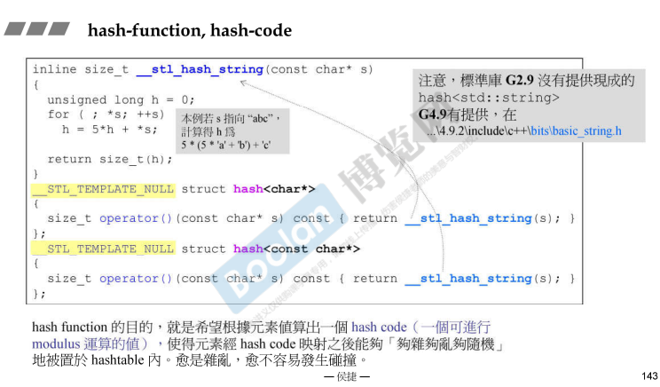

C++11 后，hashtable就是unordered容器。

 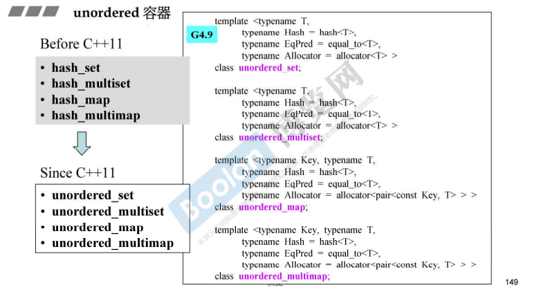


