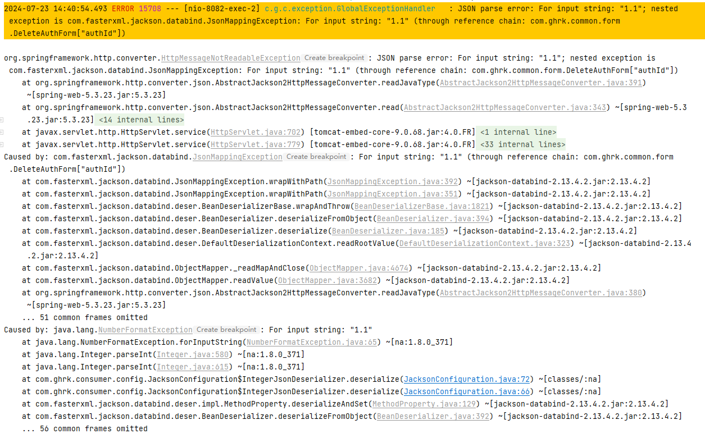

# 一、问题

SpringBoot接口接收Long或Integer这种整数型字段，如果传小数不报错，会只保留整数部分。

# 二、解决方案

SpringBoot默认采用jackson进行序列化与反序列化，添加jackson对整数类型的反序列化。

```java

@Configuration
public class JacksonConfiguration {

    @Value("${spring.jackson.date-format:yyyy-MM-dd HH:mm:ss}")
    private String formatValue;

    @Bean(name = "format")
    public DateTimeFormatter format() {
        return DateTimeFormatter.ofPattern(formatValue);
    }

    @Bean
    public ObjectMapper serializingObjectMapper(@Qualifier("format") DateTimeFormatter format) {
        ObjectMapper mapper = new ObjectMapper()
                .registerModule(new ParameterNamesModule())
                .disable(SerializationFeature.WRITE_DATES_AS_TIMESTAMPS)
                .disable(MapperFeature.DEFAULT_VIEW_INCLUSION)
                .configure(DeserializationFeature.FAIL_ON_UNKNOWN_PROPERTIES, false)
                .registerModule(serializerAndDeserializerModule());
        return mapper;
    }

    /**
     * 序列化与反序列化
     * @return SimpleModule
     */
    public SimpleModule serializerAndDeserializerModule(){
        SimpleModule module = new SimpleModule();

        module.addDeserializer(Long.class, LongJsonDeserializer.instance);
        module.addDeserializer(Long.TYPE, LongJsonDeserializer.instance);

        module.addDeserializer(Integer.class, IntegerJsonDeserializer.instance);
        module.addDeserializer(Integer.TYPE, IntegerJsonDeserializer.instance);

        return module;
    }

    public static class LongJsonDeserializer extends JsonDeserializer<Long> {
        public static final LongJsonDeserializer instance = new LongJsonDeserializer();
        @Override
        public Long deserialize(JsonParser jsonParser, DeserializationContext deserializationContext) throws IOException {
            String value = jsonParser.getText();
            try {
                return value == null ? null : Long.parseLong(value);
            } catch (NumberFormatException e) {
                throw e;
            }
        }
    }

    public static class IntegerJsonDeserializer extends JsonDeserializer<Integer> {
        public static final IntegerJsonDeserializer instance = new IntegerJsonDeserializer();
        @Override
        public Integer deserialize(JsonParser jsonParser, DeserializationContext deserializationContext) throws IOException {
            String value = jsonParser.getText();
            try {
                return value == null ? null : Integer.parseInt(value);
            } catch (NumberFormatException e) {
                throw e;
            }
        }
    }
}
```

# 三、效果

Integer字段，传入1.1这个值，后端报错信息如下：



可以看到Exception类型为 `HttpMessageNotReadableException`，我们可以在异常处理类中检测该错误类型，并返回统一结果给前端。

```java
/**
 * 异常处理器
 */
@RestControllerAdvice
public class GlobalExceptionHandler {
	private Logger logger = LoggerFactory.getLogger(getClass());

	// 数据参数读取异常，比如Integer收到String或者float
	@ExceptionHandler(HttpMessageNotReadableException.class)
	public R handleHttpMessageNotReadableException(HttpMessageNotReadableException e){
		logger.error(e.getMessage(), e);
		return R.error("输入数据不合法"); // R类是静态统一返回结果类
	}
    
    // ......
}
```

