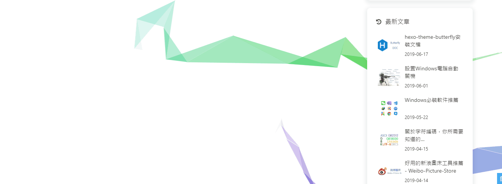
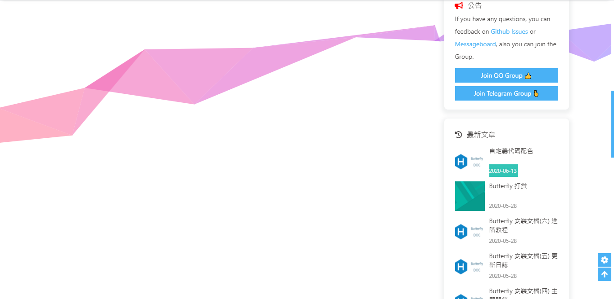
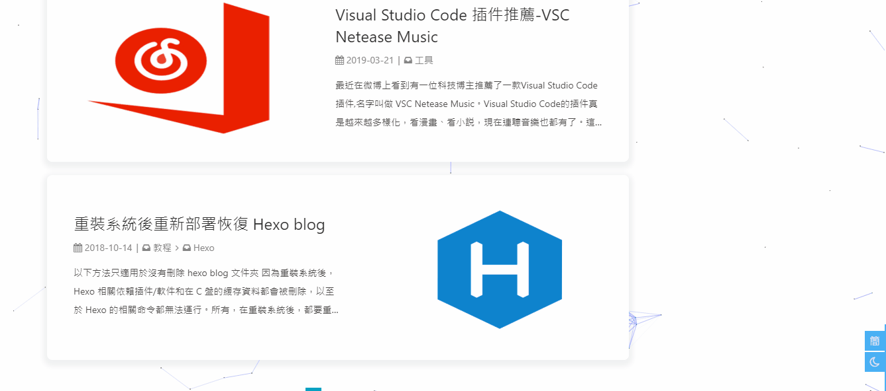
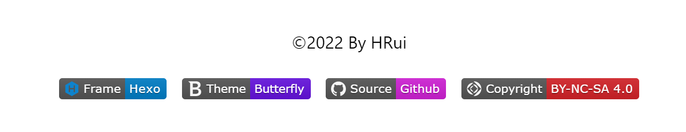
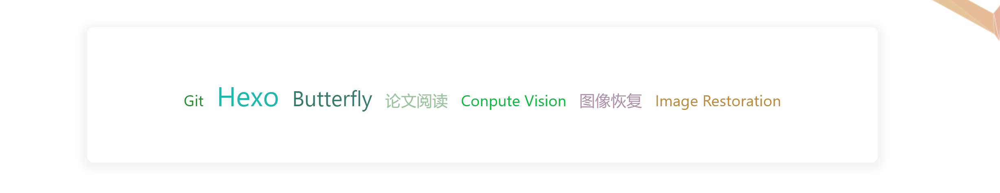
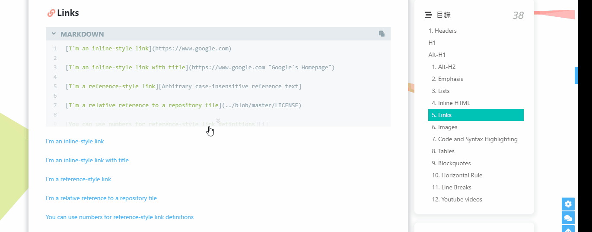



本文记录我对博客中使用的`Butterfly `主题的所有优化和美化，使得我的博客能够达到我想要的效果，后续的优化也会在此篇文章更新！





1. 在 hexo 的根目录创建一个文件 `_config.butterfly.yml`，并把主题目录的` _config.yml `内容复制到 `_config.butterfly.yml `去。对主题的所有修改都是在` _config.butterfly.yml`中进行的。

2. 在butterfly主题文件里的 `source \ css` 文件夹里新建一个 `mycss.css` 文件，并在`_config.butterfly.yml`文件中引入

   ```yaml
   inject:
     head:
       - <link rel="stylesheet" href="/css/mycss.css">
   ```



## 首页

### 修改首页背景图

 在`_config.butterfly.yml`中找到`index_img`选项，修改为想要使用的背景图片地址即可。

``` yml
# The banner image of home page
index_img: /img/index_img.jpg
```

### 首页子标题

可设置主页中显示的网站副标题或者喜欢的座右铭。修改`_config.butterfly.yml`配置文件


<!-- tab 修改配置 -->

``` yaml
# the subtitle on homepage (主頁subtitle)
subtitle:
  enable: true
  # Typewriter Effect (打字效果);如果关闭打字效果，subtitle 只会显示 sub 的第一行文字
  effect: true
  startDelay: 300 # time before typing starts in milliseconds
  typeSpeed: 150 # type speed in milliseconds
  backSpeed: 50 # backspacing speed in milliseconds
  # loop (循环打字)
  loop: true
  # source 调用第三方服务
  # source: false 关闭调用
  # source: 1  调用一言网的一句话（简体） https://hitokoto.cn/
  # source: 2  调用一句网（简体） http://yijuzhan.com/
  # source: 3  调用今日诗词（简体） https://www.jinrishici.com/
  # subtitle 会先显示 source , 再显示 sub 的内容
  sub:
    - Never put off till tomorrow what you can do today!
    - I want to be with you this yeat and next yeat!
```

<!-- endtab -->
<!-- tab 效果预览 -->

<!-- endtab -->


### 背景特效



<!-- tab 动态飘带-->

我的博客采用的背景效果。好看的彩带背景，会飘动。修改 `_config.butterfly.yml`

``` yaml
canvas_fluttering_ribbon:
  enable: true
  mobile: false # false 手机端不显示 true 手机端显示
```



<!-- endtab -->

<!-- tab 静态彩带 -->

好看的彩带背景，可设置每次刷新更换彩带，或者每次点击更换彩带。修改 `_config.butterfly.yml`

``` yaml
canvas_ribbon:
  enable: false
  size: 150 
  alpha: 0.6
  zIndex: -1
  click_to_change: false  #设置是否每次点击都更换綵带
  mobile: false # false 手机端不显示 true 手机端显示
```



<!-- endtab -->

<!-- tab canvas-nest -->

修改 `_config.butterfly.yml`

``` yaml
canvas_nest:
  enable: true
  color: '0,0,255' #color of lines, default: '0,0,0'; RGB values: (R,G,B).(note: use ',' to separate.)
  opacity: 0.7 # the opacity of line (0~1), default: 0.5.
  zIndex: -1 # z-index property of the background, default: -1.
  count: 99 # the number of lines, default: 99.
  mobile: false # false 手机端不显示 true 手机端显示
```



<!-- endtab -->



## 字体样式和大小



<!-- tab 全局字体 -->

修改 `_config.butterfly.yml`，设置**全局**字体size和样式

```yaml
# Global font settings
# Don't modify the following settings unless you know how they work (非必要不要修改)
font:
  global-font-size: 16px
  code-font-size: 16px
  font-family:  SegoeUI,"Segoe UI", "Microsoft YaHei", 微软雅黑, "Helvetica Neue", Helvetica, Arial, sans-serif
  code-font-family: consolas, Menlo, "PingFang SC", "Microsoft JhengHei", "Microsoft YaHei", sans-serif
```

<!-- endtab -->

<!-- tab 首页标题字体 -->

修改 `_config.butterfly.yml`，设置**首页blog标题**（左上角和居中标题）

如不需要使用网络字体，只需要把`font_link`留空就行

```yaml
# Font settings for the site title and site subtitle
# 左上角網站名字 主頁居中網站名字
blog_title_font:
  font_link: https://fonts.googleapis.com/css?family=Titillium+Web&display=swap
  font-family: Titillium Web, 'PingFang SC', 'Hiragino Sans GB', 'Microsoft JhengHei', 'Microsoft YaHei', sans-serif
```

<!-- endtab -->



## footer



<!-- tab 效果预览-->



<!-- endtab -->

<!-- tab footer背景-->

由于原footer样式看起来有点不协调，所以我直接去掉footer的背景，在修改footer的字体颜色

在新建的`mycss.css`文件中，添加如下内容：

``` yaml
/* footer样式 */
#footer {
    background: #fff;
    /* background: #fff url("/images/footer.jpg"); */
    /* opacity: 0.3; */
}
#footer-wrap {
    padding: 20px 20px;
    /* color: var(--light-grey); */
    color: #000;
}
#footer-wrap a{
    color: #49b1f5;
}
```

<!-- endtab -->

<!-- tab 页脚徽标-->

这个挺简单的，可以直接通过 [shields.io](https://shields.io/) 在线生成

- label：标签，徽标左侧内容
- message：信息，徽标右侧内容
- color：色值，支持支持十六进制、rgb、rgba、hsl、hsla 和 css 命名颜色。十六进制记得删除前面的 # 号

输入相关信息后，点击 `make badge` 即可得到徽标的 URL。可以用 img 标签引用

接着打开主题的配置文件（`_config.butterfly.yml`）找到 `custom_text` 配置项并修改它，最后建议把 footer 配置下的 `copyright `设为 **false** 。

``` yaml
# Footer Settings
# --------------------------------------
footer:
  owner:
    enable: true
    since: 2022
  custom_text:  <p>
                  <a style="margin-inline:5px"target="_blank" href="https://hexo.io/">
                    
                  </a>
                  <a style="margin-inline:5px"target="_blank" href="https://butterfly.js.org/">
                  
                  </a>
                  <a style="margin-inline:5px"target="_blank" href="https://github.com/">
                    
                  </a>
                  <a style="margin-inline:5px"target="_blank"href="http://creativecommons.org/licenses/by-nc-sa/4.0/">
                    
                  </a>
                </p>
 
  copyright: false # Copyright of theme and framework
```

<!-- endtab -->



## 侧边栏

### 只显示目录

在某个页面的侧边栏如果你只想要展示目录的话，可以在对应页面的 Markdown 顶部配置如下内容:

```yaml
---
title: 标签
date: 2020-03-07 12:33:35
toc_style_simple: true   # true代表只展示目录，默认为false
---
```

### 关闭侧边栏

在某个页面如果你不想要侧边栏的话，可以在对应页面的 Markdown 里加如下配置：

```yaml
---
title: 标签
date: 2020-03-07 12:33:35
type: "tags"
aside: false	# 关闭侧边栏
---
```

此时我们对应的页面就没有侧边栏了，效果如下：



## 代码展示

### 代码样式

Butterfly 支持6种代码高亮样式：darker 、pale night、light、ocean、mac、mac light
修改`_butterfly_config.yml`文件

```yaml
# 我的博客采用的样式为: mac light
highlight_theme: mac light
```

### 代码框高度

可配置代码高度限制，超出的部分会隐藏，并显示展开按钮。

```yaml
# highlight_height_limit: false # unit: px
highlight_height_limit: 300 # unit: px
```



## 使用本地图片


关于在**markdown**和**博客**中都能正常使用显示本地图片，请移步至[Hexo 使用本地图片](/Hexo/Hexo博客部署/#Hexo-使用本地图片) 。


## 图片压缩


使用**Gulp**对博客的js、css、img、html等静态资源文件进行压缩，从而加速对博客的访问，解决方案请移步至[Hexo+Gulp压缩图片](/Hexo/Hexo压缩图片/) 。


## 标签外挂


对于本博客中使用的标签外挂，参考链接请移步至[hexo-butterfly使用外挂标签](/Hexo/hexo-butterfly使用外挂标签/) 。

更多更全面的标签外挂，请参考[butterfly官方链接](https://butterfly.js.org/posts/4aa8abbe/#%E6%A8%99%E7%B1%A4%E5%A4%96%E6%8E%9B%EF%BC%88Tag-Plugins%EF%BC%89) 。



## 导航栏搜索


记得运行 `hexo clean`


为了减少不必要的又麻烦又容易出错的配置步骤，本博客采用本地搜索方式。

1. 你需要安装 [hexo-generator-search](https://github.com/wzpan/hexo-generator-search)，根据它的文档去做相应配置

   ```shell
   npm install hexo-generator-search --save
   ```

   修改博客根目录下的`_config.yml`.

   ```yaml
   search:
     path: search.xml
     field: post
     content: true
   ```

   - **path** - 文件路径 。默认为 `search.xml` 。如果文件后缀是 `.json`，则输出文件是 JSON 文件. 
   - **field** - 允许被搜索的博客类型，选择范围：
     - **post** (默认) - 只会覆盖博客中的 post 页。
     - **page** - 只会覆盖博客中的 page 页。
     - **all** - 会覆盖博客中的 post 页 和 page 页。
   - **content** - 是否包含每篇文章的整个内容。 如果`false`, 生成的结果只包括标题和其他元信息，没有主体内容。默认是 `true`.

   要**排除**某个帖子或页面被编入索引，你可以简单地在其正面内容的 `front-matter` 中插入 `indexing: false` 。

   ```markdown
   ---
   title: "Code Highlight"
   date: "2014-03-15 20:17:16"
   indexing: false 
   ---
   ```

2. 修改 主题配置文件`_butterfly_config.yml`

   ```yaml
   local_search:
     enable: false
     preload: false
     CDN:
   ```

## 页面加密


你可能需要写一些私密的博客, 通过密码验证的方式让人不能随意浏览。

为了解决这个问题，你需要安装[hexo-blog-encrypt](https://cdn.githubjs.cf/D0n9X1n/hexo-blog-encrypt) ，更多细节请移步至[官方文档](https://cdn.githubjs.cf/D0n9X1n/hexo-blog-encrypt)。


1. 安装 `hexo-blog-encrypt` 

   ```shell
   npm install --save hexo-blog-encrypt
   ```

2. 修改博客根目录下的`_config.yml`。根据自己的喜好设置如下内容（也可以不设置，使用默认内容）：

   ```yaml
   encrypt: # hexo-blog-encrypt
     abstract: 有东西被加密了, 请输入密码查看.
     message: 您好, 这里需要密码.
     tags:
     - {name: tagName, password: 密码A}
     - {name: tagName, password: 密码B}
     wrong_pass_message: 抱歉, 这个密码看着不太对, 请再试试.
     wrong_hash_message: 抱歉, 这个文章不能被校验, 不过您还是能看看解密后的内容.
   ```

3. 将 "password" 字段添加到您文章信息头就像这样.

   ```markdown
   ---
   title: Hello World
   date: 2016-03-30 21:18:02
   password: hello
   ---
   ```

   只需要将博文头部的 `password` 设置为 `""` 即可取消对本博文的加密.

   ```markdown
   ---
   title: Callback Test
   date: 2019-12-21 11:54:07
   tags:
       - A Tag should be encrypted
   password: ""
   ---
   Use a "" to diable tag encryption.
   ```

   

   在部分博客中, 解密后部分元素可能无法正常显示或者表现。解决方法参加[官方文档](https://cdn.githubjs.cf/D0n9X1n/hexo-blog-encrypt/blob/master/ReadMe.zh.md#%E5%85%B3%E4%BA%8E-callback-%E5%87%BD%E6%95%B0) 。

   

## 2048小游戏

想在博客中加入自己编写的2048小游戏，查阅资料后发现需要在文中嵌入 HTML 代码。虽然可以直接在markdown中使用 HTML 标签，但是遇见了渲染异常，即即嵌入的html也被hexo的主题代码渲染了，导致 CSS 样式或者 JS 异常。以下是我的解决方案：

1. 我们使用 `<iframe></iframe>`标签，样式根据自己的实际情况设置，其中`src` 是我们想要渲染的HTML页面。

   ```html
    <iframe  
    height=800
    width=100%
    src="/games/2048小游戏/2048.html"  
    frameborder=0  
    allowfullscreen>
    </iframe>
   ```

2. 我们需要在hexo的配置文件`_config.yml`中找到`skip_render`这一配置项，做如下修改：

   ```yaml
   skip_render:
     - "games/2048小游戏/2048.html"
     - "games/2048小游戏/css/*"
     - "games/2048小游戏/js/*"
   ```

   `skip_render`代表不希望被hexo渲染的页面，希望hexo直接使用。跳过渲染的规则如下：

   ```yaml
   "/2048.html" # 表示跳过该文件
   "/*.html" # 表示跳过html文件
   "/css/*"  # 表示跳过该文件夹下的文件
   "/js/**"  # 表示跳过该文件夹以及文件夹下的文件夹下的所有文件
   ```

## Math

### 使用Mathjax

尽管[butterfly官文文档](https://butterfly.js.org/posts/ceeb73f/#Math-%E6%95%B8%E5%AD%B8)推荐使用**KaTex**，但是我按照官方文档的步骤后，需要换行的数学公式显示有问题，所以退而求其次使用**Mathjax** 。

1. 修改主题配置文件`_butterfly_config.yml`

   ```yaml
   mathjax:
     enable: true
     # true 表示每一页都加载mathjax.js
     # false 需要时加载，须在使用的Markdown Front-matter 加上 mathjax: true
     per_page: false
   ```

   

   如果 `per_page` 设为 true,则每一页都会加载 Mathjax 服务。设为 false，则需要在文章 Front-matter 添加 `mathjax: true`，对应的文章才会加载 Mathjax 服务。

   

2. 安装渲染插件

   ```shell
   npm uninstall hexo-renderer-marked --save  #如果有其他的数学渲染插件，一并删除
   npm install hexo-renderer-kramed --save
   ```

   

   安装新的插件后，要重新打开cmd窗口才会生效。

   

3. 配置hexo的配置文件`_config.yml`

   ```yaml
   kramed:
     gfm: true
     pedantic: false
     sanitize: false
     tables: true
     breaks: true
     smartLists: true
     smartypants: true
   ```

### 解决在hexo中无法显示数学公式的问题

修改node_modules\kramed\lib\rules\inline.js文件

hexo-renderer-kmared渲染引擎仍然存在一些语义冲突问题，到博客的根目录下，找到node_modules\kramed\lib\rules\inline.js，把第11行的escape变量的值做相应的修改：

```javascript
//escape: /^\\([\\`*{}\[\]()#$+\-.!_>])/,
  escape: /^\\([`*\[\]()#$+\-.!_>])/,
```

这一步是在原基础上取消了对\,{,}的转义(escape)。

同时把第20行的em变量也要做相应的修改。

```javascript
//em: /^\b_((?:__|[\s\S])+?)_\b|^\*((?:\*\*|[\s\S])+?)\*(?!\*)/,
  em: /^\*((?:\*\*|[\s\S])+?)\*(?!\*)/,
```

重启hexo：

```shell
hexo cl && hexo g && hexo s
```

### Nunjucks Error expected variable end解决办法

问题描述：运行hexo g 和hexo s 都会报Nunjucks Error 错误

解决方法：在公式中的 `{{` 和 `}}`中间加一个空格变成`{ {`  和 `}  }`

