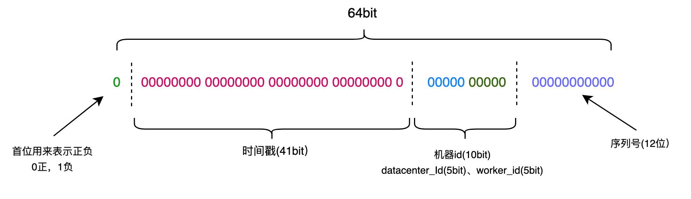

# SnowFlake 雪花算法基本概念

SnowFlake 雪花算法是 Twitter 开源的分布式唯一 ID 生成算法，其具有简洁、高性能、低延迟、ID 按时间趋势有序等特点。如采用 12 位序列号，则理论支持每毫秒生成 4096 个不同数字，能够满足绝大多数高并发场景下的互联网应用。SnowFlake 雪花算法能保证在 datacenterId 和 workerId 唯一的情况下不会生成重复值。如果单位毫秒并发量 >4096，将会等到下一毫秒继续生成 ID。因此如果单台服务器并发量大于 4096/ms，是时候考虑自研算法了。

SnowFlake 的结构如下：



总共 64 个 bit 位，对应于 Java 基本数据类型的 Long 类型 1 位符号位，正数是 0，负数是 1，id 一般是正数，因此最高位是 0 41 位时间戳（毫秒级），41 位时间戳不是存储当前时间的时间戳，而是存储时间戳差值（当前时间戳 - 开始时间戳）。开始时间戳一般是 Id 生成器开始投入使用的时间，可在程序中指定。

- 41 位时间戳，可以使用 69 年，年数 = (1L << 41) / (1000L * 60 * 60 * 24 * 365) ≈ 69
- 10 位机器位，可以部署 1024 个节点，包括 5 位 datacenterId 和 5 位 workerId
- 12 位序列号，毫秒内计数，支持每个节点每毫秒产生 4096 个不重复 ID 序号

# 问题描述

在数据库中，有一个User表，主键是id，bigint类型，用来存储雪花算法生成的ID。

```sql
CREATE TABLE user
(
	id BIGINT(20) NOT NULL COMMENT '主键ID',
        #其他字段省略
);
```

在Springboot项目中，使用Long 类型对应数据库ID数据。

```java
@Data
public class User {
    private Long id;
	//其他成员变量省略
}
```

在Postman中测试，看到数据响应以JSON响应给前端。目前为止都没有问题

```json
{
	id：1397850392090947585
	//其他属性省略
}
```

**问题来了**：我们将这条数据传给前端，前端正常接收也正常显示。但是当前端要把这个id传给后端时，奇怪的事情发生了：**后端接收到的 id 变成了1397850392090947000，而不是1397850392090947585。**也就是说id的后面三位变成了0。

# 分析问题

首先在代码逻辑肯定没有问题的情况下，考虑**精度丢失**问题。

JavaScript使用Number类型接收后端传来的Long类型。而Number的精度是16位，雪花ID的精度是19位，这就是为什么后三位变成了0。

# 解决方案

1. 后端String 类型做ID，但是严重影响SQL查询的效率。不推荐！
2. **后端的ID(Long) ==> Jackson(Long转String) ==> 前端使用String类型的ID,前端使用js string精度就不会丢失了。**

在Spring Boot项目中，使用 Jackson 进行JSON序列化的时候怎么将Long类型ID转成String响应给前端。 前端再把 String 类型的19位数字传回服务端的时候，后端也会反序列化，可以用Long正常接收。

```java
import com.fasterxml.jackson.databind.ObjectMapper;
import com.fasterxml.jackson.databind.module.SimpleModule;
import com.fasterxml.jackson.databind.ser.std.ToStringSerializer;
import com.fasterxml.jackson.datatype.jsr310.deser.LocalDateDeserializer;
import com.fasterxml.jackson.datatype.jsr310.deser.LocalDateTimeDeserializer;
import com.fasterxml.jackson.datatype.jsr310.deser.LocalTimeDeserializer;
import com.fasterxml.jackson.datatype.jsr310.ser.LocalDateSerializer;
import com.fasterxml.jackson.datatype.jsr310.ser.LocalDateTimeSerializer;
import com.fasterxml.jackson.datatype.jsr310.ser.LocalTimeSerializer;
import org.springframework.boot.autoconfigure.condition.ConditionalOnMissingBean;
import org.springframework.context.annotation.Bean;
import org.springframework.context.annotation.Configuration;
import org.springframework.context.annotation.Primary;
import org.springframework.http.converter.json.Jackson2ObjectMapperBuilder;

import java.math.BigInteger;
import java.time.LocalDate;
import java.time.LocalDateTime;
import java.time.LocalTime;
import java.time.format.DateTimeFormatter;

@Configuration
public class JacksonConfig {

  public static final String DEFAULT_DATE_FORMAT = "yyyy-MM-dd";
  public static final String DEFAULT_DATE_TIME_FORMAT = "yyyy-MM-dd HH:mm:ss";
  public static final String DEFAULT_TIME_FORMAT = "HH:mm:ss";
  
  @Bean
  @Primary
  @ConditionalOnMissingBean(ObjectMapper.class)
  public ObjectMapper jacksonObjectMapper(Jackson2ObjectMapperBuilder builder)
  {
    ObjectMapper objectMapper = builder.createXmlMapper(false).build();

    // 全局配置序列化返回 JSON 处理
    SimpleModule simpleModule = new SimpleModule();
    //JSON Long ==> String
    simpleModule.addSerializer(Long.class, ToStringSerializer.instance)
            .addSerializer(BigInteger.class, ToStringSerializer.instance)
            .addDeserializer(LocalDateTime.class, new LocalDateTimeDeserializer(DateTimeFormatter.ofPattern(DEFAULT_DATE_TIME_FORMAT)))
            .addDeserializer(LocalDate.class, new LocalDateDeserializer(DateTimeFormatter.ofPattern(DEFAULT_DATE_FORMAT)))
            .addDeserializer(LocalTime.class, new LocalTimeDeserializer(DateTimeFormatter.ofPattern(DEFAULT_TIME_FORMAT)))
            .addSerializer(LocalDateTime.class, new LocalDateTimeSerializer(DateTimeFormatter.ofPattern(DEFAULT_DATE_TIME_FORMAT)))
            .addSerializer(LocalDate.class, new LocalDateSerializer(DateTimeFormatter.ofPattern(DEFAULT_DATE_FORMAT)))
            .addSerializer(LocalTime.class, new LocalTimeSerializer(DateTimeFormatter.ofPattern(DEFAULT_TIME_FORMAT)));

    objectMapper.registerModule(simpleModule);
    return objectMapper;
  }
}
```

上面的代码顺便添加了序列化时间的处理。如果不需要的可以删除，只保留第一个`addSerializer(Long.class, ToStringSerializer.instance)`

# 感言

又解决了一个BUG，真好！


